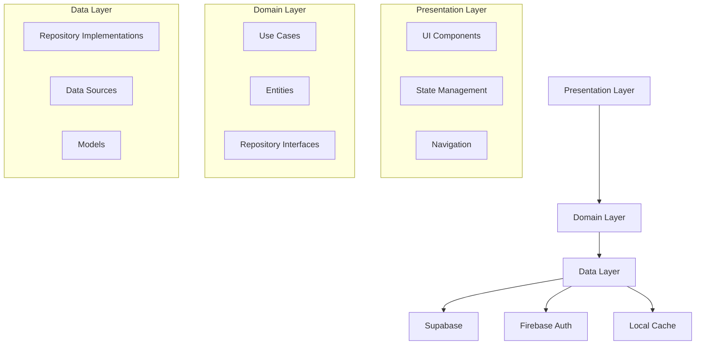

# 🚀 GigaEats Flutter Backend Integration Guidelines
## Professional Development Standards & Best Practices

---

## 📋 **Table of Contents**
1. [Architecture Overview](#1-architecture-overview)
2. [Project Structure & Organization](#2-project-structure--organization)
3. [Code Quality Standards](#3-code-quality-standards)
4. [Security Framework](#4-security-framework)
5. [Authentication & Authorization](#5-authentication--authorization)
6. [Data Management Patterns](#6-data-management-patterns)
7. [Error Handling & Logging](#7-error-handling--logging)
8. [Testing Strategy](#8-testing-strategy)
9. [Performance Optimization](#9-performance-optimization)
10. [Collaboration Guidelines](#10-collaboration-guidelines)
11. [Version Control & CI/CD](#11-version-control--cicd)
12. [Documentation Standards](#12-documentation-standards)
13. [Deployment & Monitoring](#13-deployment--monitoring)
14. [Implementation Roadmap](#implementation-roadmap)
15. [Additional Resources](#additional-resources)
16. [Quick Start Checklist](#quick-start-checklist)

---

## 1. **Architecture Overview**

### Backend Stack
- **Database:** Supabase (PostgreSQL)
- **Authentication:** Firebase Auth + Supabase integration
- **Storage:** Supabase Storage Buckets
- **Real-time:** Supabase Realtime subscriptions
- **Functions:** Supabase Edge Functions for complex business logic

### Architecture Principles
- **Clean Architecture:** Separation of concerns with distinct layers
- **SOLID Principles:** Maintainable and extensible code
- **Repository Pattern:** Abstraction of data access logic
- **Dependency Injection:** Loose coupling and testability
- **Event-Driven Architecture:** Reactive programming patterns

---

## 2. **Project Structure & Organization**

### Recommended Directory Structure
```
lib/
├── core/
│   ├── config/
│   │   ├── app_config.dart
│   │   ├── supabase_config.dart
│   │   └── firebase_config.dart
│   ├── constants/
│   │   ├── app_constants.dart
│   │   ├── api_constants.dart
│   │   └── storage_constants.dart
│   ├── errors/
│   │   ├── exceptions.dart
│   │   ├── failures.dart
│   │   └── error_handler.dart
│   ├── network/
│   │   ├── network_info.dart
│   │   └── api_client.dart
│   ├── utils/
│   │   ├── logger.dart
│   │   ├── validators.dart
│   │   └── helpers.dart
│   └── di/
│       └── injection_container.dart
├── data/
│   ├── datasources/
│   │   ├── local/
│   │   │   ├── cache_datasource.dart
│   │   │   └── secure_storage_datasource.dart
│   │   └── remote/
│   │       ├── auth_datasource.dart
│   │       ├── user_datasource.dart
│   │       └── vendor_datasource.dart
│   ├── models/
│   │   ├── user_model.dart
│   │   ├── vendor_model.dart
│   │   └── order_model.dart
│   ├── repositories/
│   │   ├── base_repository.dart
│   │   ├── auth_repository_impl.dart
│   │   ├── user_repository_impl.dart
│   │   └── vendor_repository_impl.dart
│   └── services/
│       ├── cache_service.dart
│       ├── storage_service.dart
│       └── notification_service.dart
├── domain/
│   ├── entities/
│   │   ├── user_entity.dart
│   │   ├── vendor_entity.dart
│   │   └── order_entity.dart
│   ├── repositories/
│   │   ├── auth_repository.dart
│   │   ├── user_repository.dart
│   │   └── vendor_repository.dart
│   └── usecases/
│       ├── auth/
│       │   ├── login_usecase.dart
│       │   └── register_usecase.dart
│       ├── user/
│       │   ├── get_user_profile_usecase.dart
│       │   └── update_user_profile_usecase.dart
│       └── vendor/
│           ├── get_vendors_usecase.dart
│           └── create_vendor_usecase.dart
├── presentation/
│   ├── blocs/
│   ├── pages/
│   └── widgets/
└── main.dart
```

### Code Organization Principles
- **Single Responsibility:** Each class has one clear purpose
- **Feature-Based Grouping:** Related functionality grouped together
- **Layer Separation:** Clear boundaries between presentation, domain, and data layers
- **Abstraction Levels:** Appropriate abstraction at each layer

---

## 3. **Code Quality Standards**

### Coding Conventions

#### Naming Conventions
```dart
// Classes: PascalCase
class UserRepository {}

// Variables & Methods: camelCase
String userName = '';
void getUserProfile() {}

// Constants: SCREAMING_SNAKE_CASE
static const String API_BASE_URL = '';

// Private members: underscore prefix
String _privateField = '';
void _privateMethod() {}

// Files: snake_case
user_repository.dart
auth_service.dart
```

#### Code Structure Standards
```dart
// Example: Repository Implementation
class UserRepositoryImpl implements UserRepository {
  // 1. Dependencies
  final UserDataSource _dataSource;
  final CacheService _cacheService;
  final Logger _logger;

  // 2. Constructor
  UserRepositoryImpl({
    required UserDataSource dataSource,
    required CacheService cacheService,
    required Logger logger,
  }) : _dataSource = dataSource,
       _cacheService = cacheService,
       _logger = logger;

  // 3. Public methods
  @override
  Future<Either<Failure, User>> getUserProfile(String userId) async {
    try {
      _logger.info('Fetching user profile for: $userId');
      
      // Check cache first
      final cachedUser = await _cacheService.getUser(userId);
      if (cachedUser != null) {
        return Right(cachedUser);
      }

      // Fetch from remote
      final user = await _dataSource.getUserProfile(userId);
      
      // Cache the result
      await _cacheService.saveUser(user);
      
      return Right(user);
    } catch (e) {
      _logger.error('Failed to get user profile: $e');
      return Left(ServerFailure(e.toString()));
    }
  }

  // 4. Private helper methods
  void _validateUserId(String userId) {
    if (userId.isEmpty) {
      throw ArgumentError('User ID cannot be empty');
    }
  }
}
```

### Documentation Standards
```dart
/// Repository for managing user data operations.
/// 
/// This repository handles user profile management, authentication state,
/// and provides caching mechanisms for improved performance.
/// 
/// Example usage:
/// ```dart
/// final userRepo = UserRepository();
/// final user = await userRepo.getUserProfile('user123');
/// ```
class UserRepository {
  /// Retrieves user profile information.
  /// 
  /// Parameters:
  /// - [userId]: The unique identifier for the user
  /// 
  /// Returns:
  /// - [Either<Failure, User>]: Success with user data or failure with error
  /// 
  /// Throws:
  /// - [ArgumentError]: If userId is null or empty
  Future<Either<Failure, User>> getUserProfile(String userId);
}
```

---

## 4. **Security Framework**

### Authentication Security
```dart
class SecurityService {
  // Token management
  static const String _accessTokenKey = 'access_token';
  static const String _refreshTokenKey = 'refresh_token';
  
  // Secure storage for sensitive data
  static final FlutterSecureStorage _secureStorage = FlutterSecureStorage(
    aOptions: AndroidOptions(
      encryptedSharedPreferences: true,
    ),
    iOptions: IOSOptions(
      accessibility: IOSAccessibility.first_unlock_this_device,
    ),
  );

  /// Stores authentication tokens securely
  static Future<void> storeTokens({
    required String accessToken,
    required String refreshToken,
  }) async {
    await Future.wait([
      _secureStorage.write(key: _accessTokenKey, value: accessToken),
      _secureStorage.write(key: _refreshTokenKey, value: refreshToken),
    ]);
  }

  /// Validates token expiration
  static bool isTokenValid(String token) {
    try {
      final payload = JwtDecoder.decode(token);
      final exp = payload['exp'] as int;
      return DateTime.now().millisecondsSinceEpoch < exp * 1000;
    } catch (e) {
      return false;
    }
  }
}
```

### Data Validation & Sanitization
```dart
class InputValidator {
  // Email validation
  static bool isValidEmail(String email) {
    return RegExp(r'^[\w-\.]+@([\w-]+\.)+[\w-]{2,4}$').hasMatch(email);
  }

  // Password strength validation
  static bool isStrongPassword(String password) {
    return password.length >= 8 &&
           RegExp(r'[A-Z]').hasMatch(password) &&
           RegExp(r'[a-z]').hasMatch(password) &&
           RegExp(r'[0-9]').hasMatch(password) &&
           RegExp(r'[!@#$%^&*(),.?":{}|<>]').hasMatch(password);
  }

  // SQL injection prevention
  static String sanitizeInput(String input) {
    return input
        .replaceAll(RegExp(r'[^\w\s@.-]'), '')
        .trim();
  }
}
```

### API Security Headers
```dart
class SecureApiClient {
  static const Map<String, String> _securityHeaders = {
    'Content-Type': 'application/json',
    'X-Content-Type-Options': 'nosniff',
    'X-Frame-Options': 'DENY',
    'X-XSS-Protection': '1; mode=block',
    'Strict-Transport-Security': 'max-age=31536000; includeSubDomains',
  };

  static Map<String, String> getAuthHeaders(String token) {
    return {
      ..._securityHeaders,
      'Authorization': 'Bearer $token',
    };
  }
}
```

---

## 5. **Authentication & Authorization**

### Authentication Flow
```dart
abstract class AuthRepository {
  Future<Either<Failure, User>> signInWithEmailAndPassword({
    required String email,
    required String password,
  });
  
  Future<Either<Failure, User>> signUpWithEmailAndPassword({
    required String email,
    required String password,
    required String displayName,
  });
  
  Future<Either<Failure, void>> signOut();
  Future<Either<Failure, User?>> getCurrentUser();
  Stream<User?> get authStateChanges;
}

class AuthRepositoryImpl implements AuthRepository {
  final FirebaseAuth _firebaseAuth;
  final SupabaseClient _supabaseClient;
  final SecurityService _securityService;

  @override
  Future<Either<Failure, User>> signInWithEmailAndPassword({
    required String email,
    required String password,
  }) async {
    try {
      // Validate input
      if (!InputValidator.isValidEmail(email)) {
        return Left(ValidationFailure('Invalid email format'));
      }

      // Firebase authentication
      final credential = await _firebaseAuth.signInWithEmailAndPassword(
        email: email,
        password: password,
      );

      // Get Supabase session
      final supabaseResponse = await _supabaseClient.auth.signInWithPassword(
        email: email,
        password: password,
      );

      // Store tokens securely
      await _securityService.storeTokens(
        accessToken: supabaseResponse.session!.accessToken,
        refreshToken: supabaseResponse.session!.refreshToken!,
      );

      return Right(User.fromFirebaseUser(credential.user!));
    } on FirebaseAuthException catch (e) {
      return Left(AuthFailure(e.message ?? 'Authentication failed'));
    } catch (e) {
      return Left(ServerFailure(e.toString()));
    }
  }
}
```

### Role-Based Access Control
```dart
enum UserRole {
  customer,
  vendor,
  salesAgent,
  admin,
}

class PermissionService {
  static const Map<UserRole, Set<String>> _rolePermissions = {
    UserRole.customer: {
      'place_order',
      'view_orders',
      'update_profile',
    },
    UserRole.vendor: {
      'manage_menu',
      'view_orders',
      'update_order_status',
      'view_analytics',
    },
    UserRole.salesAgent: {
      'view_all_vendors',
      'manage_vendor_status',
      'view_reports',
    },
    UserRole.admin: {
      'manage_users',
      'manage_vendors',
      'view_all_data',
      'system_settings',
    },
  };

  static bool hasPermission(UserRole role, String permission) {
    return _rolePermissions[role]?.contains(permission) ?? false;
  }

  static bool canAccessRoute(UserRole role, String route) {
    final routePermissions = _getRoutePermissions(route);
    return routePermissions.any((permission) => 
      hasPermission(role, permission)
    );
  }

  static Set<String> _getRoutePermissions(String route) {
    // Map routes to required permissions
    const Map<String, Set<String>> routePermissions = {
      '/admin': {'system_settings'},
      '/vendor/dashboard': {'manage_menu'},
      '/orders': {'view_orders'},
    };
    
    return routePermissions[route] ?? {};
  }
}
```

---

## 6. **Data Management Patterns**

### Repository Pattern Implementation
```dart
abstract class BaseRepository<T> {
  Future<Either<Failure, List<T>>> getAll();
  Future<Either<Failure, T>> getById(String id);
  Future<Either<Failure, T>> create(T entity);
  Future<Either<Failure, T>> update(T entity);
  Future<Either<Failure, void>> delete(String id);
}

class BaseRepositoryImpl<T> implements BaseRepository<T> {
  final DataSource<T> _dataSource;
  final CacheService _cacheService;
  final Logger _logger;

  BaseRepositoryImpl({
    required DataSource<T> dataSource,
    required CacheService cacheService,
    required Logger logger,
  }) : _dataSource = dataSource,
       _cacheService = cacheService,
       _logger = logger;

  @override
  Future<Either<Failure, List<T>>> getAll() async {
    try {
      // Check cache first
      final cachedData = await _cacheService.getList<T>();
      if (cachedData.isNotEmpty) {
        return Right(cachedData);
      }

      // Fetch from remote
      final data = await _dataSource.getAll();
      
      // Cache the result
      await _cacheService.saveList(data);
      
      return Right(data);
    } catch (e) {
      _logger.error('Failed to get all items: $e');
      return Left(ServerFailure(e.toString()));
    }
  }

  // Implement other CRUD operations...
}
```

### Caching Strategy
```dart
class CacheService {
  final Duration _defaultCacheDuration = Duration(hours: 1);
  final Map<String, CacheItem> _cache = {};

  Future<T?> get<T>(String key) async {
    final item = _cache[key];
    if (item == null || item.isExpired) {
      _cache.remove(key);
      return null;
    }
    return item.data as T;
  }

  Future<void> set<T>(String key, T data, {Duration? duration}) async {
    _cache[key] = CacheItem(
      data: data,
      expiryTime: DateTime.now().add(duration ?? _defaultCacheDuration),
    );
  }

  Future<void> invalidate(String key) async {
    _cache.remove(key);
  }

  Future<void> clear() async {
    _cache.clear();
  }
}

class CacheItem {
  final dynamic data;
  final DateTime expiryTime;

  CacheItem({required this.data, required this.expiryTime});

  bool get isExpired => DateTime.now().isAfter(expiryTime);
}
```

### Real-time Data Synchronization
```dart
class RealtimeService {
  final SupabaseClient _supabaseClient;
  final Map<String, StreamSubscription> _subscriptions = {};

  RealtimeService(this._supabaseClient);

  Stream<List<T>> subscribeToTable<T>(
    String tableName,
    T Function(Map<String, dynamic>) fromJson,
  ) {
    return _supabaseClient
        .from(tableName)
        .stream(primaryKey: ['id'])
        .map((data) => data.map((json) => fromJson(json)).toList());
  }

  void subscribeToChanges<T>(
    String tableName,
    String subscriptionKey,
    void Function(List<T>) onData,
    T Function(Map<String, dynamic>) fromJson,
  ) {
    _subscriptions[subscriptionKey] = subscribeToTable(tableName, fromJson)
        .listen(onData);
  }

  void unsubscribe(String subscriptionKey) {
    _subscriptions[subscriptionKey]?.cancel();
    _subscriptions.remove(subscriptionKey);
  }

  void dispose() {
    _subscriptions.values.forEach((subscription) => subscription.cancel());
    _subscriptions.clear();
  }
}
```

---

## 7. **Error Handling & Logging**

### Centralized Error Handling
```dart
abstract class Failure {
  final String message;
  final String? code;
  final DateTime timestamp;

  Failure({
    required this.message,
    this.code,
    DateTime? timestamp,
  }) : timestamp = timestamp ?? DateTime.now();
}

class ServerFailure extends Failure {
  ServerFailure(String message, {String? code}) 
    : super(message: message, code: code);
}

class NetworkFailure extends Failure {
  NetworkFailure(String message) 
    : super(message: message, code: 'NETWORK_ERROR');
}

class ValidationFailure extends Failure {
  ValidationFailure(String message) 
    : super(message: message, code: 'VALIDATION_ERROR');
}

class AuthFailure extends Failure {
  AuthFailure(String message) 
    : super(message: message, code: 'AUTH_ERROR');
}
```

### Logging Service
```dart
enum LogLevel {
  debug,
  info,
  warning,
  error,
  fatal,
}

class Logger {
  static final Logger _instance = Logger._internal();
  factory Logger() => _instance;
  Logger._internal();

  void log(LogLevel level, String message, {
    String? tag,
    dynamic error,
    StackTrace? stackTrace,
  }) {
    final logEntry = LogEntry(
      level: level,
      message: message,
      tag: tag ?? _getCallerTag(),
      error: error,
      stackTrace: stackTrace,
      timestamp: DateTime.now(),
    );

    _writeLog(logEntry);
    
    // Send critical errors to crash reporting service
    if (level == LogLevel.error || level == LogLevel.fatal) {
      _reportToCrashlytics(logEntry);
    }
  }

  void debug(String message, {String? tag}) => 
    log(LogLevel.debug, message, tag: tag);

  void info(String message, {String? tag}) => 
    log(LogLevel.info, message, tag: tag);

  void warning(String message, {String? tag, dynamic error}) => 
    log(LogLevel.warning, message, tag: tag, error: error);

  void error(String message, {String? tag, dynamic error, StackTrace? stackTrace}) => 
    log(LogLevel.error, message, tag: tag, error: error, stackTrace: stackTrace);

  void _writeLog(LogEntry entry) {
    // Write to console in debug mode
    if (kDebugMode) {
      print('[${entry.level.name.toUpperCase()}] ${entry.tag}: ${entry.message}');
      if (entry.error != null) {
        print('Error: ${entry.error}');
      }
      if (entry.stackTrace != null) {
        print('Stack trace: ${entry.stackTrace}');
      }
    }

    // Write to file or remote logging service in production
    // Implementation depends on your logging requirements
  }

  void _reportToCrashlytics(LogEntry entry) {
    // Report to Firebase Crashlytics or similar service
    // FirebaseCrashlytics.instance.recordError(
    //   entry.error,
    //   entry.stackTrace,
    //   reason: entry.message,
    // );
  }

  String _getCallerTag() {
    // Extract caller class name from stack trace
    final stackTrace = StackTrace.current;
    final lines = stackTrace.toString().split('\n');
    if (lines.length > 2) {
      final match = RegExp(r'#\d+\s+(.+?)\.').firstMatch(lines[2]);
      return match?.group(1) ?? 'Unknown';
    }
    return 'Unknown';
  }
}

class LogEntry {
  final LogLevel level;
  final String message;
  final String tag;
  final dynamic error;
  final StackTrace? stackTrace;
  final DateTime timestamp;

  LogEntry({
    required this.level,
    required this.message,
    required this.tag,
    this.error,
    this.stackTrace,
    required this.timestamp,
  });
}
```

---

## 8. **Testing Strategy**

### Testing Pyramid Structure
```
    /\
   /  \    E2E Tests (10%)
  /____\   
 /      \  Integration Tests (20%)
/________\ Unit Tests (70%)
```

### Unit Testing Framework
```dart
// test/unit/repositories/user_repository_test.dart
import 'package:flutter_test/flutter_test.dart';
import 'package:mockito/mockito.dart';
import 'package:mockito/annotations.dart';

@GenerateMocks([UserDataSource, CacheService, Logger])
import 'user_repository_test.mocks.dart';

void main() {
  group('UserRepository', () {
    late UserRepositoryImpl repository;
    late MockUserDataSource mockDataSource;
    late MockCacheService mockCacheService;
    late MockLogger mockLogger;

    setUp(() {
      mockDataSource = MockUserDataSource();
      mockCacheService = MockCacheService();
      mockLogger = MockLogger();
      
      repository = UserRepositoryImpl(
        dataSource: mockDataSource,
        cacheService: mockCacheService,
        logger: mockLogger,
      );
    });

    group('getUserProfile', () {
      test('should return cached user when available', () async {
        // Arrange
        const userId = 'test-user-id';
        final cachedUser = User(id: userId, name: 'Test User');
        when(mockCacheService.getUser(userId))
            .thenAnswer((_) async => cachedUser);

        // Act
        final result = await repository.getUserProfile(userId);

        // Assert
        expect(result, Right(cachedUser));
        verify(mockCacheService.getUser(userId));
        verifyNever(mockDataSource.getUserProfile(any));
      });

      test('should fetch from remote when cache is empty', () async {
        // Arrange
        const userId = 'test-user-id';
        final user = User(id: userId, name: 'Test User');
        when(mockCacheService.getUser(userId))
            .thenAnswer((_) async => null);
        when(mockDataSource.getUserProfile(userId))
            .thenAnswer((_) async => user);

        // Act
        final result = await repository.getUserProfile(userId);

        // Assert
        expect(result, Right(user));
        verify(mockCacheService.getUser(userId));
        verify(mockDataSource.getUserProfile(userId));
        verify(mockCacheService.saveUser(user));
      });

      test('should return failure when exception occurs', () async {
        // Arrange
        const userId = 'test-user-id';
        when(mockCacheService.getUser(userId))
            .thenThrow(Exception('Cache error'));

        // Act
        final result = await repository.getUserProfile(userId);

        // Assert
        expect(result, isA<Left<Failure, User>>());
        verify(mockLogger.error(any));
      });
    });
  });
}
```

### Integration Testing
```dart
// test/integration/auth_flow_test.dart
import 'package:flutter_test/flutter_test.dart';
import 'package:integration_test/integration_test.dart';

void main() {
  IntegrationTestWidgetsFlutterBinding.ensureInitialized();

  group('Authentication Flow', () {
    testWidgets('should complete sign up and sign in flow', (tester) async {
      // Test complete authentication flow
      await tester.pumpWidget(MyApp());
      
      // Navigate to sign up
      await tester.tap(find.text('Sign Up'));
      await tester.pumpAndSettle();
      
      // Fill sign up form
      await tester.enterText(find.byKey(Key('email')), 'test@example.com');
      await tester.enterText(find.byKey(Key('password')), 'TestPassword123!');
      await tester.tap(find.text('Create Account'));
      await tester.pumpAndSettle();
      
      // Verify successful sign up
      expect(find.text('Welcome'), findsOneWidget);
      
      // Test sign out
      await tester.tap(find.text('Sign Out'));
      await tester.pumpAndSettle();
      
      // Test sign in with same credentials
      await tester.enterText(find.byKey(Key('email')), 'test@example.com');
      await tester.enterText(find.byKey(Key('password')), 'TestPassword123!');
      await tester.tap(find.text('Sign In'));
      await tester.pumpAndSettle();
      
      // Verify successful sign in
      expect(find.text('Welcome'), findsOneWidget);
    });
  });
}
```

### Test Coverage Goals
- **Unit Tests:** 80% code coverage minimum
- **Integration Tests:** Critical user flows covered
- **E2E Tests:** Major user journeys tested

---

## 9. **Performance Optimization**

### Database Query Optimization
```dart
class OptimizedVendorRepository {
  final SupabaseClient _supabaseClient;
  final CacheService _cacheService;

  // Efficient pagination with proper indexing
  Future<Either<Failure, List<Vendor>>> getVendors({
    int page = 0,
    int limit = 20,
    String? searchQuery,
    List<String>? cuisineTypes,
    double? minRating,
  }) async {
    try {
      final cacheKey = _buildCacheKey(page, limit, searchQuery, cuisineTypes, minRating);
      
      // Check cache first
      final cachedResult = await _cacheService.get<List<Vendor>>(cacheKey);
      if (cachedResult != null) {
        return Right(cachedResult);
      }

      // Build optimized query
      var query = _supabaseClient
          .from('vendors')
          .select('*, vendor_ratings(rating)')
          .range(page * limit, (page + 1) * limit - 1)
          .order('created_at', ascending: false);

      // Apply filters efficiently
      if (searchQuery != null && searchQuery.isNotEmpty) {
        query = query.textSearch('name', searchQuery);
      }

      if (cuisineTypes != null && cuisineTypes.isNotEmpty) {
        query = query.in_('cuisine_type', cuisineTypes);
      }

      if (minRating != null) {
        query = query.gte('average_rating', minRating);
      }

      final response = await query;
      final vendors = response.map((json) => Vendor.fromJson(json)).toList();

      // Cache the result
      await _cacheService.set(cacheKey, vendors, duration: Duration(minutes: 30));

      return Right(vendors);
    } catch (e) {
      return Left(ServerFailure(e.toString()));
    }
  }

  String _buildCacheKey(
    int page,
    int limit,
    String? searchQuery,
    List<String>? cuisineTypes,
    double? minRating,
  ) {
    return 'vendors_${page}_${limit}_${searchQuery ?? ''}_${cuisineTypes?.join(',') ?? ''}_${minRating ?? ''}';
  }
}
```

### Image Optimization
```dart
class ImageOptimizationService {
  static const int maxImageSize = 1024 * 1024; // 1MB
  static const int maxImageWidth = 1920;
  static const int maxImageHeight = 1080;

  static Future<File> optimizeImage(File imageFile) async {
    final bytes = await imageFile.readAsBytes();
    
    // Check if optimization is needed
    if (bytes.length <= maxImageSize) {
      return imageFile;
    }

    // Compress image
    final compressedBytes = await FlutterImageCompress.compressWithList(
      bytes,
      minWidth: maxImageWidth,
      minHeight: maxImageHeight,
      quality: 85,
      format: CompressFormat.jpeg,
    );

    // Save optimized image
    final optimizedPath = '${imageFile.path}_optimized.jpg';
    final optimizedFile = File(optimizedPath);
    await optimizedFile.writeAsBytes(compressedBytes);

    return optimizedFile;
  }
}
```

### Connection Management
```dart
class ConnectionPool {
  static const int maxConnections = 10;
  static const Duration connectionTimeout = Duration(seconds: 30);
  
  final Queue<SupabaseClient> _availableConnections = Queue();
  final Set<SupabaseClient> _usedConnections = <SupabaseClient>{};

  Future<SupabaseClient> getConnection() async {
    if (_availableConnections.isNotEmpty) {
      final connection = _availableConnections.removeFirst();
      _usedConnections.add(connection);
      return connection;
    }

    if (_usedConnections.length < maxConnections) {
      final connection = SupabaseClient(
        supabaseUrl,
        supabaseKey,
        httpTimeout: connectionTimeout,
      );
      _usedConnections.add(connection);
      return connection;
    }

    // Wait for a connection to become available
    await Future.delayed(Duration(milliseconds: 100));
    return getConnection();
  }

  void releaseConnection(SupabaseClient connection) {
    _usedConnections.remove(connection);
    _availableConnections.add(connection);
  }
}
```

---

## 10. **Collaboration Guidelines**

### Code Review Standards

#### Pre-Review Checklist
- [ ] Code follows established naming conventions
- [ ] All methods have proper documentation
- [ ] Unit tests are written and passing
- [ ] No hardcoded values (use constants)
- [ ] Error handling is implemented
- [ ] Security best practices are followed
- [ ] Performance implications considered

#### Review Process
```dart
// Example: Good code review comment
// ❌ Bad: "This is wrong"
// ✅ Good: "Consider using a repository pattern here to separate data access logic. 
//          This would make the code more testable and maintainable."

// Code review template
/**
 * Code Review Checklist:
 * 
 * Functionality:
 * - Does the code do what it's supposed to do?
 * - Are edge cases handled properly?
 * 
 * Design:
 * - Is the code well-structured?
 * - Does it follow SOLID principles?
 * 
 * Performance:
 * - Are there any obvious performance issues?
 * - Is caching implemented where appropriate?
 * 
 * Security:
 * - Is user input validated?
 * - Are sensitive operations properly authorized?
 * 
 * Testing:
 * - Are there adequate unit tests?
 * - Do tests cover edge cases?
 */
```

### Team Communication Standards

#### Commit Message Format
```
<type>(<scope>): <subject>

<body>

<footer>
```

**Types:**
- `feat`: New feature
- `fix`: Bug fix
- `docs`: Documentation changes
- `style`: Code formatting
- `refactor`: Code refactoring
- `test`: Adding tests
- `chore`: Build process or auxiliary tool changes

**Examples:**
```bash
feat(auth): implement biometric authentication

- Add fingerprint/face ID support for iOS and Android
- Integrate with secure storage for credentials
- Add fallback to PIN authentication

Closes #123
```

#### Pull Request Template
```markdown
## Description
Brief description of changes

## Type of Change
- [ ] Bug fix
- [ ] New feature
- [ ] Breaking change
- [ ] Documentation update

## Testing
- [ ] Unit tests pass
- [ ] Integration tests pass
- [ ] Manual testing completed

## Security Checklist
- [ ] Input validation implemented
- [ ] Authentication/authorization verified
- [ ] No sensitive data exposed

## Performance Impact
- [ ] No performance degradation
- [ ] Database queries optimized
- [ ] Caching implemented where needed

## Screenshots (if applicable)
[Add screenshots here]

## Related Issues
Closes #[issue-number]
```

### Knowledge Sharing

#### Technical Documentation
- **Architecture Decisions:** Document in `docs/architecture/`
- **API Documentation:** Auto-generated from code comments
- **Setup Guides:** Step-by-step development environment setup
- **Troubleshooting:** Common issues and solutions

#### Code Examples Repository
```dart
// docs/examples/repository_pattern.dart
/// Example implementation of repository pattern
class ExampleRepository extends BaseRepository<User> {
  @override
  Future<Either<Failure, User>> getById(String id) async {
    // Implementation example with error handling
    try {
      final user = await _dataSource.getUser(id);
      return Right(user);
    } catch (e) {
      return Left(ServerFailure(e.toString()));
    }
  }
}
```

---

## 11. **Version Control & CI/CD**

### Git Workflow Strategy

#### Branch Structure
```
main
├── develop
│   ├── feature/user-authentication
│   ├── feature/vendor-management
│   └── feature/order-processing
├── release/v1.2.0
└── hotfix/critical-security-fix
```

#### Branch Naming Conventions
- **Feature branches:** `feature/brief-description`
- **Bug fixes:** `bugfix/issue-description`
- **Hotfixes:** `hotfix/critical-issue`
- **Release branches:** `release/v1.2.0`

#### Merge Strategy
```yaml
# .github/branch-protection.yml
main:
  required_reviews: 2
  dismiss_stale_reviews: true
  require_code_owner_reviews: true
  required_status_checks:
    - ci/tests
    - ci/security-scan
    - ci/performance-test
  restrictions:
    users: []
    teams: ["senior-developers"]
```

### Continuous Integration Pipeline

#### GitHub Actions Workflow
```yaml
# .github/workflows/ci.yml
name: CI/CD Pipeline

on:
  push:
    branches: [main, develop]
  pull_request:
    branches: [main, develop]

jobs:
  test:
    runs-on: ubuntu-latest
    steps:
      - uses: actions/checkout@v3
      
      - name: Setup Flutter
        uses: subosito/flutter-action@v2
        with:
          flutter-version: '3.16.0'
          
      - name: Install dependencies
        run: flutter pub get
        
      - name: Run analyzer
        run: flutter analyze
        
      - name: Run tests
        run: flutter test --coverage
        
      - name: Upload coverage
        uses: codecov/codecov-action@v3
        with:
          file: coverage/lcov.info

  security-scan:
    runs-on: ubuntu-latest
    steps:
      - uses: actions/checkout@v3
      
      - name: Run security scan
        run: |
          dart pub global activate pana
          pana --no-warning
          
      - name: Dependency check
        run: flutter pub deps

  build:
    needs: [test, security-scan]
    runs-on: ubuntu-latest
    strategy:
      matrix:
        platform: [android, ios]
    steps:
      - uses: actions/checkout@v3
      
      - name: Setup Flutter
        uses: subosito/flutter-action@v2
        
      - name: Build ${{ matrix.platform }}
        run: |
          if [ "${{ matrix.platform }}" == "android" ]; then
            flutter build apk --release
          else
            flutter build ios --release --no-codesign
          fi

  deploy:
    needs: build
    runs-on: ubuntu-latest
    if: github.ref == 'refs/heads/main'
    steps:
      - name: Deploy to staging
        run: echo "Deploy to staging"
        
      - name: Run E2E tests
        run: echo "Run E2E tests"
        
      - name: Deploy to production
        run: echo "Deploy to production"
```

### Automated Quality Gates

#### Pre-commit Hooks
```yaml
# .pre-commit-config.yaml
repos:
  - repo: https://github.com/dart-lang/dart_style
    rev: main
    hooks:
      - id: dart-format
      
  - repo: local
    hooks:
      - id: flutter-analyze
        name: flutter-analyze
        entry: flutter analyze
        language: system
        pass_filenames: false
        
      - id: flutter-test
        name: flutter-test
        entry: flutter test
        language: system
        pass_filenames: false
```

#### Quality Metrics Dashboard
```dart
// tools/quality_metrics.dart
class QualityMetrics {
  static void generateReport() {
    final metrics = {
      'test_coverage': _getTestCoverage(),
      'code_duplication': _getCodeDuplication(),
      'technical_debt': _getTechnicalDebt(),
      'security_vulnerabilities': _getSecurityIssues(),
    };
    
    _generateHTMLReport(metrics);
  }
  
  static double _getTestCoverage() {
    // Parse coverage report
    return 85.5; // Example
  }
  
  static double _getCodeDuplication() {
    // Analyze code duplication
    return 3.2; // Example percentage
  }
}
```

---

## 12. **Documentation Standards**

### API Documentation

#### Automated Documentation Generation
```dart
/// Manages user authentication and profile operations.
/// 
/// This service handles all user-related operations including:
/// - Authentication (sign in/up/out)
/// - Profile management
/// - Role-based access control
/// 
/// Example usage:
/// ```dart
/// final authService = AuthService();
/// final user = await authService.signIn(email: 'user@example.com', password: 'password');
/// ```
/// 
/// See also:
/// * [UserRepository] for data persistence
/// * [PermissionService] for role management
class AuthService {
  /// Signs in a user with email and password.
  /// 
  /// Parameters:
  /// * [email] - User's email address (must be valid format)
  /// * [password] - User's password (minimum 8 characters)
  /// 
  /// Returns:
  /// * [Future<Either<Failure, User>>] - Success with user data or failure
  /// 
  /// Throws:
  /// * [ValidationFailure] - If email format is invalid
  /// * [AuthFailure] - If credentials are incorrect
  /// * [NetworkFailure] - If network connection fails
  /// 
  /// Example:
  /// ```dart
  /// final result = await authService.signIn(
  ///   email: 'user@example.com',
  ///   password: 'securePassword123'
  /// );
  /// 
  /// result.fold(
  ///   (failure) => print('Error: ${failure.message}'),
  ///   (user) => print('Welcome ${user.name}'),
  /// );
  /// ```
  Future<Either<Failure, User>> signIn({
    required String email,
    required String password,
  });
}
```

### Architecture Documentation

#### Decision Records (ADRs)
```markdown
# ADR-001: Repository Pattern Implementation

## Status
Accepted

## Context
We need a consistent way to access data from multiple sources (Supabase, cache, etc.) while maintaining testability and separation of concerns.

## Decision
Implement the Repository Pattern with the following structure:
- Abstract repository interfaces in domain layer
- Concrete implementations in data layer
- Use dependency injection for testability

## Consequences
### Positive
- Clear separation of data access logic
- Easy to mock for testing
- Consistent error handling
- Support for multiple data sources

### Negative
- Additional abstraction layer
- More boilerplate code
- Learning curve for team

## Implementation
```dart
abstract class UserRepository {
  Future<Either<Failure, User>> getUser(String id);
}

class UserRepositoryImpl implements UserRepository {
  // Implementation details
}
```
```

#### System Architecture Diagrams


### Setup Documentation

#### Development Environment Setup
```markdown
# Development Environment Setup

## Prerequisites
- Flutter SDK (3.16.0 or later)
- Dart SDK (3.2.0 or later)
- Android Studio / VS Code
- Git

## Installation Steps

1. **Clone the repository**
   ```bash
   git clone https://github.com/your-org/gigaeats-flutter.git
   cd gigaeats-flutter
   ```

2. **Setup Flutter**
   ```bash
   flutter doctor
   flutter pub get
   ```

3. **Environment Configuration**
   ```bash
   cp .env.example .env
   # Edit .env with your configuration
   ```

4. **Database Setup**
   ```bash
   # Run Supabase locally (optional)
   npx supabase start
   ```

5. **Run Tests**
   ```bash
   flutter test
   ```

6. **Run Application**
   ```bash
   flutter run
   ```

## IDE Configuration

### VS Code Extensions
- Dart
- Flutter
- GitLens
- Error Lens
- Bracket Pair Colorizer

### Android Studio Plugins
- Flutter
- Dart
- Rainbow Brackets
```

---

## 13. **Deployment & Monitoring**

### Environment Management

#### Configuration Management
```dart
// lib/core/config/app_config.dart
enum Environment { development, staging, production }

class AppConfig {
  static const Environment _environment = Environment.production;
  
  static String get supabaseUrl {
    switch (_environment) {
      case Environment.development:
        return 'https://dev-project.supabase.co';
      case Environment.staging:
        return 'https://staging-project.supabase.co';
      case Environment.production:
        return 'https://prod-project.supabase.co';
    }
  }
  
  static String get supabaseAnonKey {
    switch (_environment) {
      case Environment.development:
        return const String.fromEnvironment('SUPABASE_ANON_KEY_DEV');
      case Environment.staging:
        return const String.fromEnvironment('SUPABASE_ANON_KEY_STAGING');
      case Environment.production:
        return const String.fromEnvironment('SUPABASE_ANON_KEY_PROD');
    }
  }
  
  static bool get isProduction => _environment == Environment.production;
  static bool get enableLogging => _environment != Environment.production;
}
```

#### Build Configuration
```yaml
# build.yaml
targets:
  $default:
    builders:
      json_serializable:
        options:
          explicit_to_json: true
          include_if_null: false
      
# android/app/build.gradle
android {
    buildTypes {
        debug {
            applicationIdSuffix ".dev"
            versionNameSuffix "-dev"
            buildConfigField "String", "ENVIRONMENT", '"development"'
        }
        staging {
            applicationIdSuffix ".staging"
            versionNameSuffix "-staging"
            buildConfigField "String", "ENVIRONMENT", '"staging"'
        }
        release {
            buildConfigField "String", "ENVIRONMENT", '"production"'
        }
    }
}
```

### Monitoring & Analytics

#### Performance Monitoring
```dart
class PerformanceMonitor {
  static final FirebasePerformance _performance = FirebasePerformance.instance;
  
  static Future<T> trackApiCall<T>(
    String operationName,
    Future<T> Function() operation,
  ) async {
    final trace = _performance.newTrace(operationName);
    await trace.start();
    
    try {
      final result = await operation();
      trace.setMetric('success', 1);
      return result;
    } catch (e) {
      trace.setMetric('error', 1);
      rethrow;
    } finally {
      await trace.stop();
    }
  }
  
  static void trackUserFlow(String flowName) {
    _performance.newTrace('user_flow_$flowName').start();
  }
}

// Usage example
final users = await PerformanceMonitor.trackApiCall(
  'fetch_users',
  () => userRepository.getUsers(),
);
```

#### Error Reporting
```dart
class ErrorReporting {
  static void initialize() {
    FlutterError.onError = (FlutterErrorDetails details) {
      FirebaseCrashlytics.instance.recordFlutterFatalError(details);
    };
    
    PlatformDispatcher.instance.onError = (error, stack) {
      FirebaseCrashlytics.instance.recordError(
        error,
        stack,
        fatal: true,
      );
      return true;
    };
  }
  
  static void reportError(
    dynamic error, {
    StackTrace? stackTrace,
    String? reason,
    Map<String, dynamic>? additionalData,
  }) {
    // Add custom data
    if (additionalData != null) {
      additionalData.forEach((key, value) {
        FirebaseCrashlytics.instance.setCustomKey(key, value);
      });
    }
    
    FirebaseCrashlytics.instance.recordError(
      error,
      stackTrace,
      reason: reason,
    );
  }
}
```

#### Analytics Tracking
```dart
class AnalyticsService {
  static final FirebaseAnalytics _analytics = FirebaseAnalytics.instance;
  
  static Future<void> trackUserAction(
    String action, {
    Map<String, dynamic>? parameters,
  }) async {
    await _analytics.logEvent(
      name: action,
      parameters: parameters,
    );
  }
  
  static Future<void> trackScreenView(String screenName) async {
    await _analytics.logScreenView(
      screenName: screenName,
    );
  }
  
  static Future<void> setUserProperties({
    required String userId,
    required String userRole,
  }) async {
    await _analytics.setUserId(id: userId);
    await _analytics.setUserProperty(
      name: 'user_role',
      value: userRole,
    );
  }
}
```

### Health Checks & Alerts

#### System Health Monitoring
```dart
class HealthCheckService {
  static Future<Map<String, dynamic>> performHealthCheck() async {
    final results = <String, dynamic>{};
    
    // Database connectivity
    results['database'] = await _checkDatabaseHealth();
    
    // Authentication service
    results['auth'] = await _checkAuthHealth();
    
    // Storage service
    results['storage'] = await _checkStorageHealth();
    
    // External APIs
    results['external_apis'] = await _checkExternalAPIs();
    
    return results;
  }
  
  static Future<bool> _checkDatabaseHealth() async {
    try {
      final response = await Supabase.instance.client
          .from('health_check')
          .select('1')
          .limit(1);
      return response.isNotEmpty;
    } catch (e) {
      return false;
    }
  }
  
  static Future<bool> _checkAuthHealth() async {
    try {
      final user = Supabase.instance.client.auth.currentUser;
      return user != null;
    } catch (e) {
      return false;
    }
  }
}
```

---

## 14. **Implementation Roadmap**

### Phase 1: Foundation (Weeks 1-2)
- [ ] Setup project structure
- [ ] Implement base repository pattern
- [ ] Setup authentication framework
- [ ] Establish error handling system
- [ ] Configure logging service

### Phase 2: Core Features (Weeks 3-4)
- [ ] Implement user management
- [ ] Setup caching system
- [ ] Add security measures
- [ ] Create testing framework
- [ ] Setup CI/CD pipeline

### Phase 3: Optimization (Weeks 5-6)
- [ ] Performance monitoring
- [ ] Database optimization
- [ ] Image optimization
- [ ] Real-time features
- [ ] Advanced caching

### Phase 4: Production Ready (Weeks 7-8)
- [ ] Security audit
- [ ] Load testing
- [ ] Documentation completion
- [ ] Deployment automation
- [ ] Monitoring setup

---

## 15. **Additional Resources**

### Learning Materials
- [Clean Architecture in Flutter](https://example.com)
- [Supabase Flutter Documentation](https://supabase.com/docs/reference/dart)
- [Firebase Flutter Documentation](https://firebase.google.com/docs/flutter)
- [Flutter Testing Guide](https://flutter.dev/docs/testing)

### Tools & Libraries
```yaml
dependencies:
  # Core
  flutter:
    sdk: flutter
  
  # State Management
  flutter_bloc: ^8.1.3
  
  # Networking
  supabase_flutter: ^1.10.25
  firebase_auth: ^4.15.3
  
  # Storage
  flutter_secure_storage: ^9.0.0
  hive: ^2.2.3
  
  # Utils
  dartz: ^0.10.1
  injectable: ^2.3.2
  get_it: ^7.6.4

dev_dependencies:
  # Testing
  flutter_test:
    sdk: flutter
  mockito: ^5.4.2
  build_runner: ^2.4.7
  
  # Code Quality
  flutter_lints: ^3.0.1
  dart_code_metrics: ^5.7.6
```

### Code Quality Tools
```yaml
# analysis_options.yaml
include: package:flutter_lints/flutter.yaml

analyzer:
  exclude:
    - "**/*.g.dart"
    - "**/*.freezed.dart"
  
  strong-mode:
    implicit-casts: false
    implicit-dynamic: false

linter:
  rules:
    # Error rules
    avoid_returning_null_for_future: true
    cancel_subscriptions: true
    close_sinks: true
    
    # Style rules
    always_declare_return_types: true
    prefer_single_quotes: true
    require_trailing_commas: true
    
    # Pub rules
    sort_pub_dependencies: true
```

---

## 16. **Quick Start Checklist**

### For New Team Members
- [ ] Clone repository and setup development environment
- [ ] Read architecture documentation
- [ ] Setup IDE with recommended extensions
- [ ] Run tests to ensure everything works
- [ ] Complete first code review
- [ ] Join team communication channels

### For New Features
- [ ] Create feature branch from develop
- [ ] Write tests first (TDD approach)
- [ ] Implement feature following patterns
- [ ] Add documentation
- [ ] Submit pull request
- [ ] Address code review feedback
- [ ] Merge after approval

### For Bug Fixes
- [ ] Reproduce bug with test case
- [ ] Create hotfix branch if critical
- [ ] Fix issue and verify with tests
- [ ] Update documentation if needed
- [ ] Deploy fix and monitor

---

*This document is a living guide that should evolve with your project. Regular reviews and updates ensure it remains relevant and helpful for your development team.*
```
