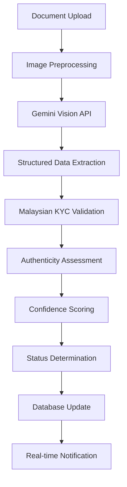

# Driver Document AI Verification System Guide

## 🎯 Overview

The GigaEats Driver Document AI Verification System provides comprehensive document verification capabilities using Google Gemini 2.5 Flash Lite AI vision model. This system processes uploaded driver verification documents, extracts structured data, validates authenticity, and ensures Malaysian KYC compliance for wallet access.

## 🤖 AI Vision Processing Architecture

### **Google Gemini 2.5 Flash Lite Integration**

The system leverages Google's advanced multimodal AI model for intelligent document analysis:



### **Processing Pipeline**

1. **Image Preprocessing**
   - Download from Supabase Storage
   - Convert to base64 for API transmission
   - Validate format and quality

2. **AI Vision Analysis**
   - Send document-specific prompts to Gemini
   - Extract structured data with confidence scores
   - Assess image quality and document condition
   - Detect potential tampering or authenticity issues

3. **Malaysian KYC Validation**
   - Validate IC number format (YYMMDD-PB-XXXX)
   - Check birth date consistency
   - Verify postcode format (5 digits)
   - Validate document expiry dates
   - Cross-reference data consistency

4. **Authenticity Assessment**
   - Analyze security features
   - Detect signs of tampering
   - Evaluate document quality
   - Generate authenticity confidence scores

## 📄 Supported Document Types

### **1. Malaysian IC Card (MyKad)**

**Front Side Processing:**
```json
{
  "extracted_fields": {
    "full_name": "AHMAD BIN ALI",
    "ic_number": "901234-12-3456",
    "birth_date": "1990-12-34",
    "birth_place": "KUALA LUMPUR",
    "gender": "LELAKI",
    "race": "MELAYU",
    "religion": "ISLAM",
    "nationality": "WARGANEGARA MALAYSIA"
  },
  "security_features": {
    "holographic_elements": true,
    "microprinting": true,
    "security_chip": true,
    "photo_quality": 92
  }
}
```

**Back Side Processing:**
```json
{
  "extracted_fields": {
    "address": "NO 123, JALAN MERDEKA, TAMAN SETIA",
    "postcode": "50000",
    "state": "KUALA LUMPUR",
    "country": "MALAYSIA"
  },
  "validation_results": {
    "postcode_format": true,
    "address_completeness": 95
  }
}
```

### **2. Malaysian Passport**

**Information Page Processing:**
```json
{
  "extracted_fields": {
    "passport_type": "P",
    "country_code": "MYS",
    "passport_number": "A12345678",
    "surname": "ALI",
    "given_names": "AHMAD BIN",
    "nationality": "MALAYSIAN",
    "date_of_birth": "1990-12-34",
    "place_of_birth": "KUALA LUMPUR",
    "gender": "M",
    "date_of_issue": "2020-01-15",
    "date_of_expiry": "2030-01-14",
    "personal_number": "901234123456"
  },
  "mrz_validation": {
    "format_correct": true,
    "checksum_valid": true,
    "machine_readable": true
  }
}
```

### **3. Driver's License**

```json
{
  "extracted_fields": {
    "license_number": "D1234567890",
    "full_name": "AHMAD BIN ALI",
    "ic_number": "901234-12-3456",
    "date_of_birth": "1990-12-34",
    "address": "NO 123, JALAN MERDEKA",
    "license_class": "D, DA",
    "date_of_issue": "2020-01-15",
    "date_of_expiry": "2025-01-14",
    "issuing_authority": "JPJ"
  }
}
```

### **4. Selfie Photo**

```json
{
  "extracted_fields": {
    "face_detected": true,
    "face_quality": 88,
    "lighting_quality": "good",
    "image_sharpness": 92,
    "background_type": "plain",
    "face_angle": "frontal",
    "eyes_visible": true,
    "face_obstructions": []
  },
  "quality_assessment": {
    "meets_requirements": true,
    "recommendations": []
  }
}
```

## 🔍 AI Prompt Engineering

### **Document-Specific Prompts**

The system uses carefully crafted prompts for each document type to ensure accurate extraction:

**Malaysian IC Card Prompt:**
```
You are an expert document verification AI. Analyze the Malaysian Identity Card and extract:

CRITICAL REQUIREMENTS:
1. Return ONLY valid JSON
2. Include confidence scores (0-100) for each field
3. Assess image quality and authenticity
4. Follow Malaysian document standards

Extract these fields:
- full_name: Full name as printed
- ic_number: 12-digit IC number (format: XXXXXX-XX-XXXX)
- birth_date: Date of birth
- [... additional fields ...]

Security features to check:
- Holographic elements
- Microprinting
- Photo quality and alignment
- [... additional checks ...]
```

### **Response Format Standardization**

All AI responses follow a consistent JSON structure:

```json
{
  "confidence_score": 92,
  "extracted_fields": { /* document-specific fields */ },
  "quality_assessment": {
    "image_quality": 90,
    "text_clarity": 88,
    "document_condition": "excellent",
    "recommendations": []
  },
  "authenticity_indicators": {
    "security_features_present": true,
    "text_consistency": true,
    "image_tampering_detected": false,
    "overall_authenticity": "authentic"
  }
}
```

## 📊 Confidence Scoring System

### **Multi-Layer Confidence Calculation**

The system uses a weighted confidence scoring approach:

```typescript
// Weighted average calculation
const overallConfidence = Math.round(
  (aiConfidence * 0.4) +        // AI extraction confidence (40%)
  (validationScore * 0.35) +    // Malaysian KYC validation (35%)
  (authenticityScore * 0.25)    // Document authenticity (25%)
)
```

### **Confidence Thresholds**

- **≥85% + Compliant + Authentic**: `verified` status
- **60-84% or Suspicious**: `manual_review` status  
- **<60% or Failed Validation**: `failed` status

### **Quality Assessment Metrics**

```json
{
  "image_quality": 90,        // Overall image clarity (0-100)
  "text_clarity": 88,         // Text readability (0-100)
  "document_condition": "excellent", // excellent|good|fair|poor
  "lighting_score": 85,       // Lighting quality (0-100)
  "focus_score": 92,          // Image sharpness (0-100)
  "angle_score": 88           // Document orientation (0-100)
}
```

## 🛡️ Security & Authenticity Validation

### **Tampering Detection**

The AI system analyzes multiple indicators for document tampering:

1. **Text Consistency Analysis**
   - Font uniformity across document
   - Character spacing and alignment
   - Text quality and resolution

2. **Image Manipulation Detection**
   - Pixel-level analysis for alterations
   - Compression artifact patterns
   - Color consistency checks

3. **Security Feature Validation**
   - Holographic element presence
   - Microprinting detection
   - Watermark analysis
   - Security thread visibility

### **Malaysian KYC Compliance Validation**

```typescript
// IC Number Format Validation
const MALAYSIAN_IC_REGEX = /^\d{6}-\d{2}-\d{4}$/

// Birth Date Consistency Check
const icPrefix = icNumber.substring(0, 6)
const birthYear = parseInt('20' + icPrefix.substring(0, 2))
const birthMonth = parseInt(icPrefix.substring(2, 4))
const birthDay = parseInt(icPrefix.substring(4, 6))

// Postcode Format Validation
const MALAYSIAN_POSTCODE_REGEX = /^\d{5}$/
```

## 🔄 Real-time Processing Flow

### **Status Updates via Supabase Subscriptions**

```typescript
// Document status progression
'pending' → 'processing' → 'verified'|'manual_review'|'failed'

// Real-time updates to Flutter app
supabase
  .from('driver_verification_documents')
  .on('UPDATE', payload => {
    // Update UI with new status
    updateVerificationProgress(payload.new)
  })
  .subscribe()
```

### **Processing Timeline**

- **Document Upload**: Instant
- **AI Processing**: 2-5 seconds
- **Validation**: 1-2 seconds
- **Status Update**: Real-time
- **Total Processing**: 3-7 seconds average

## 🧪 Testing & Validation

### **Test Document Requirements**

For comprehensive testing, prepare documents with:

1. **High Quality Images**
   - Resolution: ≥1080p
   - Format: JPEG/PNG
   - Size: <20MB
   - Lighting: Even, no shadows

2. **Various Conditions**
   - Different lighting conditions
   - Various angles and orientations
   - Different document conditions
   - Multiple document types

### **Confidence Score Validation**

```bash
# Test with high-quality document
curl -X POST 'https://your-project.supabase.co/functions/v1/driver-document-ai-verification' \
  -H 'Authorization: Bearer YOUR_KEY' \
  -H 'Content-Type: application/json' \
  -d '{
    "action": "process_document",
    "document_id": "test-doc-id",
    "document_type": "ic_card",
    "document_side": "front",
    "file_path": "path/to/high-quality-ic.jpg"
  }'

# Expected: confidence_score ≥ 85
```

## 📈 Performance Monitoring

### **Key Metrics to Track**

1. **Processing Performance**
   - Average processing time per document type
   - API response times
   - Success/failure rates

2. **Accuracy Metrics**
   - Confidence score distributions
   - Manual review rates
   - False positive/negative rates

3. **Cost Optimization**
   - Gemini API usage and costs
   - Processing efficiency
   - Resource utilization

### **Monitoring Dashboard Queries**

```sql
-- Average confidence scores by document type
SELECT 
  document_type,
  AVG(confidence_score) as avg_confidence,
  COUNT(*) as total_processed
FROM driver_verification_documents 
WHERE processing_status = 'verified'
GROUP BY document_type;

-- Processing time analysis
SELECT 
  document_type,
  AVG(EXTRACT(EPOCH FROM (processing_completed_at - processing_started_at))) as avg_processing_seconds
FROM driver_verification_documents 
WHERE processing_completed_at IS NOT NULL
GROUP BY document_type;
```

## 🚀 Deployment & Configuration

### **Environment Setup**

```bash
# Required environment variables
SUPABASE_URL=your_supabase_url
SUPABASE_SERVICE_ROLE_KEY=your_service_role_key
GEMINI_API_KEY=your_gemini_api_key

# Optional configuration
GEMINI_API_URL=https://generativelanguage.googleapis.com/v1beta/models/gemini-2.5-flash-lite:generateContent
```

### **Deployment Commands**

```bash
# Deploy Edge Function
./scripts/deploy-driver-document-ai-verification.sh

# Test deployment
supabase functions logs driver-document-ai-verification --follow
```

## 🔧 Troubleshooting

### **Common Issues & Solutions**

1. **Low Confidence Scores**
   - **Cause**: Poor image quality, lighting issues
   - **Solution**: Improve image capture guidelines, add quality checks

2. **Gemini API Errors**
   - **Cause**: API key issues, quota limits
   - **Solution**: Verify API configuration, monitor usage

3. **Validation Failures**
   - **Cause**: Document format issues, expired documents
   - **Solution**: Update validation rules, improve user guidance

### **Debug Logging**

```bash
# View detailed processing logs
supabase functions logs driver-document-ai-verification

# Monitor real-time processing
supabase functions logs driver-document-ai-verification --follow
```

---

**Last Updated**: January 2025  
**Version**: 1.0.0  
**AI Model**: Google Gemini 2.5 Flash Lite  
**Compliance**: Malaysian KYC Standards, PCI DSS
