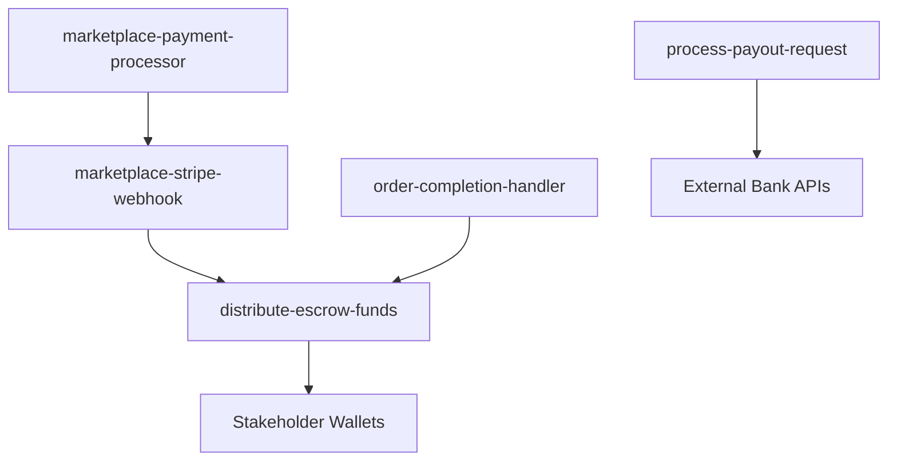

# GigaEats Marketplace Payment Edge Functions

## 🎯 Overview

This document describes the Supabase Edge Functions that power the GigaEats multi-party marketplace payment system. These functions handle secure payment processing, automated commission calculation, escrow fund management, and stakeholder fund distribution.

## 🚀 Edge Functions Architecture

### **Function Dependencies**



## 📋 Function Specifications

### **1. marketplace-payment-processor**

**Purpose**: Enhanced payment processing with marketplace escrow functionality

**Endpoint**: `/functions/v1/marketplace-payment-processor`

**Request Body**:
```typescript
{
  order_id: string
  payment_method: 'fpx' | 'credit_card' | 'grabpay' | 'tng' | 'boost' | 'shopeepay'
  amount: number
  currency?: string
  auto_escrow?: boolean
  release_trigger?: 'order_delivered' | 'manual_release' | 'auto_release'
  hold_duration_hours?: number
}
```

**Response**:
```typescript
{
  success: boolean
  transaction_id?: string
  escrow_account_id?: string
  client_secret?: string
  status: 'pending' | 'completed' | 'failed' | 'escrowed'
  commission_breakdown?: {
    total_amount: number
    vendor_amount: number
    platform_fee: number
    sales_agent_commission: number
    driver_commission: number
    delivery_fee: number
  }
}
```

**Key Features**:
- ✅ Integrates with existing Stripe/Billplz payment processing
- ✅ Automatic commission calculation based on delivery method
- ✅ Creates escrow accounts for fund holding
- ✅ Comprehensive audit logging
- ✅ Role-based access control validation

### **2. marketplace-stripe-webhook**

**Purpose**: Enhanced Stripe webhook handler with marketplace fund management

**Endpoint**: `/functions/v1/marketplace-stripe-webhook`

**Webhook Events Handled**:
- `payment_intent.succeeded` - Moves funds to escrow, triggers distribution
- `payment_intent.payment_failed` - Updates transaction status, handles refunds
- `payment_intent.canceled` - Cancels escrow accounts

**Key Features**:
- ✅ Automatic escrow status updates
- ✅ Conditional fund release for pickup orders
- ✅ Comprehensive error handling and rollback
- ✅ Financial audit trail logging
- ✅ Integration with fund distribution system

### **3. distribute-escrow-funds**

**Purpose**: Distributes held funds from escrow to stakeholder wallets

**Endpoint**: `/functions/v1/distribute-escrow-funds`

**Request Body**:
```typescript
{
  escrow_account_id?: string
  order_id?: string
  release_reason: 'order_delivered' | 'manual_release' | 'auto_release' | 'dispute_resolved'
  force_release?: boolean
}
```

**Response**:
```typescript
{
  success: boolean
  escrow_account_id: string
  distributions: Array<{
    wallet_id: string
    user_id: string
    user_role: string
    amount: number
    transaction_type: string
    description: string
  }>
  total_distributed: number
}
```

**Distribution Logic**:
1. **Vendor Share**: 80-92% of subtotal (based on delivery method)
2. **Platform Fee**: 5% of total order value
3. **Sales Agent Commission**: 3% of total order value
4. **Driver Commission**: 80% of delivery fee + variable percentage (own fleet only)

### **4. process-payout-request**

**Purpose**: Handles withdrawal requests from stakeholder wallets

**Endpoint**: `/functions/v1/process-payout-request`

**Request Body**:
```typescript
{
  amount: number
  bank_account_number: string
  bank_name: string
  account_holder_name: string
  swift_code?: string
  currency?: string
}
```

**Response**:
```typescript
{
  success: boolean
  payout_request_id: string
  status: 'pending' | 'processing' | 'completed' | 'failed'
  processing_fee: number
  net_amount: number
  estimated_completion: string
}
```

**Validation Rules**:
- ✅ Minimum payout: RM 10.00
- ✅ Maximum payout: RM 10,000.00
- ✅ Processing fee: 1% (minimum RM 2.00)
- ✅ No pending payout requests allowed
- ✅ Sufficient wallet balance required

### **5. order-completion-handler**

**Purpose**: Triggers fund release when orders are completed

**Endpoint**: `/functions/v1/order-completion-handler`

**Request Body**:
```typescript
{
  order_id: string
  completion_type: 'delivered' | 'picked_up' | 'cancelled' | 'refunded'
  completed_by?: string
  completion_notes?: string
  force_release?: boolean
}
```

**Response**:
```typescript
{
  success: boolean
  order_id: string
  escrow_released: boolean
  funds_distributed: boolean
  total_distributed?: number
}
```

**Trigger Conditions**:
- **Delivered Orders**: Automatic fund release
- **Pickup Orders**: Immediate fund release
- **Cancelled Orders**: Escrow marked for refund
- **Manual Release**: Admin override capability

## 🔒 Security & Authentication

### **Authentication Methods**

1. **User JWT Tokens**: For user-initiated requests
   ```typescript
   headers: {
     'Authorization': 'Bearer <user_jwt_token>'
   }
   ```

2. **Service Role Key**: For system/webhook calls
   ```typescript
   headers: {
     'Authorization': 'Bearer <service_role_key>'
   }
   ```

### **Access Control**

- **Payment Processing**: Order stakeholders only (customer, vendor, sales agent)
- **Fund Distribution**: System calls and admin users
- **Payout Requests**: Wallet owners only
- **Order Completion**: Authorized users and system triggers

### **Data Validation**

- ✅ Order ownership verification
- ✅ Payment amount validation
- ✅ Wallet balance checks
- ✅ Commission structure validation
- ✅ Bank account format verification

## 📊 Error Handling

### **Common Error Responses**

```typescript
{
  success: false,
  error: string,
  error_code?: string,
  details?: Record<string, any>
}
```

### **Error Categories**

1. **Authentication Errors** (401)
   - Invalid or expired JWT token
   - Missing authorization header

2. **Validation Errors** (400)
   - Missing required fields
   - Invalid amount values
   - Insufficient wallet balance

3. **Business Logic Errors** (422)
   - Order already paid
   - Escrow already released
   - Pending payout requests exist

4. **System Errors** (500)
   - Database connection failures
   - External API failures
   - Transaction rollback errors

## 🔄 Integration Patterns

### **Flutter Client Integration**

```dart
// Process marketplace payment
final response = await Supabase.instance.client.functions.invoke(
  'marketplace-payment-processor',
  body: {
    'order_id': orderId,
    'payment_method': 'credit_card',
    'amount': orderTotal,
    'auto_escrow': true,
  },
);

// Request payout
final payoutResponse = await Supabase.instance.client.functions.invoke(
  'process-payout-request',
  body: {
    'amount': 100.00,
    'bank_account_number': '1234567890',
    'bank_name': 'Maybank',
    'account_holder_name': 'John Doe',
  },
);
```

### **Webhook Integration**

```typescript
// Stripe webhook configuration
const webhookEndpoint = 'https://your-project.supabase.co/functions/v1/marketplace-stripe-webhook'

// Required webhook events
const events = [
  'payment_intent.succeeded',
  'payment_intent.payment_failed',
  'payment_intent.canceled'
]
```

### **Order System Integration**

```dart
// Trigger fund release on order completion
await Supabase.instance.client.functions.invoke(
  'order-completion-handler',
  body: {
    'order_id': orderId,
    'completion_type': 'delivered',
    'completed_by': driverId,
  },
);
```

## 📈 Monitoring & Logging

### **Financial Audit Logs**

All functions automatically log to `financial_audit_log` table:

```sql
SELECT 
  event_type,
  entity_type,
  amount,
  description,
  created_at
FROM financial_audit_log 
WHERE created_at > NOW() - INTERVAL '24 hours'
ORDER BY created_at DESC;
```

### **Performance Metrics**

Monitor function performance via Supabase dashboard:
- Execution time
- Success/failure rates
- Error frequency
- Resource usage

### **Key Metrics to Track**

1. **Payment Success Rate**: >95%
2. **Fund Distribution Accuracy**: 100%
3. **Payout Processing Time**: <3 business days
4. **Error Rate**: <1%
5. **Audit Log Completeness**: 100%

## 🚀 Deployment

### **Environment Variables**

```bash
# Stripe Configuration
STRIPE_SECRET_KEY=sk_live_...
STRIPE_WEBHOOK_SECRET=whsec_...

# Payout Configuration
MIN_PAYOUT_AMOUNT=10.00
MAX_PAYOUT_AMOUNT=10000.00
PAYOUT_FEE_RATE=0.01
MIN_PAYOUT_FEE=2.00

# Bank Transfer APIs
WISE_API_KEY=your_wise_api_key
LOCAL_BANK_API_ENDPOINT=https://api.bank.com
```

### **Deployment Commands**

```bash
# Deploy all marketplace functions
supabase functions deploy marketplace-payment-processor
supabase functions deploy marketplace-stripe-webhook
supabase functions deploy distribute-escrow-funds
supabase functions deploy process-payout-request
supabase functions deploy order-completion-handler

# Set environment variables
supabase secrets set STRIPE_SECRET_KEY=sk_live_...
supabase secrets set MIN_PAYOUT_AMOUNT=10.00
```

### **Testing**

```bash
# Test payment processing
curl -X POST https://your-project.supabase.co/functions/v1/marketplace-payment-processor \
  -H "Authorization: Bearer <jwt_token>" \
  -H "Content-Type: application/json" \
  -d '{"order_id":"test-order","payment_method":"credit_card","amount":50.00}'

# Test fund distribution
curl -X POST https://your-project.supabase.co/functions/v1/distribute-escrow-funds \
  -H "Authorization: Bearer <service_role_key>" \
  -H "Content-Type: application/json" \
  -d '{"order_id":"test-order","release_reason":"order_delivered"}'
```

## 🔧 Maintenance

### **Regular Tasks**

1. **Monitor Error Logs**: Check function logs daily
2. **Audit Financial Records**: Weekly reconciliation
3. **Performance Review**: Monthly performance analysis
4. **Security Updates**: Keep dependencies updated
5. **Backup Verification**: Ensure audit logs are backed up

### **Troubleshooting**

Common issues and solutions documented in the setup guide. For production issues, check:

1. Function logs in Supabase dashboard
2. Financial audit log for transaction trails
3. Database constraints and RLS policies
4. External API status (Stripe, banks)
5. Environment variable configuration
