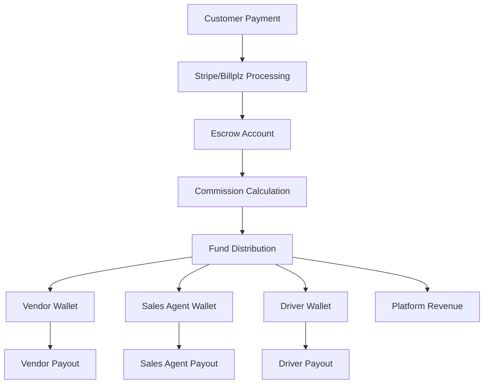

# GigaEats Multi-Party Marketplace Payment System

## 🎯 Overview

The GigaEats Multi-Party Marketplace Payment System is a comprehensive escrow-based financial platform that manages fund distribution across all stakeholders in the food delivery ecosystem. It provides secure payment processing, automated commission calculation, and transparent financial tracking while ensuring compliance with Malaysian financial regulations.

## 🏗️ System Architecture

### **Core Components**

1. **Escrow System**: Temporarily holds customer payments before distribution
2. **Stakeholder Wallets**: Individual balance tracking for all user roles
3. **Commission Engine**: Automated calculation and distribution of earnings
4. **Payout Management**: Secure withdrawal processing to bank accounts
5. **Audit Trail**: Comprehensive financial transaction logging
6. **Compliance Framework**: Malaysian regulatory compliance and risk management

### **Payment Flow Architecture**



## 📊 Database Schema

### **Core Tables**

#### **1. Escrow Accounts**
```sql
escrow_accounts (
  id UUID PRIMARY KEY,
  order_id UUID REFERENCES orders(id),
  total_amount DECIMAL(12,2),
  status escrow_status, -- 'pending', 'held', 'released', 'refunded', 'disputed'
  vendor_amount DECIMAL(12,2),
  platform_fee DECIMAL(12,2),
  sales_agent_commission DECIMAL(12,2),
  driver_commission DECIMAL(12,2),
  delivery_fee DECIMAL(12,2),
  release_trigger TEXT,
  release_date TIMESTAMPTZ
)
```

**Purpose**: Temporarily holds customer payments and manages fund allocation breakdown before distribution to stakeholders.

#### **2. Stakeholder Wallets**
```sql
stakeholder_wallets (
  id UUID PRIMARY KEY,
  user_id UUID REFERENCES auth.users(id),
  user_role TEXT, -- 'vendor', 'sales_agent', 'driver', 'customer'
  available_balance DECIMAL(12,2),
  pending_balance DECIMAL(12,2),
  total_earned DECIMAL(12,2),
  total_withdrawn DECIMAL(12,2),
  auto_payout_enabled BOOLEAN,
  auto_payout_threshold DECIMAL(12,2),
  bank_account_details JSONB
)
```

**Purpose**: Tracks individual wallet balances and payout preferences for each stakeholder.

#### **3. Wallet Transactions**
```sql
wallet_transactions (
  id UUID PRIMARY KEY,
  wallet_id UUID REFERENCES stakeholder_wallets(id),
  transaction_type wallet_transaction_type, -- 'credit', 'debit', 'commission', 'payout'
  amount DECIMAL(12,2),
  balance_before DECIMAL(12,2),
  balance_after DECIMAL(12,2),
  reference_type TEXT,
  reference_id UUID,
  description TEXT
)
```

**Purpose**: Detailed transaction log for all wallet activities and fund movements.

#### **4. Commission Structures**
```sql
commission_structures (
  id UUID PRIMARY KEY,
  platform_fee_rate DECIMAL(5,4), -- 0.0500 = 5%
  vendor_commission_rate DECIMAL(5,4), -- 0.8500 = 85%
  sales_agent_commission_rate DECIMAL(5,4), -- 0.0300 = 3%
  driver_commission_rate DECIMAL(5,4), -- 0.8000 = 80%
  delivery_method TEXT,
  effective_from TIMESTAMPTZ,
  effective_until TIMESTAMPTZ
)
```

**Purpose**: Configurable commission rates for different delivery methods and scenarios.

#### **5. Payout Requests**
```sql
payout_requests (
  id UUID PRIMARY KEY,
  wallet_id UUID REFERENCES stakeholder_wallets(id),
  amount DECIMAL(12,2),
  status payout_status, -- 'pending', 'processing', 'completed', 'failed'
  bank_account_number TEXT,
  bank_name TEXT,
  account_holder_name TEXT,
  processing_fee DECIMAL(12,2),
  gateway_transaction_id TEXT
)
```

**Purpose**: Manages withdrawal requests and bank transfer processing.

#### **6. Financial Audit Log**
```sql
financial_audit_log (
  id UUID PRIMARY KEY,
  event_type TEXT, -- 'payment_received', 'funds_escrowed', 'commission_calculated'
  entity_type TEXT, -- 'escrow_account', 'wallet_transaction', 'payout_request'
  entity_id UUID,
  user_id UUID,
  amount DECIMAL(12,2),
  old_status TEXT,
  new_status TEXT,
  compliance_flags JSONB,
  risk_score INTEGER
)
```

**Purpose**: Comprehensive audit trail for compliance and financial tracking.

## 💰 Commission Structure

### **Default Commission Rates**

| Delivery Method | Platform Fee | Vendor Share | Sales Agent | Driver Share | Delivery Fee |
|----------------|--------------|--------------|-------------|--------------|--------------|
| Customer Pickup | 5% | 92% | 3% | 0% | RM 0.00 |
| Sales Agent Pickup | 5% | 85% | 3% | 0% | RM 3.00 |
| Own Fleet Delivery | 5% | 80% | 3% | 12% | RM 8.00 |

### **Commission Calculation Example**

For a RM 50.00 order with own fleet delivery:
- **Subtotal**: RM 50.00
- **Delivery Fee**: RM 8.00
- **Total**: RM 58.00

**Distribution**:
- Platform Fee (5%): RM 2.90
- Vendor Share (80% of subtotal): RM 40.00
- Sales Agent Commission (3%): RM 1.74
- Driver Commission (12% + delivery fee): RM 6.00 + RM 8.00 = RM 14.00
- **Total Distributed**: RM 58.64 ✓

## 🔄 Payment Workflow

### **1. Payment Processing**
1. Customer initiates payment via Stripe/Billplz
2. Payment processed and verified
3. Funds moved to escrow account
4. Commission breakdown calculated
5. Order status updated to 'paid'

### **2. Escrow Management**
1. Funds held in escrow until release trigger
2. Release triggers:
   - Order delivered (automatic)
   - Manual release by admin
   - Auto-release after 7 days
3. Dispute handling for problematic orders

### **3. Fund Distribution**
1. Commission calculation based on delivery method
2. Funds distributed to stakeholder wallets
3. Real-time balance updates
4. Transaction logging and audit trail

### **4. Payout Processing**
1. Stakeholder requests payout
2. Admin approval (if required)
3. Bank transfer processing
4. Status tracking and confirmation

## 🔒 Security & Compliance

### **Row Level Security (RLS)**
- Users can only access their own wallet data
- Admins have full access for management
- Stakeholders can view related escrow accounts
- Audit logs restricted by role

### **Malaysian Compliance**
- Bank Negara Malaysia guidelines adherence
- Anti-money laundering (AML) monitoring
- Risk scoring for transactions
- Comprehensive audit trails
- Data encryption for sensitive information

### **Financial Controls**
- Automated balance validation
- Transaction amount limits
- Fraud detection algorithms
- Multi-level approval workflows
- Real-time monitoring and alerts

## 🚀 Integration Points

### **Existing Systems**
- **Orders Table**: Links to escrow accounts
- **Payment Transactions**: Enhanced with escrow references
- **User Profiles**: Automatic wallet creation
- **Driver Earnings**: Integrated with wallet system
- **Stripe Webhooks**: Enhanced for fund distribution

### **Real-time Features**
- Live wallet balance updates
- Transaction notifications
- Payout status tracking
- Commission calculations
- Audit log streaming

## 📱 User Interface Components

### **Vendor Dashboard**
- Wallet balance display
- Earnings breakdown
- Transaction history
- Payout request interface
- Commission rate visibility

### **Sales Agent Dashboard**
- Commission tracking
- Wallet management
- Payout scheduling
- Performance analytics
- Transaction filtering

### **Driver Dashboard**
- Earnings summary
- Delivery fee tracking
- Wallet balance
- Payout requests
- Performance metrics

### **Admin Dashboard**
- System-wide financial overview
- Commission structure management
- Payout approval workflow
- Audit log monitoring
- Risk management tools

## 🔧 Configuration

### **Commission Rate Management**
- Role-based rate configuration
- Delivery method specific rates
- Time-based rate changes
- Vendor-specific negotiations
- Bulk rate updates

### **Payout Settings**
- Automatic payout thresholds
- Payout schedules (daily/weekly/monthly)
- Bank account verification
- Processing fee configuration
- Currency support

### **Risk Management**
- Transaction monitoring rules
- Automated risk scoring
- Compliance flag triggers
- Alert thresholds
- Audit requirements

## 📈 Analytics & Reporting

### **Financial Metrics**
- Total platform revenue
- Commission distribution
- Payout volumes
- Transaction success rates
- Average order values

### **Stakeholder Analytics**
- Individual earnings tracking
- Performance comparisons
- Payout frequency analysis
- Commission optimization
- Growth trends

### **Compliance Reporting**
- Regulatory compliance status
- Audit trail summaries
- Risk assessment reports
- Transaction monitoring
- AML compliance metrics
