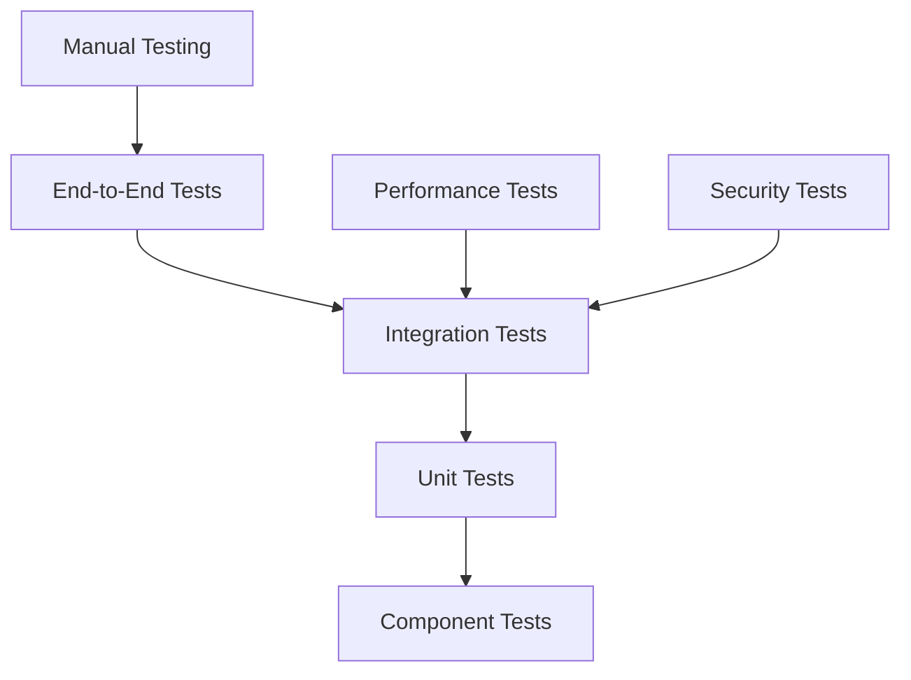

# GigaEats Marketplace Payment System Testing Strategy

## 🎯 Overview

This document outlines the comprehensive testing strategy for the GigaEats marketplace payment system integration, covering unit tests, integration tests, end-to-end tests, and backward compatibility validation.

## 🧪 Testing Architecture

### **Testing Pyramid Structure**



**Test Distribution**:
- **Unit Tests**: 70% - Fast, isolated, comprehensive coverage
- **Integration Tests**: 20% - Service interactions, data flow
- **End-to-End Tests**: 10% - Complete user workflows

## 📋 Test Categories

### **1. Unit Tests**

**Purpose**: Test individual components in isolation

**Coverage Areas**:
- Payment flow integration logic
- Order completion integration logic
- Commission calculation algorithms
- Escrow account management
- Wallet transaction processing
- Error handling and fallback mechanisms

**Key Test Files**:
```
test/features/marketplace_wallet/
├── integration/
│   ├── payment_flow_integration_test.dart
│   ├── order_completion_integration_test.dart
│   └── end_to_end_payment_flow_test.dart
├── data/
│   ├── services/marketplace_payment_service_test.dart
│   ├── repositories/wallet_repository_test.dart
│   └── models/commission_breakdown_test.dart
└── presentation/
    ├── providers/wallet_state_provider_test.dart
    ├── providers/transaction_history_provider_test.dart
    └── widgets/wallet_balance_card_test.dart
```

### **2. Integration Tests**

**Purpose**: Test interactions between multiple components

**Test Scenarios**:
- Payment processing with Stripe integration
- Escrow account creation and management
- Fund distribution across stakeholders
- Real-time wallet updates
- Database transaction consistency
- Webhook handling and processing

**Example Integration Test**:
```dart
testWidgets('Payment processing integration', (WidgetTester tester) async {
  // Setup test environment
  final container = ProviderContainer(overrides: [
    supabaseClientProvider.overrideWithValue(mockSupabaseClient),
    stripeProvider.overrideWithValue(mockStripe),
  ]);

  // Test payment flow
  final paymentService = container.read(marketplacePaymentServiceProvider);
  final result = await paymentService.processPayment(
    orderId: 'test_order',
    amount: 55.90,
    paymentMethod: MarketplacePaymentMethod.creditCard,
  );

  // Verify results
  expect(result.isRight(), isTrue);
  
  // Verify database state
  final escrowAccount = await paymentService.getEscrowAccount('test_order');
  expect(escrowAccount.totalAmount, equals(55.90));
});
```

### **3. End-to-End Tests**

**Purpose**: Test complete user workflows from start to finish

**Test Scenarios**:
- Complete order creation and payment flow
- Order delivery and fund distribution
- Order cancellation and refund processing
- Multi-stakeholder wallet updates
- Real-time notification delivery
- Cross-platform compatibility

**E2E Test Structure**:
```dart
group('Complete Order Lifecycle', () {
  testWidgets('Customer order to delivery completion', (tester) async {
    // 1. Customer creates order
    // 2. Payment processing
    // 3. Vendor accepts order
    // 4. Driver picks up order
    // 5. Order delivered
    // 6. Funds distributed
    // 7. Verify all stakeholder wallets updated
  });
});
```

## 🔧 Testing Tools & Framework

### **Testing Stack**

**Core Testing**:
- **flutter_test**: Flutter testing framework
- **mockito**: Mock object generation
- **flutter_riverpod**: Provider testing utilities
- **integration_test**: Flutter integration testing

**Database Testing**:
- **supabase_test**: Supabase testing utilities
- **postgres_test**: PostgreSQL testing helpers

**Payment Testing**:
- **stripe_test**: Stripe testing utilities
- **webhook_test**: Webhook simulation tools

### **Mock Setup**

```dart
@GenerateMocks([
  MarketplacePaymentService,
  PaymentService,
  SupabaseClient,
  Stripe,
])
class TestMocks {}

// Mock configuration
void setupMocks() {
  when(mockMarketplacePaymentService.processPayment(
    orderId: anyNamed('orderId'),
    amount: anyNamed('amount'),
    paymentMethod: anyNamed('paymentMethod'),
  )).thenAnswer((_) async => Right(mockPaymentResult));
}
```

## 📊 Test Coverage Requirements

### **Coverage Targets**

- **Overall Code Coverage**: ≥ 90%
- **Critical Path Coverage**: 100%
- **Error Handling Coverage**: ≥ 95%
- **Integration Points**: 100%

### **Critical Paths**

1. **Payment Processing Flow**:
   - Order creation → Payment intent → Payment confirmation → Escrow creation
   - Coverage: 100%

2. **Fund Distribution Flow**:
   - Order delivery → Escrow release → Commission calculation → Wallet updates
   - Coverage: 100%

3. **Error Recovery Flow**:
   - Payment failures → Fallback mechanisms → User notification
   - Coverage: 100%

4. **Backward Compatibility**:
   - Legacy payment handling → Marketplace migration → Feature parity
   - Coverage: 100%

## 🧩 Test Data Management

### **Test Data Strategy**

**Test Data Categories**:
- **Static Test Data**: Predefined test orders, users, and configurations
- **Dynamic Test Data**: Generated test data for edge cases
- **Mock Data**: Simulated external service responses

**Test Data Setup**:
```dart
class TestDataFactory {
  static Order createTestOrder({
    String? id,
    double? totalAmount,
    OrderStatus? status,
  }) {
    return Order(
      id: id ?? 'test_order_${DateTime.now().millisecondsSinceEpoch}',
      totalAmount: totalAmount ?? 55.90,
      status: status ?? OrderStatus.pending,
      // ... other required fields
    );
  }

  static CommissionBreakdown createCommissionBreakdown({
    double? totalAmount,
  }) {
    final amount = totalAmount ?? 55.90;
    return CommissionBreakdown(
      totalAmount: amount,
      vendorAmount: amount * 0.80,
      platformFee: amount * 0.05,
      salesAgentCommission: amount * 0.03,
      driverCommission: amount * 0.12,
      deliveryFee: 8.00,
      orderId: 'test_order',
      calculatedAt: DateTime.now(),
    );
  }
}
```

## 🔄 Continuous Integration

### **CI/CD Pipeline Testing**

**Test Stages**:
1. **Unit Tests**: Run on every commit
2. **Integration Tests**: Run on pull requests
3. **E2E Tests**: Run on staging deployment
4. **Performance Tests**: Run nightly
5. **Security Tests**: Run weekly

**GitHub Actions Workflow**:
```yaml
name: Marketplace Wallet Tests

on: [push, pull_request]

jobs:
  unit-tests:
    runs-on: ubuntu-latest
    steps:
      - uses: actions/checkout@v3
      - uses: subosito/flutter-action@v2
      - run: flutter test test/features/marketplace_wallet/

  integration-tests:
    runs-on: ubuntu-latest
    needs: unit-tests
    steps:
      - uses: actions/checkout@v3
      - uses: supabase/setup-cli@v1
      - run: supabase start
      - run: flutter test integration_test/
```

## 🛡️ Security Testing

### **Security Test Areas**

**Authentication & Authorization**:
- RLS policy enforcement
- JWT token validation
- Role-based access control
- Session management

**Data Protection**:
- Sensitive data encryption
- PII handling compliance
- Payment data security
- Audit trail integrity

**API Security**:
- Input validation
- SQL injection prevention
- Rate limiting
- CORS configuration

**Security Test Examples**:
```dart
group('Security Tests', () {
  test('should enforce RLS policies', () async {
    // Test unauthorized access attempts
    final unauthorizedClient = createUnauthorizedClient();
    
    expect(
      () => unauthorizedClient.from('stakeholder_wallets').select(),
      throwsA(isA<PostgrestException>()),
    );
  });

  test('should validate payment amounts', () async {
    // Test negative amount validation
    final result = await paymentService.processPayment(
      orderId: 'test_order',
      amount: -10.00, // Invalid negative amount
      paymentMethod: MarketplacePaymentMethod.creditCard,
    );
    
    expect(result.isLeft(), isTrue);
    expect(result.fold((l) => l.message, (r) => ''), contains('Invalid amount'));
  });
});
```

## 📈 Performance Testing

### **Performance Test Scenarios**

**Load Testing**:
- Concurrent payment processing
- High-volume transaction history queries
- Real-time wallet updates under load
- Database connection pooling

**Stress Testing**:
- Payment system failure recovery
- Database transaction rollback
- Memory usage under load
- Response time degradation

**Performance Benchmarks**:
```dart
group('Performance Tests', () {
  test('payment processing should complete within 5 seconds', () async {
    final stopwatch = Stopwatch()..start();
    
    await paymentService.processPayment(
      orderId: 'perf_test_order',
      amount: 55.90,
      paymentMethod: MarketplacePaymentMethod.creditCard,
    );
    
    stopwatch.stop();
    expect(stopwatch.elapsedMilliseconds, lessThan(5000));
  });
});
```

## 🔍 Test Monitoring & Reporting

### **Test Metrics**

**Key Metrics**:
- Test execution time
- Test success/failure rates
- Code coverage percentages
- Performance benchmarks
- Security vulnerability counts

**Reporting Tools**:
- **Coverage Reports**: lcov, codecov
- **Test Reports**: JUnit XML format
- **Performance Reports**: Custom dashboards
- **Security Reports**: SAST/DAST tools

### **Test Quality Gates**

**Quality Criteria**:
- All tests must pass
- Code coverage ≥ 90%
- No critical security vulnerabilities
- Performance benchmarks met
- Integration tests successful

## 🚀 Test Execution Strategy

### **Local Development**

```bash
# Run unit tests
flutter test test/features/marketplace_wallet/

# Run integration tests
flutter test integration_test/

# Run with coverage
flutter test --coverage
genhtml coverage/lcov.info -o coverage/html
```

### **Staging Environment**

```bash
# Run E2E tests against staging
flutter drive --target=integration_test/marketplace_wallet_e2e_test.dart

# Run performance tests
flutter test test/performance/marketplace_wallet_performance_test.dart
```

### **Production Monitoring**

- **Synthetic Tests**: Automated production health checks
- **Real User Monitoring**: Track actual user payment flows
- **Error Tracking**: Monitor payment failures and recovery
- **Performance Monitoring**: Track payment processing times

This comprehensive testing strategy ensures the marketplace payment system is robust, secure, and performs well under various conditions while maintaining backward compatibility with existing payment flows.
