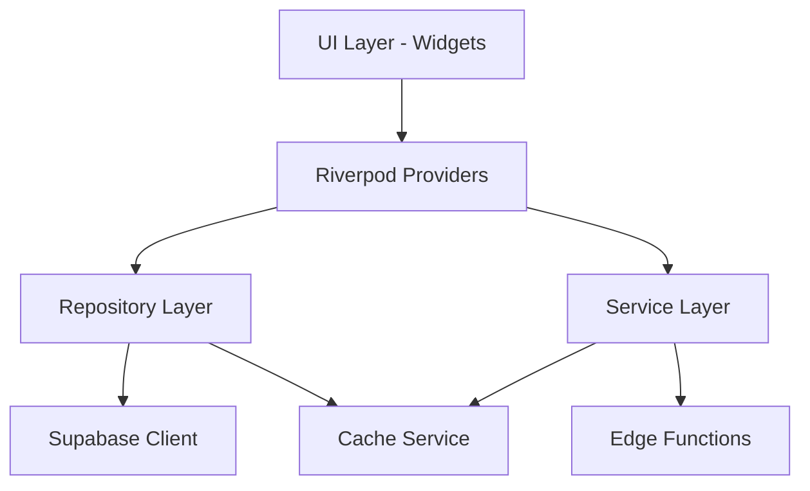

# GigaEats Marketplace Wallet Repository & Service Layer

## 🎯 Overview

This document describes the Flutter repository and service layer implementation for the GigaEats marketplace wallet system. These components provide a clean abstraction layer between the UI and the Supabase backend, implementing proper error handling, caching strategies, and Riverpod integration.

## 🏗️ Architecture Overview

### **Layer Structure**



### **Key Components**

1. **Data Models**: Type-safe data classes with JSON serialization
2. **Repository Layer**: Database operations and data management
3. **Service Layer**: Business logic and Edge Function integration
4. **Cache Service**: Local data caching for performance
5. **Riverpod Providers**: Dependency injection and state management

## 📊 Data Models

### **StakeholderWallet**

```dart
class StakeholderWallet {
  final String id;
  final String userId;
  final String userRole;
  final double availableBalance;
  final double pendingBalance;
  final double totalEarned;
  final double totalWithdrawn;
  final bool autoPayoutEnabled;
  final double? autoPayoutThreshold;
  // ... additional fields
}
```

**Key Features**:
- ✅ Formatted currency display methods
- ✅ Wallet status calculation (active, inactive, unverified, empty)
- ✅ Auto-payout eligibility checks
- ✅ Next payout date estimation
- ✅ Test factory methods for development

### **WalletTransaction**

```dart
class WalletTransaction {
  final String id;
  final String walletId;
  final WalletTransactionType transactionType;
  final double amount;
  final double balanceBefore;
  final double balanceAfter;
  final String? description;
  // ... additional fields
}
```

**Transaction Types**:
- `credit` - Money added to wallet
- `debit` - Money removed from wallet
- `commission` - Commission earnings
- `payout` - Withdrawal processing
- `refund` - Refund received
- `adjustment` - Balance adjustment
- `bonus` - Bonus payment

### **PayoutRequest**

```dart
class PayoutRequest {
  final String id;
  final String walletId;
  final double amount;
  final PayoutStatus status;
  final String bankAccountNumber;
  final String bankName;
  final String accountHolderName;
  final double processingFee;
  final double netAmount;
  // ... additional fields
}
```

**Payout Statuses**:
- `pending` - Awaiting processing
- `processing` - Being processed
- `completed` - Successfully completed
- `failed` - Processing failed
- `cancelled` - Cancelled by user/admin

### **CommissionBreakdown**

```dart
class CommissionBreakdown {
  final double totalAmount;
  final double vendorAmount;
  final double platformFee;
  final double salesAgentCommission;
  final double driverCommission;
  final double deliveryFee;
  // ... additional fields
}
```

## 🗄️ Repository Layer

### **MarketplaceWalletRepository**

**Purpose**: Handles all database operations related to wallets, transactions, and payouts.

**Key Methods**:

```dart
// Get wallet for current user
Future<Either<Failure, StakeholderWallet?>> getWallet(String userRole)

// Real-time wallet updates
Stream<StakeholderWallet?> getWalletStream(String userRole)

// Get wallet transactions with pagination
Future<Either<Failure, List<WalletTransaction>>> getWalletTransactions({
  required String walletId,
  int limit = 20,
  int offset = 0,
  WalletTransactionType? type,
  DateTime? startDate,
  DateTime? endDate,
})

// Create payout request
Future<Either<Failure, PayoutRequest>> createPayoutRequest({
  required double amount,
  required String bankAccountNumber,
  required String bankName,
  required String accountHolderName,
  String? swiftCode,
})

// Update wallet settings
Future<Either<Failure, StakeholderWallet>> updateWalletSettings({
  required String walletId,
  bool? autoPayoutEnabled,
  double? autoPayoutThreshold,
  String? payoutSchedule,
  Map<String, dynamic>? bankAccountDetails,
})
```

**Error Handling**:
- Uses `Either<Failure, T>` pattern for error handling
- Comprehensive logging with debug prints
- Graceful degradation for network issues
- Proper exception mapping to user-friendly messages

**Caching Integration**:
- Automatic cache invalidation on data updates
- Cache-first strategy for frequently accessed data
- Fallback to network when cache is stale

## 🔧 Service Layer

### **MarketplacePaymentService**

**Purpose**: Handles business logic and Edge Function integration for payment processing.

**Key Methods**:

```dart
// Process marketplace payment with escrow
Future<Either<Failure, MarketplacePaymentResult>> processMarketplacePayment({
  required String orderId,
  required String paymentMethod,
  required double amount,
  String currency = 'MYR',
  bool autoEscrow = true,
  String releaseTriger = 'order_delivered',
})

// Distribute funds from escrow
Future<Either<Failure, FundDistributionResult>> distributeFunds({
  String? escrowAccountId,
  String? orderId,
  required String releaseReason,
  bool forceRelease = false,
})

// Complete order and trigger fund release
Future<Either<Failure, OrderCompletionResult>> completeOrder({
  required String orderId,
  required String completionType,
  String? completedBy,
  String? completionNotes,
})

// Calculate commission breakdown
Future<Either<Failure, CommissionBreakdown>> calculateCommissionBreakdown({
  required String orderId,
})
```

**Business Logic**:
- Commission calculation based on delivery method
- Automatic fund release trigger management
- Payment status tracking and validation
- Integration with existing order management system

### **WalletCacheService**

**Purpose**: Provides intelligent caching for wallet data to improve performance.

**Caching Strategy**:
- **Wallet Data**: 5-minute cache duration
- **Transactions**: 2-minute cache duration
- **Analytics**: 10-minute cache duration
- **Automatic Expiration**: Stale data automatically removed

**Key Methods**:

```dart
// Cache wallet data
Future<void> cacheWallet(StakeholderWallet wallet)

// Get cached wallet
Future<StakeholderWallet?> getCachedWallet(String userId, String userRole)

// Cache transactions
Future<void> cacheTransactions(String walletId, List<WalletTransaction> transactions)

// Clear specific cache
Future<void> clearWalletCache(String userId, String userRole)

// Get cache statistics
Future<CacheStatistics> getCacheStatistics()
```

## 🔄 Riverpod Integration

### **Provider Structure**

```dart
// Core providers
final supabaseClientProvider = Provider<SupabaseClient>((ref) => Supabase.instance.client);
final walletCacheServiceProvider = Provider<WalletCacheService>((ref) => WalletCacheService());

// Repository providers
final marketplaceWalletRepositoryProvider = Provider<MarketplaceWalletRepository>((ref) {
  final client = ref.watch(supabaseClientProvider);
  return MarketplaceWalletRepository(client: client);
});

// Service providers
final marketplacePaymentServiceProvider = Provider<MarketplacePaymentService>((ref) {
  final client = ref.watch(supabaseClientProvider);
  return MarketplacePaymentService(client: client);
});
```

### **Usage in UI Components**

```dart
class WalletDashboard extends ConsumerWidget {
  @override
  Widget build(BuildContext context, WidgetRef ref) {
    final repository = ref.watch(walletRepositoryProvider);
    
    return FutureBuilder(
      future: repository.getWallet('vendor'),
      builder: (context, snapshot) {
        // Handle loading, error, and success states
      },
    );
  }
}
```

## 🔒 Error Handling

### **Error Types**

1. **NetworkFailure**: Connection issues
2. **ServerFailure**: Server-side errors
3. **CacheFailure**: Local storage issues
4. **ValidationFailure**: Data validation errors
5. **AuthenticationFailure**: Authentication issues

### **Error Handling Pattern**

```dart
final result = await repository.getWallet('vendor');
result.fold(
  (failure) {
    // Handle error
    switch (failure.runtimeType) {
      case NetworkFailure:
        showNetworkError();
        break;
      case ServerFailure:
        showServerError();
        break;
      default:
        showGenericError();
    }
  },
  (wallet) {
    // Handle success
    updateUI(wallet);
  },
);
```

## 📈 Performance Optimization

### **Caching Strategy**

1. **Cache-First Approach**: Check cache before network requests
2. **Intelligent Invalidation**: Clear cache on data mutations
3. **Background Refresh**: Update cache in background
4. **Memory Management**: Automatic cleanup of stale data

### **Network Optimization**

1. **Request Batching**: Combine multiple requests when possible
2. **Pagination**: Load data in chunks to reduce memory usage
3. **Selective Loading**: Only fetch required fields
4. **Connection Pooling**: Reuse Supabase connections

### **Real-time Updates**

```dart
// Stream-based real-time updates
Stream<StakeholderWallet?> getWalletStream(String userRole) {
  return client
      .from('stakeholder_wallets')
      .stream(primaryKey: ['id'])
      .eq('user_id', currentUserUid!)
      .eq('user_role', userRole)
      .map((data) => data.isEmpty ? null : StakeholderWallet.fromJson(data.first));
}
```

## 🧪 Testing Support

### **Test Factories**

```dart
// Create test wallet
final testWallet = StakeholderWallet.test(
  availableBalance: 150.00,
  userRole: 'vendor',
);

// Create test transaction
final testTransaction = WalletTransaction.test(
  amount: 50.00,
  transactionType: WalletTransactionType.commission,
);

// Create test payout request
final testPayout = PayoutRequest.test(
  amount: 100.00,
  status: PayoutStatus.pending,
);
```

### **Mock Repository**

```dart
class MockMarketplaceWalletRepository implements MarketplaceWalletRepository {
  @override
  Future<Either<Failure, StakeholderWallet?>> getWallet(String userRole) async {
    return Right(StakeholderWallet.test(userRole: userRole));
  }
  
  // ... implement other methods for testing
}
```

## 🔧 Configuration

### **Environment Variables**

```dart
// Repository configuration
static const int defaultPageSize = 20;
static const Duration cacheTimeout = Duration(minutes: 5);
static const int maxRetryAttempts = 3;

// Service configuration
static const String defaultCurrency = 'MYR';
static const double minPayoutAmount = 10.00;
static const double maxPayoutAmount = 10000.00;
```

### **Feature Flags**

```dart
// Enable/disable features
static const bool enableCaching = true;
static const bool enableRealTimeUpdates = true;
static const bool enableAnalytics = true;
```

## 🚀 Usage Examples

### **Basic Wallet Operations**

```dart
// Get wallet
final walletResult = await repository.getWallet('vendor');
walletResult.fold(
  (failure) => handleError(failure),
  (wallet) => displayWallet(wallet),
);

// Create payout request
final payoutResult = await repository.createPayoutRequest(
  amount: 100.00,
  bankAccountNumber: '1234567890',
  bankName: 'Maybank',
  accountHolderName: 'John Doe',
);
```

### **Payment Processing**

```dart
// Process marketplace payment
final paymentResult = await paymentService.processMarketplacePayment(
  orderId: 'order-123',
  paymentMethod: 'credit_card',
  amount: 58.00,
);

// Calculate commission breakdown
final commissionResult = await paymentService.calculateCommissionBreakdown(
  orderId: 'order-123',
);
```

### **Real-time Updates**

```dart
// Listen to wallet changes
ref.listen(walletStreamProvider('vendor'), (previous, next) {
  next.when(
    data: (wallet) => updateWalletUI(wallet),
    loading: () => showLoadingIndicator(),
    error: (error, stack) => showError(error),
  );
});
```

This repository and service layer provides a robust foundation for the marketplace wallet system, ensuring type safety, proper error handling, and optimal performance through intelligent caching and real-time updates.
