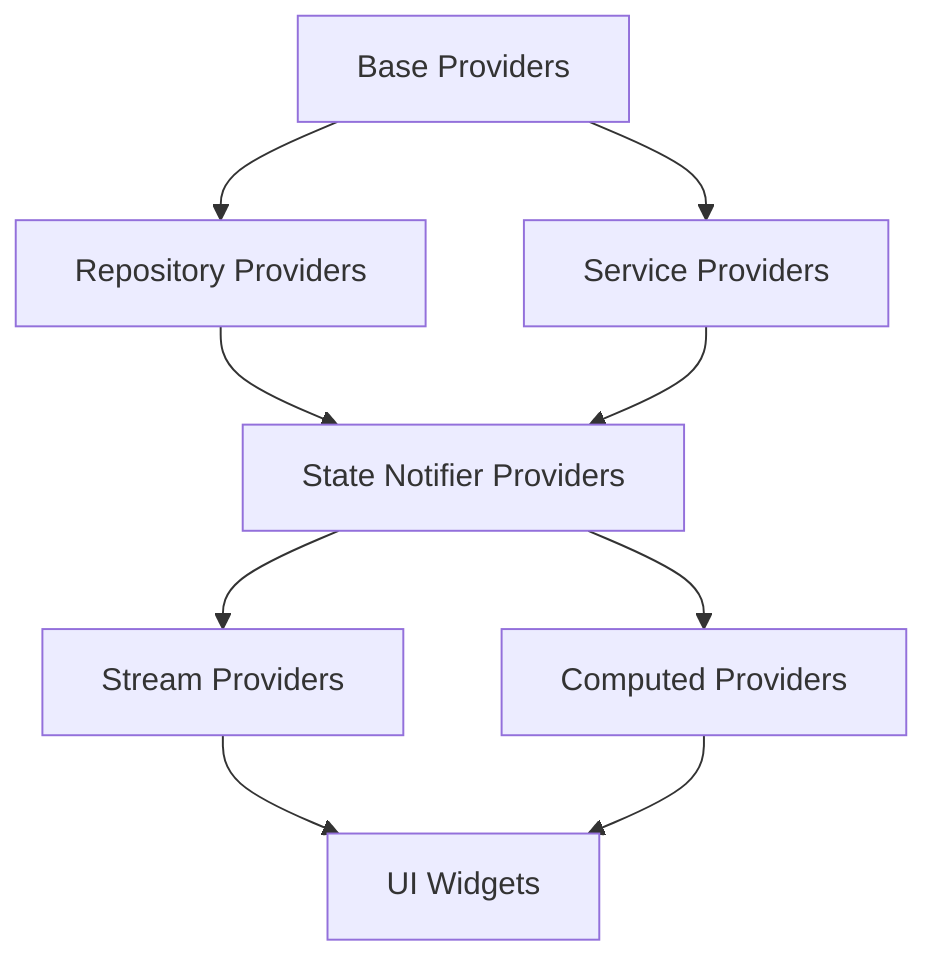

# GigaEats Marketplace Wallet Riverpod Providers

## 🎯 Overview

This document describes the comprehensive Riverpod state management implementation for the GigaEats marketplace wallet system. The providers manage real-time wallet data, transaction history, payout requests, commission tracking, and notifications with proper error handling and caching strategies.

## 🏗️ Provider Architecture

### **Provider Hierarchy**



### **Core Provider Categories**

1. **Base Providers**: Supabase client, cache service, repository instances
2. **State Notifier Providers**: Mutable state management with business logic
3. **Stream Providers**: Real-time data updates from Supabase
4. **Computed Providers**: Derived state and calculations
5. **Action Providers**: Centralized operations for UI components

## 📊 Provider Specifications

### **1. Wallet State Provider**

**Purpose**: Manages wallet data and operations for stakeholders

**File**: `wallet_state_provider.dart`

**Key Providers**:

```dart
// Family provider for different user roles
final walletStateProvider = StateNotifierProvider.family<WalletStateNotifier, WalletState, String>((ref, userRole) => ...);

// Current user wallet provider (auto-detects role)
final currentUserWalletProvider = StateNotifierProvider<WalletStateNotifier, WalletState>((ref) => ...);

// Real-time wallet stream
final walletStreamProvider = StreamProvider.family<StakeholderWallet?, String>((ref, userRole) => ...);

// Quick balance access
final walletBalanceProvider = Provider.family<double, String>((ref, userRole) => ...);

// Wallet status
final walletStatusProvider = Provider.family<WalletStatus, String>((ref, userRole) => ...);
```

**State Management**:
- ✅ **Cache-first strategy** with automatic fallback to network
- ✅ **Real-time updates** via Supabase subscriptions
- ✅ **Error handling** with user-friendly failure messages
- ✅ **Loading states** for UI feedback
- ✅ **Settings management** for auto-payout configuration

**Key Features**:
- Automatic wallet creation for new users
- Real-time balance updates
- Cache invalidation on data changes
- Wallet settings management (auto-payout, thresholds)
- Connection status tracking

### **2. Transaction History Provider**

**Purpose**: Manages wallet transaction history with pagination and filtering

**File**: `wallet_transactions_provider.dart`

**Key Providers**:

```dart
// Family provider for different wallets
final transactionHistoryProvider = StateNotifierProvider.family<TransactionHistoryNotifier, TransactionHistoryState, String>((ref, walletId) => ...);

// Current user transactions
final currentUserTransactionHistoryProvider = StateNotifierProvider<TransactionHistoryNotifier, TransactionHistoryState>((ref) => ...);

// Real-time transaction stream
final transactionStreamProvider = StreamProvider.family<List<WalletTransaction>, String>((ref, walletId) => ...);

// Transaction summary
final transactionSummaryProvider = Provider.family<TransactionSummary, String>((ref, walletId) => ...);
```

**Features**:
- ✅ **Pagination support** with load-more functionality
- ✅ **Advanced filtering** by type, date range
- ✅ **Real-time updates** for new transactions
- ✅ **Cache management** with intelligent invalidation
- ✅ **Transaction summary** calculations

**Filtering Options**:
- Transaction type (credit, debit, commission, payout, refund, adjustment, bonus)
- Date range (start date, end date)
- Amount range
- Status filtering

### **3. Payout Management Provider**

**Purpose**: Manages payout requests and bank transfer processing

**File**: `payout_management_provider.dart`

**Key Providers**:

```dart
// Family provider for different wallets
final payoutManagementProvider = StateNotifierProvider.family<PayoutManagementNotifier, PayoutManagementState, String>((ref, walletId) => ...);

// Current user payouts
final currentUserPayoutManagementProvider = StateNotifierProvider<PayoutManagementNotifier, PayoutManagementState>((ref) => ...);

// Payout summary
final payoutSummaryProvider = Provider.family<PayoutSummary, String>((ref, walletId) => ...);
```

**Features**:
- ✅ **Payout request creation** with bank account validation
- ✅ **Status tracking** (pending, processing, completed, failed, cancelled)
- ✅ **Processing fee calculation** (1% minimum RM 2.00)
- ✅ **Real-time status updates** via webhooks
- ✅ **Payout history** with filtering and pagination

**Validation Rules**:
- Minimum payout: RM 10.00
- Maximum payout: RM 10,000.00
- No pending payouts allowed
- Sufficient wallet balance required
- Bank account format validation

### **4. Commission Tracking Provider**

**Purpose**: Tracks commission earnings and analytics for stakeholders

**File**: `commission_tracking_provider.dart`

**Key Providers**:

```dart
// Family provider for different user roles
final commissionTrackingProvider = StateNotifierProvider.family<CommissionTrackingNotifier, CommissionTrackingState, String>((ref, userRole) => ...);

// Current user commission tracking
final currentUserCommissionTrackingProvider = StateNotifierProvider<CommissionTrackingNotifier, CommissionTrackingState>((ref) => ...);
```

**Features**:
- ✅ **Period-based analysis** (today, this week, this month, last month, last 30 days, custom)
- ✅ **Commission breakdown** by delivery method and stakeholder role
- ✅ **Growth rate calculation** compared to previous periods
- ✅ **Average commission** and total earnings tracking
- ✅ **Order-specific commission** breakdown retrieval

**Commission Periods**:
- Today
- This Week
- This Month
- Last Month
- Last 30 Days
- Custom Date Range

### **5. Wallet Notifications Provider**

**Purpose**: Manages real-time notifications for wallet events

**File**: `wallet_notifications_provider.dart`

**Key Providers**:

```dart
// Family provider for different user roles
final walletNotificationsProvider = StateNotifierProvider.family<WalletNotificationsNotifier, WalletNotificationsState, String>((ref, userRole) => ...);

// Current user notifications
final currentUserWalletNotificationsProvider = StateNotifierProvider<WalletNotificationsNotifier, WalletNotificationsState>((ref) => ...);

// Unread count
final unreadNotificationsCountProvider = Provider.family<int, String>((ref, userRole) => ...);
```

**Notification Types**:
- ✅ **Balance Updates**: Automatic notifications for balance changes
- ✅ **Transaction Received**: New transaction notifications
- ✅ **Payout Status**: Completed/failed payout notifications
- ✅ **Auto Payout Triggered**: Threshold reached notifications
- ✅ **Low Balance**: Balance warning notifications
- ✅ **Verification Required**: Account verification reminders

**Features**:
- Real-time notification generation
- Unread count tracking
- Notification persistence (last 50 notifications)
- Mark as read/unread functionality
- Action URLs for navigation

## 🔄 Real-time Integration

### **Supabase Subscriptions**

```dart
// Wallet real-time updates
Stream<StakeholderWallet?> getWalletStream(String userRole) {
  return client
      .from('stakeholder_wallets')
      .stream(primaryKey: ['id'])
      .eq('user_id', currentUserUid!)
      .eq('user_role', userRole)
      .map((data) => data.isEmpty ? null : StakeholderWallet.fromJson(data.first));
}

// Transaction real-time updates
Stream<List<WalletTransaction>> getWalletTransactionsStream({
  required String walletId,
  int limit = 20,
}) {
  return client
      .from('wallet_transactions')
      .stream(primaryKey: ['id'])
      .eq('wallet_id', walletId)
      .order('created_at', ascending: false)
      .limit(limit)
      .map((data) => data.map((json) => WalletTransaction.fromJson(json)).toList());
}
```

### **Provider Listening Pattern**

```dart
// Listen to real-time updates
ref.listen(walletStreamProvider(userRole), (previous, next) {
  next.when(
    data: (wallet) {
      // Update local state
      ref.read(walletStateProvider(userRole).notifier).handleRealtimeUpdate(wallet);
      
      // Trigger notifications
      ref.read(walletNotificationsProvider(userRole).notifier).handleWalletUpdate(previous?.value, wallet);
    },
    loading: () {},
    error: (error, stack) => handleError(error),
  );
});
```

## 🎯 Usage Patterns

### **Basic Wallet Operations**

```dart
class WalletDashboard extends ConsumerWidget {
  @override
  Widget build(BuildContext context, WidgetRef ref) {
    final walletState = ref.watch(currentUserWalletProvider);
    final walletActions = ref.watch(walletActionsProvider);
    
    return Column(
      children: [
        // Balance display
        Text(walletState.wallet?.formattedAvailableBalance ?? 'Loading...'),
        
        // Refresh button
        ElevatedButton(
          onPressed: () => walletActions.refreshCurrentUserWallet(),
          child: Text('Refresh'),
        ),
        
        // Error handling
        if (walletState.errorMessage != null)
          ErrorWidget(walletState.errorMessage!),
      ],
    );
  }
}
```

### **Transaction History with Pagination**

```dart
class TransactionHistoryView extends ConsumerWidget {
  @override
  Widget build(BuildContext context, WidgetRef ref) {
    final transactionState = ref.watch(currentUserTransactionHistoryProvider);
    final transactionActions = ref.watch(transactionActionsProvider);
    
    return ListView.builder(
      itemCount: transactionState.transactions.length + (transactionState.canLoadMore ? 1 : 0),
      itemBuilder: (context, index) {
        if (index == transactionState.transactions.length) {
          // Load more button
          return ElevatedButton(
            onPressed: () => transactionActions.loadMoreTransactions(walletId),
            child: Text('Load More'),
          );
        }
        
        final transaction = transactionState.transactions[index];
        return TransactionTile(transaction: transaction);
      },
    );
  }
}
```

### **Payout Request Creation**

```dart
class PayoutRequestForm extends ConsumerWidget {
  @override
  Widget build(BuildContext context, WidgetRef ref) {
    final payoutState = ref.watch(currentUserPayoutManagementProvider);
    final payoutActions = ref.watch(payoutActionsProvider);
    
    return Form(
      child: Column(
        children: [
          TextFormField(
            decoration: InputDecoration(labelText: 'Amount'),
            validator: (value) => validateAmount(value),
          ),
          TextFormField(
            decoration: InputDecoration(labelText: 'Bank Account'),
            validator: (value) => validateBankAccount(value),
          ),
          ElevatedButton(
            onPressed: payoutState.isCreatingPayout ? null : () async {
              final success = await payoutActions.createPayoutRequest(
                walletId: walletId,
                amount: amount,
                bankAccountNumber: bankAccount,
                bankName: bankName,
                accountHolderName: accountHolder,
              );
              
              if (success) {
                Navigator.pop(context);
                showSuccessMessage('Payout request created successfully');
              }
            },
            child: payoutState.isCreatingPayout 
                ? CircularProgressIndicator()
                : Text('Create Payout Request'),
          ),
        ],
      ),
    );
  }
}
```

### **Real-time Notifications**

```dart
class NotificationBadge extends ConsumerWidget {
  @override
  Widget build(BuildContext context, WidgetRef ref) {
    final unreadCount = ref.watch(currentUserUnreadNotificationsCountProvider);
    
    return Badge(
      count: unreadCount,
      child: IconButton(
        icon: Icon(Icons.notifications),
        onPressed: () => Navigator.pushNamed(context, '/notifications'),
      ),
    );
  }
}
```

## 🔧 Error Handling

### **Error Types and Handling**

```dart
// Provider error handling
result.fold(
  (failure) {
    switch (failure.runtimeType) {
      case NetworkFailure:
        state = state.copyWith(
          isLoading: false,
          errorMessage: 'Network connection error. Please check your internet connection.',
        );
        break;
      case ServerFailure:
        state = state.copyWith(
          isLoading: false,
          errorMessage: 'Server error. Please try again later.',
        );
        break;
      case ValidationFailure:
        state = state.copyWith(
          isLoading: false,
          errorMessage: failure.message,
        );
        break;
      default:
        state = state.copyWith(
          isLoading: false,
          errorMessage: 'An unexpected error occurred.',
        );
    }
  },
  (data) {
    // Handle success
    state = state.copyWith(
      data: data,
      isLoading: false,
      errorMessage: null,
    );
  },
);
```

## 📈 Performance Optimization

### **Caching Strategy**

- **Cache-first approach**: Check cache before network requests
- **Intelligent invalidation**: Clear cache on data mutations
- **Background refresh**: Update cache in background
- **Memory management**: Automatic cleanup of stale data

### **Provider Optimization**

```dart
// Use select to prevent unnecessary rebuilds
final balance = ref.watch(
  currentUserWalletProvider.select((state) => state.wallet?.availableBalance ?? 0.0)
);

// Family providers for parameterized data
final walletProvider = Provider.family<StakeholderWallet?, String>((ref, userRole) {
  return ref.watch(walletStateProvider(userRole)).wallet;
});
```

This comprehensive Riverpod implementation provides a robust, scalable, and maintainable state management solution for the GigaEats marketplace wallet system, ensuring optimal performance and user experience through intelligent caching, real-time updates, and proper error handling.
