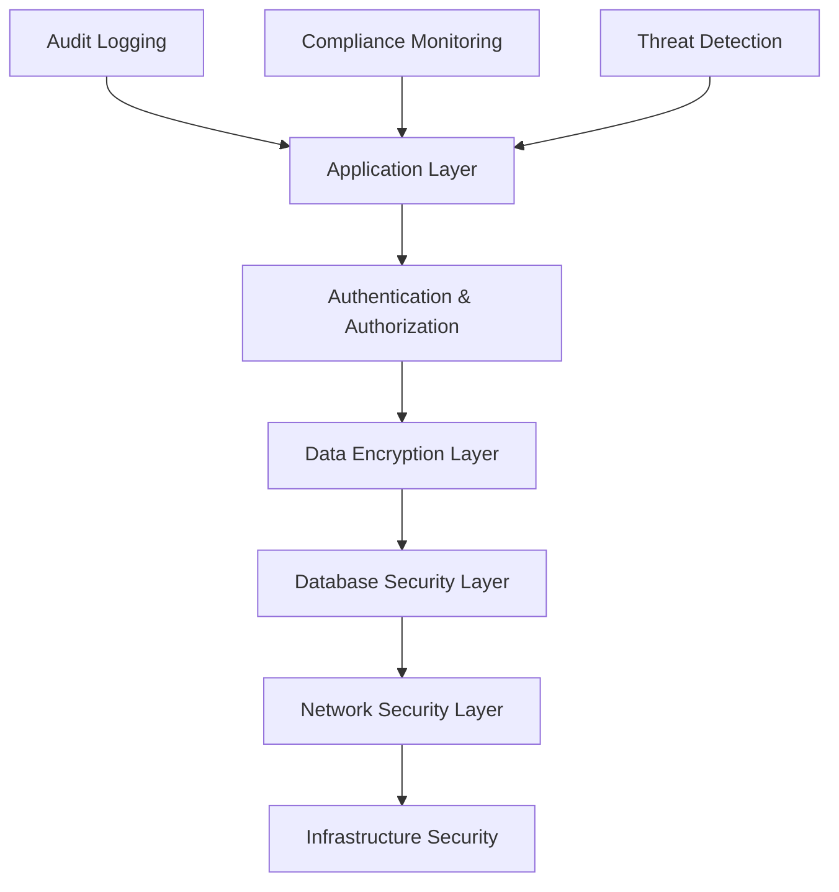

# GigaEats Marketplace Wallet Security & Compliance

## 🎯 Overview

This document outlines the comprehensive security and compliance implementation for the GigaEats marketplace wallet system, ensuring adherence to Malaysian financial regulations, international security standards, and best practices for financial technology platforms.

## 🛡️ Security Architecture

### **Multi-Layer Security Model**



**Security Layers**:
1. **Application Layer**: Input validation, business logic security
2. **Authentication & Authorization**: JWT tokens, role-based access control
3. **Data Encryption**: End-to-end encryption for sensitive financial data
4. **Database Security**: Row-level security (RLS), encrypted storage
5. **Network Security**: HTTPS, API rate limiting, CORS protection
6. **Infrastructure Security**: Cloud security, container security

## 🔐 Financial Security Service

### **Core Security Features**

**File**: `lib/features/marketplace_wallet/security/financial_security_service.dart`

**Key Capabilities**:
- ✅ **Data Encryption**: AES-256 encryption for sensitive financial data
- ✅ **Transaction Integrity**: Checksum validation for all financial transactions
- ✅ **Payout Validation**: Multi-layer validation for payout requests
- ✅ **Permission Validation**: Role-based access control for financial operations
- ✅ **Audit Trail Generation**: Comprehensive logging for all financial activities
- ✅ **Data Sanitization**: Automatic masking of sensitive data in logs

**Encryption Implementation**:
```dart
// Encrypt sensitive financial data
final encryptedData = await financialSecurityService.encryptFinancialData({
  'bank_account': '1234567890',
  'amount': 100.50,
  'currency': 'MYR',
});

// Decrypt when needed
final decryptedData = await financialSecurityService.decryptFinancialData(encryptedData);
```

**Transaction Integrity Validation**:
```dart
// Validate transaction integrity
final isValid = financialSecurityService.validateTransactionIntegrity(transaction);
if (!isValid) {
  throw SecurityException('Transaction integrity validation failed');
}
```

## 🇲🇾 Malaysian Compliance Service

### **Bank Negara Malaysia (BNM) Compliance**

**File**: `lib/features/marketplace_wallet/security/malaysian_compliance_service.dart`

**Regulatory Compliance**:
- ✅ **BNM e-Money Guidelines**: Wallet balance and transaction limits
- ✅ **Anti-Money Laundering (AML)**: Suspicious activity detection
- ✅ **Malaysian Banking Regulations**: Payout compliance and validation
- ✅ **Know Your Customer (KYC)**: Enhanced due diligence requirements

### **BNM e-Money Regulations**

**Compliance Rules**:
1. **Maximum Wallet Balance**: RM 5,000 per wallet
2. **Daily Transaction Limit**: RM 1,000 per day
3. **Monthly Transaction Limit**: RM 10,000 per month
4. **Verification Requirements**: Enhanced verification for higher limits

**Implementation**:
```dart
// Validate e-money compliance
final result = await complianceService.validateEMoneyCompliance(
  wallet: userWallet,
  transaction: newTransaction,
);

if (!result.isCompliant) {
  // Handle compliance violations
  for (final violation in result.violations) {
    logger.warning('BNM Compliance Violation: ${violation.description}');
  }
}
```

### **Anti-Money Laundering (AML)**

**AML Monitoring**:
- ✅ **Large Transaction Reporting**: Automatic flagging of transactions ≥ RM 25,000
- ✅ **Pattern Analysis**: Detection of unusual transaction patterns
- ✅ **Rapid Transaction Detection**: Monitoring for suspicious frequency
- ✅ **Risk Scoring**: Automated risk assessment for all transactions

**Risk Assessment Levels**:
- **Low Risk**: Score 0.0 - 0.3 (Normal transactions)
- **Medium Risk**: Score 0.3 - 0.7 (Requires monitoring)
- **High Risk**: Score 0.7 - 1.0 (Requires manual review and reporting)

### **Payout Compliance**

**Malaysian Banking Regulations**:
- ✅ **Minimum Payout**: RM 10.00
- ✅ **Maximum Daily Payout**: RM 50,000
- ✅ **Bank Account Validation**: Malaysian bank account format verification
- ✅ **Enhanced Due Diligence**: Required for payouts ≥ RM 10,000

**Supported Malaysian Banks**:
- Maybank
- CIMB Bank
- Public Bank
- RHB Bank
- Hong Leong Bank

## 📋 Audit Logging Service

### **Comprehensive Audit Trail**

**File**: `lib/features/marketplace_wallet/security/audit_logging_service.dart`

**Audit Categories**:
- ✅ **Payment Processing**: All payment-related events
- ✅ **Wallet Transactions**: Credit, debit, and transfer operations
- ✅ **Payout Requests**: Payout creation, processing, and completion
- ✅ **Escrow Operations**: Fund holding and release events
- ✅ **Compliance Violations**: Regulatory compliance issues
- ✅ **Security Events**: Authentication, authorization, and security incidents

**Audit Data Structure**:
```dart
{
  'audit_id': 'audit_1234567890_123456',
  'event_type': 'payment_processing',
  'entity_type': 'order',
  'entity_id': 'order_123',
  'user_id': 'user_123',
  'ip_address': '192.168.1.1',
  'timestamp': '2024-01-15T10:30:00Z',
  'event_data': {
    'payment_method': 'credit_card',
    'amount': 55.90,
    'currency': 'MYR',
    'status': 'completed'
  },
  'metadata': {
    'compliance_category': 'payment_processing',
    'requires_retention': true,
    'retention_years': 7
  },
  'checksum': 'sha256_hash_of_critical_data'
}
```

### **Retention Policies**

**Data Retention Requirements**:
- **Financial Transactions**: 7 years (Malaysian regulatory requirement)
- **Compliance Violations**: 10 years (Enhanced retention for violations)
- **Security Events**: 7 years (Security incident tracking)
- **Audit Logs**: 7 years (Regulatory compliance)

## 🔒 Data Protection & Privacy

### **Sensitive Data Handling**

**Data Classification**:
- **Highly Sensitive**: Bank account numbers, payment credentials
- **Sensitive**: Transaction amounts, personal identification
- **Internal**: User IDs, transaction IDs, timestamps
- **Public**: Currency codes, transaction types

**Protection Measures**:
```dart
// Automatic data sanitization for logging
final sanitizedData = financialSecurityService.sanitizeForLogging({
  'bank_account_number': '1234567890123456',
  'amount': 100.50,
});
// Result: {'bank_account_number': '************3456', 'amount': 100.50}
```

### **Encryption Standards**

**Encryption Implementation**:
- **Algorithm**: AES-256-GCM for data encryption
- **Key Management**: User-specific key derivation with salt
- **Transport**: TLS 1.3 for all network communications
- **Storage**: Encrypted at rest in Supabase with additional application-layer encryption

## 🧪 Security Testing

### **Comprehensive Test Coverage**

**Test Files**:
- `test/features/marketplace_wallet/security/financial_security_test.dart`
- `test/features/marketplace_wallet/security/malaysian_compliance_test.dart`

**Test Categories**:
- ✅ **Unit Tests**: Individual security function validation
- ✅ **Integration Tests**: End-to-end security workflow testing
- ✅ **Compliance Tests**: Regulatory requirement validation
- ✅ **Penetration Tests**: Security vulnerability assessment

**Security Test Scenarios**:
```dart
group('Security Tests', () {
  test('should encrypt and decrypt financial data correctly', () async {
    final testData = {'bank_account': '1234567890', 'amount': 100.50};
    final encrypted = await securityService.encryptFinancialData(testData);
    final decrypted = await securityService.decryptFinancialData(encrypted);
    expect(decrypted, equals(testData));
  });

  test('should validate BNM e-money compliance', () async {
    final result = await complianceService.validateEMoneyCompliance(
      wallet: testWallet,
      transaction: testTransaction,
    );
    expect(result.isCompliant, isTrue);
  });
});
```

## 📊 Compliance Monitoring

### **Real-time Compliance Monitoring**

**Monitoring Capabilities**:
- ✅ **Transaction Monitoring**: Real-time compliance validation
- ✅ **Violation Detection**: Automatic flagging of compliance issues
- ✅ **Risk Assessment**: Continuous risk scoring for all operations
- ✅ **Regulatory Reporting**: Automated compliance report generation

**Compliance Dashboard Metrics**:
- Total transactions processed
- Compliance violations detected
- Risk score distribution
- Regulatory reporting status
- Audit trail completeness

### **Automated Reporting**

**Report Types**:
- **Daily**: Transaction summary and compliance status
- **Weekly**: Risk assessment and violation analysis
- **Monthly**: Comprehensive compliance report for regulators
- **Quarterly**: Security assessment and audit review
- **Annual**: Full compliance and security audit

## 🚨 Incident Response

### **Security Incident Handling**

**Incident Categories**:
- **Critical**: Data breach, unauthorized access to financial data
- **High**: Compliance violation, suspicious transaction patterns
- **Medium**: Authentication failures, rate limit violations
- **Low**: Minor security warnings, configuration issues

**Response Procedures**:
1. **Detection**: Automated monitoring and alerting
2. **Assessment**: Risk evaluation and impact analysis
3. **Containment**: Immediate security measures and access restriction
4. **Investigation**: Forensic analysis and root cause identification
5. **Recovery**: System restoration and security enhancement
6. **Documentation**: Incident reporting and lessons learned

## 🔧 Security Configuration

### **Environment-Specific Security**

**Development Environment**:
- Mock compliance validation for testing
- Reduced encryption for debugging
- Enhanced logging for development

**Staging Environment**:
- Full compliance validation
- Production-level encryption
- Comprehensive audit logging

**Production Environment**:
- Maximum security enforcement
- Real-time compliance monitoring
- External audit system integration

### **Security Headers and Policies**

**HTTP Security Headers**:
```
Strict-Transport-Security: max-age=31536000; includeSubDomains
Content-Security-Policy: default-src 'self'; script-src 'self' 'unsafe-inline'
X-Frame-Options: DENY
X-Content-Type-Options: nosniff
Referrer-Policy: strict-origin-when-cross-origin
```

**API Security Policies**:
- Rate limiting: 100 requests per minute per user
- Request size limits: 1MB maximum payload
- Authentication required for all financial endpoints
- Role-based access control for sensitive operations

## 📈 Continuous Security Improvement

### **Security Metrics**

**Key Performance Indicators**:
- **Security Incident Rate**: < 0.1% of transactions
- **Compliance Violation Rate**: < 0.01% of transactions
- **Audit Trail Completeness**: 100% of financial operations
- **Encryption Coverage**: 100% of sensitive data
- **Response Time**: < 5 minutes for critical incidents

### **Regular Security Reviews**

**Review Schedule**:
- **Weekly**: Security log analysis and threat assessment
- **Monthly**: Compliance validation and policy review
- **Quarterly**: Penetration testing and vulnerability assessment
- **Annually**: Comprehensive security audit and certification

This comprehensive security and compliance implementation ensures that the GigaEats marketplace wallet system meets the highest standards for financial technology platforms while maintaining full compliance with Malaysian regulatory requirements.
