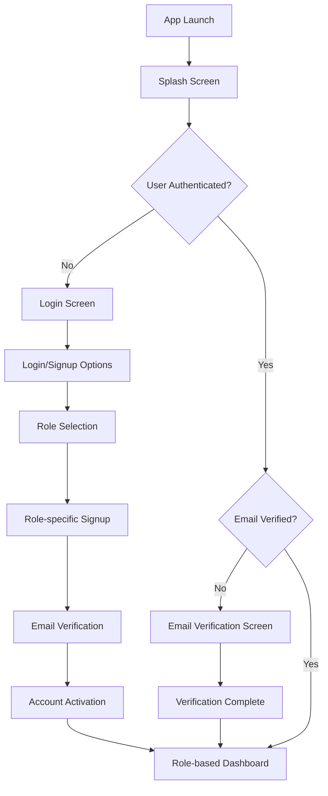

# GigaEats Authentication Flow Guide

## 🎯 Overview

This comprehensive guide documents the complete authentication flow for the GigaEats application, covering all user roles, authentication scenarios, and integration points.

## 🔄 Authentication Flow Architecture

### **High-Level Authentication Flow**


### **Authentication Components**
1. **Enhanced Auth Provider**: Core authentication state management
2. **Access Control Service**: Role-based permission validation
3. **Router Integration**: Navigation with access control
4. **Authentication Guards**: Route protection mechanisms
5. **Supabase Integration**: Backend authentication service

## 👥 User Role Authentication Flows

### **Customer Authentication Flow**

**1. Customer Signup:**
```dart
// Customer signup process
1. User selects "Customer" role
2. Fills customer-specific form (name, email, password)
3. System validates input and creates account
4. Email verification sent to user
5. User clicks verification link
6. Account activated with customer permissions
7. Redirected to customer dashboard
```

**Customer Permissions:**
- `place_order`: Place food orders
- `view_orders`: View order history
- `update_profile`: Manage personal profile
- `manage_wallet`: Handle payment methods
- `view_loyalty_points`: Access loyalty program

### **Vendor Authentication Flow**

**1. Vendor Signup:**
```dart
// Vendor signup process
1. User selects "Vendor" role
2. Fills vendor-specific form (restaurant name, contact info)
3. Phone number required for vendor communication
4. System validates business information
5. Email verification sent
6. Account activated with vendor permissions
7. Redirected to vendor dashboard
```

**Vendor Permissions:**
- `manage_menu`: Update restaurant menu
- `view_orders`: See incoming orders
- `update_order_status`: Manage order fulfillment
- `view_analytics`: Access sales analytics
- `manage_vendor_settings`: Configure restaurant settings

### **Sales Agent Authentication Flow**

**1. Sales Agent Signup:**
```dart
// Sales agent signup process
1. User selects "Sales Agent" role
2. Fills agent-specific form with business details
3. Phone number required for customer contact
4. System validates agent credentials
5. Email verification and account approval
6. Account activated with sales permissions
7. Redirected to sales agent dashboard
```

**Sales Agent Permissions:**
- `view_all_vendors`: Browse all restaurants
- `manage_customers`: Handle customer accounts
- `create_orders`: Place orders for customers
- `access_sales_tools`: Use sales management tools
- `view_reports`: Access sales analytics

### **Driver Authentication Flow**

**1. Driver Signup:**
```dart
// Driver signup process
1. User selects "Driver" role
2. Fills driver-specific form (license, vehicle info)
3. Phone number required for delivery coordination
4. System validates driver credentials
5. Email verification and background check
6. Account activated with driver permissions
7. Redirected to driver dashboard
```

**Driver Permissions:**
- `view_assigned_orders`: See delivery assignments
- `update_delivery_status`: Update delivery progress
- `view_earnings`: Track delivery earnings
- `access_gps_tracking`: Use location services
- `manage_driver_profile`: Update driver information

### **Admin Authentication Flow**

**1. Admin Access:**
```dart
// Admin authentication (restricted)
1. Admin credentials provided by system administrator
2. Enhanced security validation
3. Multi-factor authentication (future enhancement)
4. Full system access granted
5. Redirected to admin dashboard
```

**Admin Permissions:**
- `manage_users`: Full user management
- `manage_vendors`: Restaurant approval and management
- `view_all_data`: System-wide data access
- `system_settings`: Platform configuration
- `access_admin_panel`: Administrative interface

## 🔐 Authentication Security Flow

### **Email Verification Process**

**1. Verification Email Sent:**
```html
<!-- Custom branded email template -->
<h2>Welcome to GigaEats!</h2>
<p>Please verify your email to complete registration.</p>
<a href="gigaeats://auth/callback?token={{.Token}}">Verify Email</a>
```

**2. Deep Link Handling:**
```dart
// Deep link callback processing
void handleAuthCallback(Uri uri) {
  final token = uri.queryParameters['token'];
  if (token != null) {
    // Verify token with Supabase
    // Activate user account
    // Navigate to appropriate dashboard
  }
}
```

### **Session Management**

**1. Session Creation:**
```dart
// Secure session establishment
final response = await supabase.auth.signInWithPassword(
  email: email,
  password: password,
);

// Validate email verification
if (response.user?.emailConfirmedAt == null) {
  await supabase.auth.signOut();
  throw AuthException('Email verification required');
}
```

**2. Session Persistence:**
```dart
// Automatic session restoration
@riverpod
class AuthStateNotifier extends _$AuthStateNotifier {
  @override
  AuthState build() {
    _initializeAuth();
    return const AuthState.initial();
  }
  
  Future<void> _initializeAuth() async {
    final session = supabase.auth.currentSession;
    if (session != null) {
      // Restore authenticated state
      // Load user profile
      // Set appropriate permissions
    }
  }
}
```

## 🛡️ Access Control Implementation

### **Route Protection**

**1. Router-Level Protection:**
```dart
// Enhanced router redirect logic
String? _handleRedirect(BuildContext context, GoRouterState state, Ref ref) {
  final authState = ref.read(authStateProvider);
  final location = state.uri.toString();
  
  // Check authentication
  if (authState.status != AuthStatus.authenticated) {
    return AppRoutes.login;
  }
  
  // Check route access
  final accessResult = AccessControlService.checkRouteAccess(
    location, 
    authState.user?.role
  );
  
  if (!accessResult.hasAccess) {
    return AccessControlService.getDashboardRoute(authState.user!.role);
  }
  
  return null; // Allow access
}
```

**2. Widget-Level Protection:**
```dart
// Authentication guard usage
AuthGuard(
  allowedRoles: [UserRole.vendor, UserRole.admin],
  requiredPermissions: ['manage_menu'],
  routePath: '/vendor/menu',
  child: VendorMenuScreen(),
)
```

### **Permission Validation**

**1. Action-Level Permissions:**
```dart
// Check permission before action
if (AccessControlService.hasPermission(userRole, 'place_order')) {
  // Allow order placement
  await orderService.createOrder(orderData);
} else {
  // Show permission denied message
  showErrorDialog('Insufficient permissions');
}
```

**2. UI Element Permissions:**
```dart
// Conditional UI based on permissions
if (ref.watch(authStateProvider).user?.role == UserRole.admin) {
  return AdminActionButton();
} else {
  return const SizedBox.shrink(); // Hide for non-admin users
}
```

## 🔄 State Management Flow

### **Authentication State Providers**

**1. Basic Auth Provider:**
```dart
@riverpod
class AuthStateNotifier extends _$AuthStateNotifier {
  @override
  AuthState build() => const AuthState.initial();
  
  Future<void> signIn(String email, String password) async {
    state = state.copyWith(status: AuthStatus.loading);
    
    try {
      final response = await _authService.signIn(email, password);
      state = AuthState.authenticated(response.user);
    } catch (e) {
      state = AuthState.error(e.toString());
    }
  }
}
```

**2. Enhanced Auth Provider:**
```dart
@riverpod
class EnhancedAuthStateNotifier extends _$EnhancedAuthStateNotifier {
  @override
  EnhancedAuthState build() => const EnhancedAuthState.unauthenticated();
  
  Future<void> signUpWithRole(UserRole role, SignupData data) async {
    state = state.copyWith(status: EnhancedAuthStatus.loading);
    
    try {
      await _authService.signUpWithRole(role, data);
      state = state.copyWith(
        status: EnhancedAuthStatus.emailVerificationPending,
        pendingVerificationEmail: data.email,
      );
    } catch (e) {
      state = state.copyWith(
        status: EnhancedAuthStatus.error,
        errorMessage: e.toString(),
      );
    }
  }
}
```

## 🎨 User Interface Flow

### **Authentication Screens**

**1. Login Screen:**
- Email and password input
- Role-based login validation
- "Forgot Password" functionality
- "Sign Up" navigation

**2. Role Selection Screen:**
- Interactive role cards
- Role descriptions and benefits
- Visual feedback and animations
- Continue to role-specific signup

**3. Role-Specific Signup:**
- Customized forms per role
- Role-appropriate field validation
- Terms and conditions acceptance
- Password strength validation

**4. Email Verification Screen:**
- Verification status display
- Resend verification option
- Direct email app integration
- Auto-verification checking

### **Dashboard Navigation**

**1. Role-Based Dashboards:**
```dart
// Dynamic dashboard routing
String getDashboardRoute(UserRole role) {
  switch (role) {
    case UserRole.customer:
      return '/customer/dashboard';
    case UserRole.vendor:
      return '/vendor/dashboard';
    case UserRole.salesAgent:
      return '/sales-agent/dashboard';
    case UserRole.driver:
      return '/driver/dashboard';
    case UserRole.admin:
      return '/admin/dashboard';
  }
}
```

**2. Navigation Items:**
```dart
// Role-specific navigation
List<NavigationItem> getNavigationItems(UserRole role) {
  return NavigationService.getNavigationItems(role)
    .where((item) => AccessControlService.isRouteAccessible(item.route, role))
    .toList();
}
```

## 🔧 Integration Points

### **Supabase Integration**

**1. Authentication Service:**
```dart
class SupabaseAuthService {
  final SupabaseClient _client = Supabase.instance.client;
  
  Future<AuthResponse> signIn(String email, String password) async {
    return await _client.auth.signInWithPassword(
      email: email,
      password: password,
    );
  }
  
  Stream<AuthState> get authStateChanges {
    return _client.auth.onAuthStateChange.map((data) {
      return data.session != null 
        ? AuthState.authenticated(data.session!.user)
        : const AuthState.unauthenticated();
    });
  }
}
```

### **Database Integration**

**1. User Profile Management:**
```sql
-- Automatic profile creation trigger
CREATE OR REPLACE FUNCTION public.handle_new_user()
RETURNS trigger AS $$
BEGIN
  INSERT INTO public.user_profiles (user_id, email, role)
  VALUES (new.id, new.email, 'customer'::user_role);
  RETURN new;
END;
$$ LANGUAGE plpgsql SECURITY DEFINER;
```

## 🎯 Best Practices

### **Security Best Practices**
1. **Always verify email** before granting access
2. **Use strong passwords** with complexity requirements
3. **Implement proper session management** with automatic refresh
4. **Validate permissions** at every access point
5. **Log authentication events** for security monitoring

### **Performance Best Practices**
1. **Cache authentication state** to reduce API calls
2. **Use provider select()** to prevent unnecessary rebuilds
3. **Implement lazy loading** for user profiles
4. **Optimize route access checks** with caching
5. **Monitor authentication performance** metrics

### **User Experience Best Practices**
1. **Provide clear feedback** during authentication
2. **Show appropriate loading states** for all operations
3. **Handle errors gracefully** with helpful messages
4. **Implement smooth navigation** between auth screens
5. **Maintain consistent branding** throughout auth flow

## 🎉 Authentication Flow Summary

The GigaEats authentication system provides a comprehensive, secure, and user-friendly authentication experience with:

- **Multi-role Support**: Tailored authentication for all user types
- **Enhanced Security**: Email verification, strong passwords, and session management
- **Role-based Access Control**: Granular permissions and route protection
- **Seamless Integration**: Supabase backend with Flutter frontend
- **Excellent User Experience**: Smooth flows with clear feedback and branding

The system is production-ready and provides enterprise-grade authentication capabilities for the GigaEats food delivery platform.
