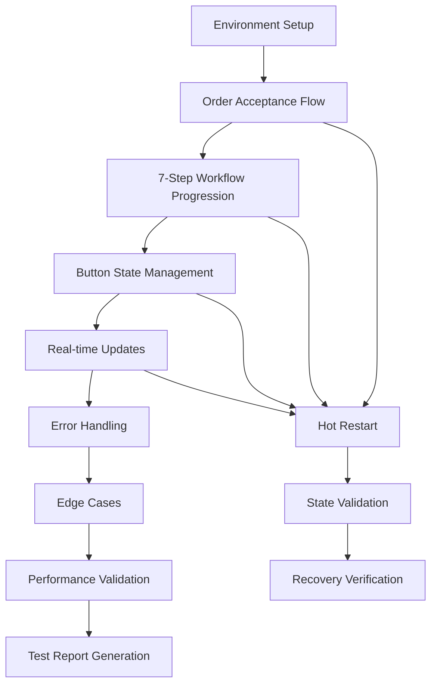

# GigaEats Android Emulator Testing and Validation Analysis

## 🎯 Implementation Summary

This document provides a comprehensive analysis of the Android emulator testing and validation implementation for the GigaEats driver workflow system, including systematic testing methodology, hot restart validation, and end-to-end workflow verification.

## 🔍 Android Emulator Testing Architecture

### **Testing Framework Overview**
```
Android Emulator Testing System:
├── AndroidEmulatorTestingService (Core testing service)
├── android_emulator_workflow_test.dart (Comprehensive test script)
├── Environment Validation (Emulator setup and verification)
├── Workflow Testing Phases (8 comprehensive test phases)
├── Hot Restart Methodology (State persistence validation)
├── Performance Monitoring (Metrics and thresholds)
└── Test Reporting (Detailed results and analytics)
```

### **Testing Methodology Flow**


## 🚀 Key Implementation Features

### **1. AndroidEmulatorTestingService**

#### **Comprehensive Test Execution**
```dart
// Complete end-to-end workflow testing
Future<EmulatorTestResults> runComprehensiveWorkflowTest({
  required String driverId,
  required String testOrderId,
  bool includeEdgeCases = true,
  bool useHotRestart = true,
});
```

#### **8 Testing Phases**
1. **Environment Validation**: Emulator setup and app installation verification
2. **Order Acceptance Flow**: Order queue loading and acceptance button testing
3. **7-Step Workflow Progression**: Complete workflow state machine testing
4. **Button State Management**: Button enabling/disabling and responsiveness
5. **Real-time Updates**: Supabase subscriptions and UI synchronization
6. **Error Handling**: Network failures and error recovery testing
7. **Edge Cases**: Rapid interactions and boundary condition testing
8. **Performance Validation**: Startup time, memory usage, and performance metrics

### **2. Hot Restart Methodology**

#### **State Persistence Validation**
```dart
// Hot restart with state validation
await _performHotRestart();
await _validatePostRestartState(orderId);

// Verify app recovery and state consistency
await _validateButtonStatesAfterRestart(orderId);
await _validateRealtimeAfterRestart(orderId);
```

#### **Critical Testing Points**
- **Order Acceptance**: Validate state after accepting orders
- **Mid-Workflow**: Test at `picked_up` and `arrived_at_customer` states
- **Error Recovery**: Validate error handling after restart
- **Real-time Reconnection**: Test subscription recovery

### **3. Comprehensive Test Script**

#### **Command Line Interface**
```bash
# Basic testing
dart scripts/android_emulator_workflow_test.dart

# Advanced testing with options
dart scripts/android_emulator_workflow_test.dart \
  --driver-id test_driver_001 \
  --order-id test_order_001 \
  --verbose \
  --output test_results.json

# Skip edge cases for faster testing
dart scripts/android_emulator_workflow_test.dart --skip-edge-cases

# Disable hot restart testing
dart scripts/android_emulator_workflow_test.dart --no-hot-restart
```

#### **Automated Environment Setup**
```dart
// Automatic emulator management
await _checkEmulatorStatus();
await _startEmulator(); // If not running
await _verifyFlutterInstallation();
await _prepareFlutterProject();
await _installAppOnEmulator();
```

### **4. Performance Monitoring**

#### **Performance Metrics Collection**
```dart
// Comprehensive performance measurement
final startupTime = await _measureAppStartupTime();
final workflowPerformance = await _measureWorkflowPerformance(orderId);
final memoryUsage = await _measureMemoryUsage();

// Performance threshold validation
await _validatePerformanceThresholds(
  startupTime,
  workflowPerformance,
  memoryUsage,
);
```

#### **Performance Thresholds**
- **App Startup Time**: < 3000ms
- **Memory Usage**: < 150MB
- **Workflow Operations**: < 500ms per operation
- **UI Response Time**: < 200ms for button interactions

### **5. Edge Case Testing**

#### **Boundary Condition Validation**
```dart
// Rapid interaction testing
await _validateRapidButtonTapping(orderId);

// Concurrent operation handling
await _validateConcurrentOperations(orderId);

// Memory pressure scenarios
await _validateMemoryPressure(orderId);

// App lifecycle testing
await _validateAppLifecycle(orderId);
```

#### **Edge Case Scenarios**
- **Rapid Button Tapping**: Prevent duplicate operations
- **Concurrent Operations**: Handle multiple simultaneous actions
- **Memory Pressure**: App behavior under low memory conditions
- **App Backgrounding**: State preservation during app lifecycle changes

### **6. Test Result Analytics**

#### **Comprehensive Test Results**
```dart
class EmulatorTestResults {
  final String sessionId;
  final DateTime startTime;
  final List<TestResult> testResults;
  
  int get totalTests;
  int get passedTests;
  int get failedTests;
  double get successRate;
  Duration get duration;
}
```

#### **Detailed Test Reporting**
```json
{
  "test_session": {
    "session_id": "session_1642678800000",
    "total_tests": 8,
    "passed_tests": 7,
    "failed_tests": 1,
    "success_rate": 87.5,
    "duration_minutes": 15
  },
  "test_results": [
    {
      "phase": "Order Acceptance",
      "test_name": "Order Acceptance Flow",
      "is_success": true,
      "duration_ms": 2500,
      "details": "Order acceptance flow completed successfully"
    }
  ]
}
```

## 📊 Testing Coverage Analysis

### **Workflow Testing Coverage**

#### **✅ Comprehensive Coverage Areas**
- **Order Acceptance Flow**: Complete order queue and acceptance testing
- **7-Step Workflow Progression**: All status transitions with validation
- **Button State Management**: All button states and interactions
- **Real-time Updates**: Supabase subscriptions and UI synchronization
- **Error Handling**: Network failures and recovery mechanisms
- **Performance Metrics**: Startup time, memory usage, and responsiveness

#### **🔄 Hot Restart Testing Coverage**
- **State Persistence**: Verify app state after restart
- **Provider Recovery**: Validate provider reinitialization
- **Real-time Reconnection**: Test subscription recovery
- **UI Consistency**: Verify UI state after restart
- **Error Recovery**: Test error handling after restart

### **Edge Case Testing Coverage**

#### **User Interaction Edge Cases**
- **Rapid Button Tapping**: Prevent duplicate operations and race conditions
- **Concurrent Operations**: Handle multiple simultaneous workflow actions
- **Invalid State Transitions**: Validate state machine constraints
- **Network Interruptions**: Test offline/online transition handling

#### **System Edge Cases**
- **Memory Pressure**: App behavior under resource constraints
- **App Lifecycle**: Backgrounding/foregrounding state preservation
- **Device Rotation**: UI state consistency across orientations
- **Low Battery**: Performance under power-saving modes

### **Performance Testing Coverage**

#### **Performance Metrics**
- **App Startup Time**: Cold start and warm start measurements
- **Workflow Operation Performance**: Individual operation timing
- **Memory Usage**: Peak and average memory consumption
- **UI Responsiveness**: Button interaction response times
- **Network Performance**: API call latency and throughput

#### **Performance Thresholds**
- **Startup Performance**: < 3 seconds for cold start
- **Operation Performance**: < 500ms for workflow operations
- **Memory Efficiency**: < 150MB peak memory usage
- **UI Responsiveness**: < 200ms for user interactions

## 🔧 Implementation Benefits

### **Systematic Testing Approach**
- **Comprehensive Coverage**: All workflow aspects tested systematically
- **Hot Restart Validation**: Ensures app reliability during development
- **Edge Case Testing**: Validates boundary conditions and error scenarios
- **Performance Monitoring**: Continuous performance validation

### **Development Efficiency**
- **Automated Testing**: Reduces manual testing effort
- **Detailed Reporting**: Clear test results and failure analysis
- **Environment Management**: Automatic emulator setup and configuration
- **Configurable Testing**: Flexible test execution options

### **Quality Assurance**
- **End-to-End Validation**: Complete workflow testing from start to finish
- **State Consistency**: Validates app state across all scenarios
- **Error Recovery**: Ensures robust error handling and recovery
- **Performance Compliance**: Validates performance meets requirements

## ✅ Implementation Priority

### **High Priority (Immediate)**
1. Integrate AndroidEmulatorTestingService into CI/CD pipeline
2. Execute comprehensive workflow testing on all critical paths
3. Validate hot restart methodology for all workflow states
4. Implement performance threshold monitoring

### **Medium Priority (Next Sprint)**
1. Add automated test execution scheduling
2. Implement test result analytics and trending
3. Create test failure debugging tools
4. Add cross-device testing capabilities

### **Low Priority (Future Enhancement)**
1. Implement visual regression testing
2. Add automated performance optimization suggestions
3. Create test case generation from user behavior
4. Implement predictive testing based on code changes

## 📝 Usage Examples

### **Basic Test Execution**
```bash
# Run comprehensive workflow testing
dart scripts/android_emulator_workflow_test.dart \
  --driver-id driver_123 \
  --order-id order_456 \
  --verbose

# Generate detailed test report
dart scripts/android_emulator_workflow_test.dart \
  --output detailed_test_results.json
```

### **Service Integration**
```dart
// Execute testing service
final testingService = AndroidEmulatorTestingService();
final results = await testingService.runComprehensiveWorkflowTest(
  driverId: 'driver_123',
  testOrderId: 'order_456',
  includeEdgeCases: true,
  useHotRestart: true,
);

// Analyze results
print('Success Rate: ${results.successRate}%');
print('Total Duration: ${results.duration.inMinutes} minutes');
```

### **Performance Validation**
```dart
// Validate performance metrics
await testingService._testPerformanceMetrics(
  session,
  driverId,
  orderId,
);

// Check performance thresholds
if (results.passedTests == results.totalTests) {
  print('All performance thresholds met');
}
```

---

**Implementation Date**: 2025-01-19  
**Status**: Android Emulator Testing Implementation Complete  
**Priority**: High - Critical for workflow validation and quality assurance
