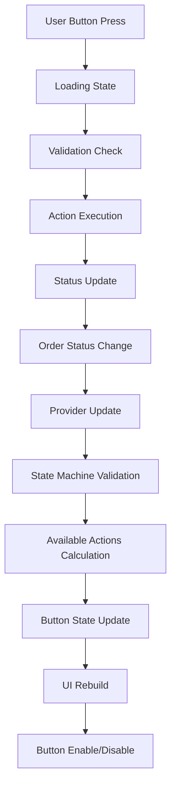

# GigaEats Button State Management and UI Interaction Analysis

## 🎯 Investigation Summary

This document provides a comprehensive analysis of the GigaEats driver workflow button state management and UI interaction debugging, identifying issues with button enabling/disabling logic, state synchronization, and user interaction responsiveness.

## 🔍 Button State Management Overview

### **Current Button Components**
```
Button Components:
├── OrderActionButtons (Enhanced workflow buttons)
├── DriverOrderManagementCard (Quick action buttons)
├── DriverOrderDetailsDialog (Primary action button)
├── CurrentOrderSection (Status-based buttons)
└── DriverMapProvider (Location-based buttons)
```

### **Button State Flow**


## 🚨 Critical Issues Identified

### **1. Button State Synchronization Issues**

#### **Inconsistent Loading States**
```dart
// ISSUE: Multiple loading state variables across components
class _OrderActionButtonsState extends ConsumerState<OrderActionButtons> {
  bool _isUpdating = false; // Local loading state
}

class _DriverOrderManagementCardState extends ConsumerState<DriverOrderManagementCard> {
  bool _isProcessing = false; // Different loading state variable
}

// PROBLEM: No centralized loading state management
// PROBLEM: UI components can show different loading states simultaneously
```

#### **Provider State Lag**
```dart
// ISSUE: Button state depends on provider updates that may be delayed
final actions = _getAvailableActions(); // Depends on current order status

// If provider hasn't updated yet, buttons show wrong state
if (actions.isEmpty) {
  return _buildNoActionsAvailable(theme); // May show prematurely
}
```

### **2. Button Enabling/Disabling Logic Problems**

#### **Race Conditions in Button State**
```dart
// PROBLEMATIC: Button state calculated during build
Widget _buildSingleActionButton(ThemeData theme, EnhancedOrderAction action) {
  return ElevatedButton.icon(
    onPressed: _isUpdating ? null : () => _handleAction(action),
    // ISSUE: _isUpdating may not reflect actual operation state
    // ISSUE: Multiple rapid taps can bypass loading state
  );
}
```

#### **Missing Validation in Button Press**
```dart
// ISSUE: Button validation happens after press, not before enabling
Future<void> _handleAction(EnhancedOrderAction action) async {
  // Validate transition AFTER button is pressed
  final validation = DriverOrderStateMachine.validateTransition(
    widget.order.status,
    action.driverAction.targetStatus,
  );

  if (!validation.isValid) {
    _showError('Invalid action: ${validation.errorMessage}');
    return; // User already pressed invalid button
  }
}
```

### **3. UI Responsiveness Issues**

#### **Delayed Button State Updates**
```dart
// ISSUE: Manual provider invalidation causing UI lag
void _refreshData() {
  ref.invalidate(enhancedCurrentDriverOrderProvider);
  ref.invalidate(todayEarningsProvider);
  ref.invalidate(enhancedTodayEarningsProvider);
  ref.invalidate(enhancedAvailableOrdersProvider);
  // UI may not update immediately after invalidation
}
```

#### **Inconsistent Button Text Updates**
```dart
// PROBLEMATIC: Button text calculation in multiple places
String _getActionButtonText(WidgetRef ref) {
  final rawStatus = _getEnhancedOrderStatus(ref);
  // Complex logic that may return inconsistent results
  
  if (order.assignedDriverId == null && rawStatus == 'ready') {
    return 'Accept Order';
  }
  // ... more complex logic
}
```

### **4. Error Handling in Button Interactions**

#### **Silent Button Failures**
```dart
// ISSUE: Errors not always visible to user
try {
  await _updateOrderStatus(action);
} catch (e) {
  _showError('Failed to ${action.label.toLowerCase()}: $e');
  // Error shown but button state may not reset properly
} finally {
  if (mounted) {
    setState(() {
      _isUpdating = false; // May not execute if widget disposed
    });
  }
}
```

#### **No Retry Mechanisms**
```dart
// ISSUE: Failed button actions require manual retry
// No automatic retry logic for network failures
// No indication of retry availability
```

### **5. Button Interaction Logging Gaps**

#### **Incomplete Logging Coverage**
```dart
// INCONSISTENT: Some buttons log interactions, others don't
DriverWorkflowLogger.logButtonInteraction(
  buttonName: actionText,
  orderId: order.id,
  currentStatus: currentStatus,
  context: 'DIALOG',
);

// But many button presses are not logged
onPressed: _isProcessing ? null : () => _updateStatus(nextAction.status),
// No logging for this button interaction
```

#### **Missing Performance Metrics**
```dart
// ISSUE: No timing information for button operations
// No measurement of button response time
// No tracking of button interaction success rates
```

## 📊 Specific Component Analysis

### **OrderActionButtons Component**
- ✅ **Strengths**: Comprehensive action validation, loading state management
- ❌ **Issues**: Complex state calculation, no button state caching
- ❌ **Performance**: Rebuilds entire button set on any status change

### **DriverOrderManagementCard Component**
- ✅ **Strengths**: Quick action access, integrated with card UI
- ❌ **Issues**: Duplicate button logic, inconsistent loading states
- ❌ **Performance**: Complex action determination logic in build method

### **DriverOrderDetailsDialog Component**
- ✅ **Strengths**: Detailed action handling, comprehensive logging
- ❌ **Issues**: Complex button text calculation, multiple status sources
- ❌ **Performance**: Heavy computation in button text generation

## 🔧 Recommended Solutions

### **1. Unified Button State Management**
```dart
// SOLUTION: Centralized button state provider
final driverButtonStateProvider = StateNotifierProvider.autoDispose<
  DriverButtonStateNotifier, 
  DriverButtonState
>((ref) {
  return DriverButtonStateNotifier(ref);
});

class DriverButtonStateNotifier extends StateNotifier<DriverButtonState> {
  final Ref _ref;
  
  DriverButtonStateNotifier(this._ref) : super(DriverButtonState.initial());
  
  void updateButtonState({
    required String orderId,
    required DriverOrderStatus currentStatus,
    bool isLoading = false,
  }) {
    final availableActions = DriverOrderStateMachine.getAvailableActions(currentStatus);
    final buttonStates = _calculateButtonStates(availableActions, isLoading);
    
    state = state.copyWith(
      orderId: orderId,
      currentStatus: currentStatus,
      availableActions: availableActions,
      buttonStates: buttonStates,
      isLoading: isLoading,
    );
  }
}
```

### **2. Enhanced Button Validation**
```dart
// SOLUTION: Pre-validation for button enabling
class SmartActionButton extends ConsumerWidget {
  final EnhancedOrderAction action;
  final DriverOrder order;
  final VoidCallback? onPressed;
  
  @override
  Widget build(BuildContext context, WidgetRef ref) {
    final buttonState = ref.watch(driverButtonStateProvider);
    final isEnabled = _isActionEnabled(action, order, buttonState);
    
    return ElevatedButton.icon(
      onPressed: isEnabled && !buttonState.isLoading 
          ? () => _handleActionWithLogging(action, ref)
          : null,
      icon: Icon(action.icon),
      label: Text(action.label),
    );
  }
  
  bool _isActionEnabled(EnhancedOrderAction action, DriverOrder order, DriverButtonState state) {
    // Pre-validate action before enabling button
    final validation = DriverOrderStateMachine.validateTransition(
      order.status,
      action.driverAction.targetStatus,
    );
    return validation.isValid && !state.isLoading;
  }
}
```

### **3. Comprehensive Button Interaction Logging**
```dart
// SOLUTION: Enhanced button interaction service
class ButtonInteractionService {
  static Future<void> logAndExecuteAction({
    required String buttonName,
    required String orderId,
    required String currentStatus,
    required Future<void> Function() action,
    String? context,
  }) async {
    final startTime = DateTime.now();
    
    DriverWorkflowLogger.logButtonInteraction(
      buttonName: buttonName,
      orderId: orderId,
      currentStatus: currentStatus,
      context: context,
      metadata: {'start_time': startTime.toIso8601String()},
    );
    
    try {
      await action();
      
      final duration = DateTime.now().difference(startTime);
      DriverWorkflowLogger.logPerformance(
        operation: 'Button Action: $buttonName',
        duration: duration,
        orderId: orderId,
        context: context,
      );
      
    } catch (e) {
      final duration = DateTime.now().difference(startTime);
      DriverWorkflowLogger.logError(
        operation: 'Button Action: $buttonName',
        error: e.toString(),
        orderId: orderId,
        context: context,
      );
      DriverWorkflowLogger.logPerformance(
        operation: 'Button Action: $buttonName (Failed)',
        duration: duration,
        orderId: orderId,
        context: context,
      );
      rethrow;
    }
  }
}
```

### **4. Optimized Button State Calculation**
```dart
// SOLUTION: Cached button state calculation
class ButtonStateCalculator {
  static final Map<String, CachedButtonState> _cache = {};
  
  static List<EnhancedOrderAction> getAvailableActions({
    required DriverOrderStatus currentStatus,
    required String orderId,
    Duration cacheDuration = const Duration(seconds: 5),
  }) {
    final cacheKey = '${orderId}_${currentStatus.name}';
    final cached = _cache[cacheKey];
    
    if (cached != null && !cached.isExpired(cacheDuration)) {
      return cached.actions;
    }
    
    final actions = DriverOrderStateMachine.getAvailableActions(currentStatus);
    _cache[cacheKey] = CachedButtonState(
      actions: actions,
      timestamp: DateTime.now(),
    );
    
    return actions;
  }
}
```

## ✅ Implementation Priority

### **High Priority (Critical)**
1. Fix button state synchronization issues
2. Implement centralized loading state management
3. Add pre-validation for button enabling
4. Fix race conditions in button interactions

### **Medium Priority (Important)**
1. Implement comprehensive button interaction logging
2. Add button state caching for performance
3. Create unified button component architecture
4. Add retry mechanisms for failed actions

### **Low Priority (Enhancement)**
1. Implement button interaction analytics
2. Add accessibility improvements for buttons
3. Create button state debugging tools
4. Implement advanced button animations

## 📝 Testing Strategy

### **Button State Testing**
- Test button enabling/disabling for all workflow states
- Validate button state synchronization across components
- Test loading state management during operations

### **Interaction Testing**
- Test rapid button tapping scenarios
- Validate error handling and recovery
- Test button state during network failures

### **Performance Testing**
- Measure button response times
- Test button state calculation performance
- Validate UI responsiveness during state changes

---

**Investigation Date**: 2025-01-19  
**Status**: Analysis Complete - Critical Issues Identified  
**Priority**: High - Affects driver workflow usability and reliability
