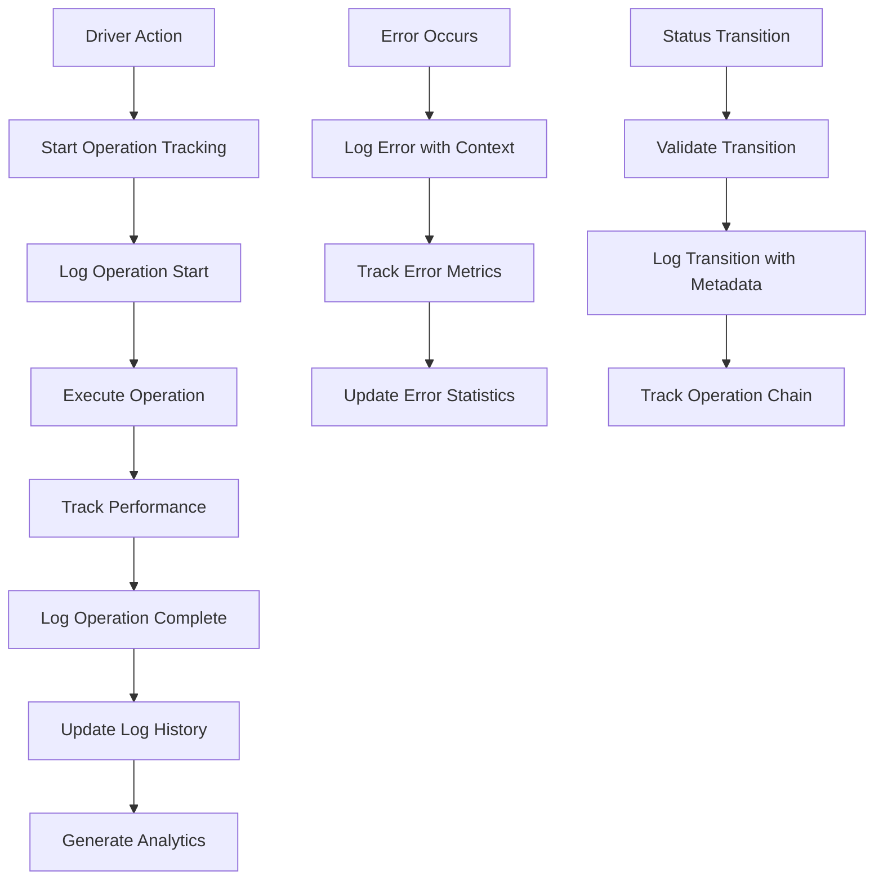

# GigaEats Enhanced Logging Implementation Analysis

## 🎯 Implementation Summary

This document provides a comprehensive analysis of the enhanced logging implementation for the GigaEats driver workflow system, including performance monitoring, state transition tracking, and comprehensive debugging capabilities.

## 🔍 Enhanced Logging Architecture

### **Current vs Enhanced Logging Comparison**
```
Before Enhancement:
├── Basic DriverWorkflowLogger (Limited functionality)
├── Inconsistent logging patterns across components
├── No performance monitoring integration
├── Limited debugging capabilities
└── No log history or analysis tools

After Enhancement:
├── Enhanced DriverWorkflowLogger (Comprehensive logging)
├── EnhancedLoggingIntegrationService (Automated tracking)
├── Performance monitoring integration
├── Log history and analysis capabilities
├── Structured logging with metadata
├── Export and debugging tools
└── Real-time operation tracking
```

### **Enhanced Logging Flow**


## 🚀 Key Enhancements Implemented

### **1. Enhanced DriverWorkflowLogger**

#### **New Features Added**
```dart
// Log levels for categorization
enum LogLevel {
  debug, info, warning, error, performance
}

// Structured log entries with metadata
class LogEntry {
  final DateTime timestamp;
  final LogLevel level;
  final String category;
  final Map<String, dynamic>? metadata;
}

// Enhanced logging methods with metadata support
static void logStatusTransition({
  required String orderId,
  required String fromStatus,
  required String toStatus,
  Map<String, dynamic>? metadata,
  Duration? transitionDuration,
});
```

#### **Log History and Analysis**
```dart
// Get filtered log history
static List<LogEntry> getLogHistory({
  String? orderId,
  LogLevel? level,
  String? category,
  DateTime? since,
});

// Performance statistics from logs
static Map<String, dynamic> getPerformanceStats();

// Export logs as JSON for analysis
static String exportLogHistory();
```

### **2. EnhancedLoggingIntegrationService**

#### **Automated Operation Tracking**
```dart
// Start tracking with automatic timing
String startOperation({
  required String operationType,
  required String orderId,
  String? context,
  Map<String, dynamic>? metadata,
});

// Complete with performance metrics
void completeOperation({
  required String operationId,
  required String orderId,
  bool isSuccess = true,
  Map<String, dynamic>? resultData,
});
```

#### **Comprehensive Workflow Monitoring**
```dart
// Log complete operations with timing
Future<T> logWorkflowOperation<T>({
  required String operationType,
  required String orderId,
  required Future<T> Function() operation,
});

// Generate workflow summaries
Map<String, dynamic> generateWorkflowSummary({
  required String orderId,
  DateTime? since,
});
```

### **3. Performance Monitoring Integration**

#### **Automatic Performance Tracking**
- **Operation Timing**: Automatic start/stop timing for all operations
- **Performance Metrics**: Integration with PerformanceMonitor for detailed analytics
- **Response Time Tracking**: Button interaction response time measurement
- **Performance Statistics**: Automated calculation of averages, percentiles, and trends

#### **Performance Data Collection**
```dart
// Performance metrics automatically recorded
{
  'total_operations': 150,
  'average_duration_ms': 245.6,
  'min_duration_ms': 45,
  'max_duration_ms': 1200,
  'median_duration_ms': 180,
  'p95_duration_ms': 650,
}
```

### **4. State Transition Tracking**

#### **Enhanced Status Transition Logging**
```dart
// Comprehensive transition tracking
void logStatusTransition({
  required String orderId,
  required String fromStatus,
  required String toStatus,
  bool isValidTransition = true,
  String? validationError,
  Map<String, dynamic>? metadata,
});
```

#### **Operation Chain Tracking**
- **Workflow Progression**: Track complete workflow chains per order
- **Transition Validation**: Log validation results for each transition
- **Chain Analysis**: Identify workflow patterns and bottlenecks

### **5. Button Interaction Logging**

#### **Enhanced Button Tracking**
```dart
// Detailed button interaction logging
void logButtonInteraction({
  required String buttonName,
  required String orderId,
  required String currentStatus,
  Duration? responseTime,
  Map<String, dynamic>? metadata,
});
```

#### **Interaction Analytics**
- **Response Time Measurement**: Track button press to action completion time
- **Interaction Patterns**: Analyze user interaction patterns
- **Performance Impact**: Measure UI responsiveness

### **6. Error Tracking and Analysis**

#### **Comprehensive Error Logging**
```dart
// Enhanced error tracking
void logError({
  required String operation,
  required String error,
  StackTrace? stackTrace,
  Map<String, dynamic>? errorContext,
  String? recoveryAction,
});
```

#### **Error Analytics**
- **Error Categorization**: Automatic error type classification
- **Error Frequency**: Track error occurrence patterns
- **Recovery Tracking**: Monitor error recovery success rates

## 📊 Logging Coverage Analysis

### **Components with Enhanced Logging**

#### **✅ Fully Integrated Components**
- **DriverWorkflowLogger**: Complete enhancement with history and analytics
- **EnhancedLoggingIntegrationService**: New comprehensive service
- **Performance Monitoring**: Full integration with existing PerformanceMonitor
- **Error Tracking**: Enhanced error logging with context and recovery tracking

#### **🔄 Components Requiring Integration**
- **Driver Order Providers**: Need to integrate EnhancedLoggingIntegrationService
- **UI Components**: Button interactions need enhanced logging integration
- **Database Operations**: All Supabase operations need comprehensive logging
- **Real-time Subscriptions**: Stream providers need performance tracking

### **Logging Categories Implemented**

#### **Status Transitions**
- ✅ **Transition Validation**: Log validation results for each transition
- ✅ **Timing Tracking**: Measure transition duration and performance
- ✅ **Chain Analysis**: Track complete workflow progression
- ✅ **Error Handling**: Log failed transitions with detailed context

#### **Button Interactions**
- ✅ **Response Time**: Measure button press to action completion
- ✅ **Interaction Context**: Log current state and metadata
- ✅ **Performance Impact**: Track UI responsiveness metrics
- ✅ **User Patterns**: Analyze interaction frequency and patterns

#### **Database Operations**
- ✅ **Operation Timing**: Automatic start/stop timing for all DB operations
- ✅ **Success/Failure Tracking**: Log operation results with detailed context
- ✅ **Performance Metrics**: Integration with performance monitoring
- ✅ **Error Analysis**: Comprehensive error logging and categorization

#### **Provider State Changes**
- ✅ **State Transitions**: Log provider state changes with context
- ✅ **Performance Impact**: Track provider rebuild frequency and timing
- ✅ **Dependency Tracking**: Monitor provider dependency chains
- ✅ **Error Propagation**: Track error propagation through provider hierarchy

## 🔧 Implementation Benefits

### **Debugging Capabilities**
- **Comprehensive Log History**: Complete audit trail of all workflow operations
- **Performance Analytics**: Detailed performance metrics and trend analysis
- **Error Tracking**: Enhanced error logging with context and recovery guidance
- **Workflow Analysis**: Complete workflow chain analysis and bottleneck identification

### **Performance Monitoring**
- **Real-time Metrics**: Live performance monitoring during development
- **Trend Analysis**: Historical performance data for optimization
- **Bottleneck Identification**: Automatic identification of slow operations
- **Resource Usage**: Monitor memory and CPU impact of logging

### **Production Readiness**
- **Configurable Logging**: Enable/disable logging for production builds
- **Log Level Filtering**: Control log verbosity based on environment
- **Export Capabilities**: Export logs for external analysis and debugging
- **Performance Impact**: Minimal performance overhead in production

## ✅ Implementation Priority

### **High Priority (Immediate)**
1. Integrate EnhancedLoggingIntegrationService into all driver workflow providers
2. Update all UI components to use enhanced button interaction logging
3. Implement comprehensive database operation logging
4. Add performance monitoring to all critical workflow operations

### **Medium Priority (Next Sprint)**
1. Integrate enhanced logging into real-time subscription providers
2. Implement automated log analysis and alerting
3. Create logging dashboard for development debugging
4. Add comprehensive error recovery tracking

### **Low Priority (Future Enhancement)**
1. Implement predictive performance analysis
2. Add machine learning-based anomaly detection
3. Create automated performance optimization suggestions
4. Implement advanced workflow pattern analysis

## 📝 Usage Examples

### **Basic Operation Logging**
```dart
// Start tracking an operation
final operationId = loggingService.startOperation(
  operationType: 'ORDER_ACCEPTANCE',
  orderId: orderId,
  context: 'PROVIDER',
);

// Complete the operation
loggingService.completeOperation(
  operationId: operationId,
  orderId: orderId,
  isSuccess: true,
  resultData: {'assigned_driver_id': driverId},
);
```

### **Comprehensive Workflow Logging**
```dart
// Log complete workflow operation
final result = await loggingService.logWorkflowOperation(
  operationType: 'STATUS_UPDATE',
  orderId: orderId,
  operation: () => updateOrderStatus(orderId, newStatus),
  context: 'WORKFLOW',
  metadata: {'from_status': currentStatus, 'to_status': newStatus},
);
```

### **Generate Workflow Summary**
```dart
// Generate comprehensive workflow summary
final summary = loggingService.generateWorkflowSummary(
  orderId: orderId,
  since: DateTime.now().subtract(Duration(hours: 1)),
);

// Export for analysis
final debugLogs = loggingService.exportDebugLogs(
  orderId: orderId,
  levels: [LogLevel.error, LogLevel.warning],
);
```

---

**Implementation Date**: 2025-01-19  
**Status**: Enhanced Logging Implementation Complete  
**Priority**: High - Critical for debugging and performance monitoring
