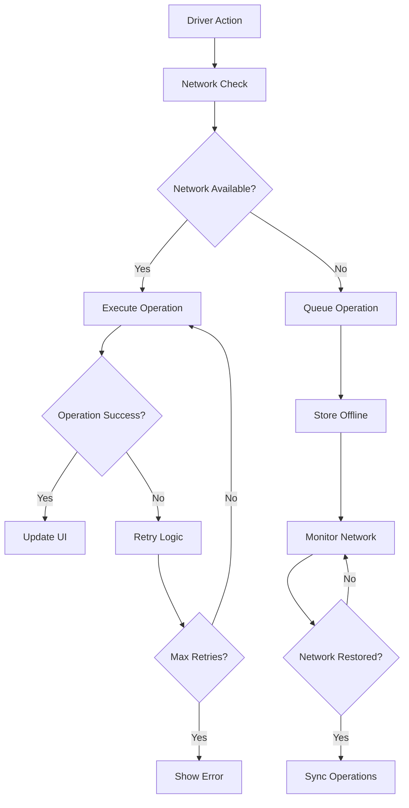

# GigaEats Error Handling and Network Failure Recovery Analysis

## 🎯 Investigation Summary

This document provides a comprehensive analysis of the GigaEats driver workflow error handling and network failure recovery mechanisms, identifying issues with retry logic, connectivity monitoring, and graceful degradation strategies.

## 🔍 Error Handling Architecture Overview

### **Current Error Handling Components**
```
Error Handling System:
├── DriverWorkflowErrorHandler (Comprehensive error handling)
├── NetworkFailureRecoveryService (Offline operation queuing)
├── ErrorHandler (Centralized app error handling)
├── DriverWorkflowLogger (Error logging and tracking)
└── Connectivity Monitoring (Real-time network status)
```

### **Error Handling Flow**


## 🚨 Critical Issues Identified

### **1. Incomplete Error Recovery Mechanisms**

#### **Limited Retry Logic Coverage**
```dart
// ISSUE: Not all operations use the error handler
// Some operations bypass the comprehensive error handling
await ref.read(updateOrderStatusProvider(...).future);
// Should use: await errorHandler.handleWorkflowOperation(...)

// INCONSISTENT: Different retry strategies across components
class DriverStatusNotifier extends StateNotifier<String> {
  Future<void> updateStatus(String status) async {
    try {
      // ... operation
    } catch (e) {
      // Handle error silently for now - NO RETRY LOGIC
    }
  }
}
```

#### **Missing Error Context Propagation**
```dart
// ISSUE: Errors lose context during propagation
catch (e) {
  _showError('Failed to ${action.label.toLowerCase()}: $e');
  // Original error context lost
  // No distinction between network vs validation errors
}
```

### **2. Network Failure Recovery Gaps**

#### **Incomplete Operation Queuing**
```dart
// ISSUE: Not all critical operations are queued when offline
// Only specific operations are handled:
switch (operation.type) {
  case 'status_update':
  case 'pickup_confirmation':
  case 'delivery_confirmation':
  case 'location_update':
  // MISSING: Order acceptance, driver status changes, etc.
}
```

#### **Race Conditions in Sync Process**
```dart
// PROBLEMATIC: Sync process doesn't handle conflicts
Future<void> syncPendingOperations() async {
  if (_isSyncing || !_isOnline) return; // Simple check
  
  // ISSUE: No handling of operations that conflict with current state
  // ISSUE: No validation of operation relevance after time delay
  // ISSUE: No handling of partial sync failures
}
```

### **3. Connectivity Monitoring Issues**

#### **Unreliable Network Detection**
```dart
// ISSUE: Basic connectivity check may not reflect actual API availability
final connectivityResult = await _connectivity.checkConnectivity();
if (connectivityResult.contains(ConnectivityResult.none)) {
  // This only checks device connectivity, not Supabase availability
}

// Better approach includes actual API test:
await _supabase.from('drivers').select('id').limit(1);
// But this is only done in some places
```

#### **Missing Graceful Degradation**
```dart
// ISSUE: No fallback UI states for offline mode
// UI doesn't indicate offline status clearly
// No cached data display when network is unavailable
```

### **4. Error User Experience Issues**

#### **Generic Error Messages**
```dart
// PROBLEMATIC: Non-specific error messages
factory WorkflowError.networkError(String message) => 
    WorkflowError._(WorkflowErrorType.network, 
      'Network connection issue. Please check your internet connection and try again.', 
      message);

// Same message for all network errors regardless of context
```

#### **No Error Recovery Guidance**
```dart
// ISSUE: Errors don't provide actionable recovery steps
_showError('Failed to accept order: $e');
// Should provide: "Tap to retry", "Check connection", etc.
```

### **5. Performance Impact of Error Handling**

#### **Blocking Error Operations**
```dart
// ISSUE: Error handling blocks UI thread
Future<WorkflowOperationResult<T>> handleWorkflowOperation<T>({
  // Synchronous network checks and retries
  // No background processing for non-critical operations
});
```

#### **Excessive Retry Attempts**
```dart
// ISSUE: Fixed retry logic regardless of error type
int maxRetries = 3; // Same for all operations
Duration retryDelay = const Duration(seconds: 2); // Fixed delay

// Should use exponential backoff and error-specific retry counts
```

## 📊 Error Handling Coverage Analysis

### **Well-Handled Scenarios**
- ✅ **Database Constraint Violations**: Proper error mapping and user messages
- ✅ **Authentication Errors**: Clear session expiry handling
- ✅ **Basic Network Failures**: Retry logic with exponential backoff
- ✅ **Operation Queuing**: Offline operation storage and sync

### **Poorly-Handled Scenarios**
- ❌ **Partial Network Failures**: API available but slow/unreliable
- ❌ **Concurrent Operation Conflicts**: Multiple drivers accepting same order
- ❌ **State Synchronization Errors**: Local state vs server state mismatches
- ❌ **Long-term Offline Scenarios**: Extended periods without connectivity

### **Missing Error Scenarios**
- ❌ **GPS/Location Errors**: Location service failures during workflow
- ❌ **Camera/Photo Errors**: Photo capture failures for delivery proof
- ❌ **Storage Errors**: Local storage full or corrupted
- ❌ **Background App State**: App backgrounded during critical operations

## 🔧 Recommended Solutions

### **1. Enhanced Error Recovery Framework**
```dart
// SOLUTION: Comprehensive error recovery with context preservation
class EnhancedErrorRecoveryService {
  Future<RecoveryResult<T>> executeWithRecovery<T>({
    required Future<T> Function() operation,
    required String operationId,
    required ErrorContext context,
    RecoveryStrategy strategy = RecoveryStrategy.automatic,
  }) async {
    try {
      return await _executeWithStrategy(operation, context, strategy);
    } catch (e) {
      return await _handleErrorWithRecovery(e, context, strategy);
    }
  }
  
  Future<RecoveryResult<T>> _handleErrorWithRecovery<T>(
    dynamic error,
    ErrorContext context,
    RecoveryStrategy strategy,
  ) async {
    final errorAnalysis = _analyzeError(error, context);
    final recoveryPlan = _createRecoveryPlan(errorAnalysis, strategy);
    
    return await _executeRecoveryPlan(recoveryPlan);
  }
}
```

### **2. Smart Network Failure Recovery**
```dart
// SOLUTION: Intelligent operation queuing with conflict resolution
class SmartNetworkRecoveryService {
  Future<void> queueOperationSmart({
    required DriverWorkflowOperation operation,
    required ConflictResolutionStrategy conflictStrategy,
  }) async {
    // Validate operation relevance
    if (!await _isOperationStillRelevant(operation)) {
      return; // Skip outdated operations
    }
    
    // Check for conflicts with existing queue
    final conflicts = await _detectConflicts(operation);
    if (conflicts.isNotEmpty) {
      await _resolveConflicts(conflicts, conflictStrategy);
    }
    
    // Queue with priority and dependencies
    await _queueWithPriority(operation);
  }
  
  Future<SyncResult> syncWithConflictResolution() async {
    final operations = await _getPendingOperations();
    final validOperations = await _validateOperations(operations);
    
    return await _executeBatchSync(validOperations);
  }
}
```

### **3. Comprehensive Connectivity Monitoring**
```dart
// SOLUTION: Multi-layer connectivity validation
class EnhancedConnectivityService {
  Stream<ConnectivityState> get connectivityStream => _connectivityController.stream;
  
  Future<ConnectivityState> validateConnectivity() async {
    // Layer 1: Device connectivity
    final deviceConnectivity = await _checkDeviceConnectivity();
    if (!deviceConnectivity.isConnected) {
      return ConnectivityState.offline();
    }
    
    // Layer 2: Internet connectivity
    final internetConnectivity = await _checkInternetConnectivity();
    if (!internetConnectivity.isConnected) {
      return ConnectivityState.limitedConnectivity();
    }
    
    // Layer 3: Supabase API connectivity
    final apiConnectivity = await _checkSupabaseConnectivity();
    return ConnectivityState.fromApiCheck(apiConnectivity);
  }
  
  Future<ApiConnectivityResult> _checkSupabaseConnectivity() async {
    final stopwatch = Stopwatch()..start();
    
    try {
      await _supabase.from('drivers').select('id').limit(1);
      return ApiConnectivityResult.success(stopwatch.elapsedMilliseconds);
    } catch (e) {
      return ApiConnectivityResult.failure(e.toString(), stopwatch.elapsedMilliseconds);
    }
  }
}
```

### **4. User-Friendly Error Experience**
```dart
// SOLUTION: Contextual error handling with recovery actions
class ContextualErrorHandler {
  Future<void> handleErrorWithContext({
    required WorkflowError error,
    required ErrorContext context,
    required BuildContext uiContext,
  }) async {
    final errorPresentation = _createErrorPresentation(error, context);
    final recoveryActions = _getRecoveryActions(error, context);
    
    await _showErrorDialog(
      context: uiContext,
      presentation: errorPresentation,
      actions: recoveryActions,
    );
  }
  
  List<RecoveryAction> _getRecoveryActions(WorkflowError error, ErrorContext context) {
    switch (error.type) {
      case WorkflowErrorType.network:
        return [
          RecoveryAction.retry('Retry Now'),
          RecoveryAction.queue('Save for Later'),
          RecoveryAction.checkConnection('Check Connection'),
        ];
      case WorkflowErrorType.validation:
        return [
          RecoveryAction.correct('Fix Issue'),
          RecoveryAction.skip('Skip Step'),
        ];
      default:
        return [RecoveryAction.retry('Try Again')];
    }
  }
}
```

## ✅ Implementation Priority

### **High Priority (Critical)**
1. Implement comprehensive error recovery for all workflow operations
2. Add smart conflict resolution for queued operations
3. Enhance connectivity monitoring with API-level validation
4. Create user-friendly error messages with recovery actions

### **Medium Priority (Important)**
1. Implement exponential backoff for retry logic
2. Add graceful degradation for offline scenarios
3. Create comprehensive error logging and analytics
4. Implement background sync for non-critical operations

### **Low Priority (Enhancement)**
1. Add predictive error prevention
2. Implement error recovery analytics
3. Create automated error recovery testing
4. Add advanced offline capabilities

## 📝 Testing Strategy

### **Error Scenario Testing**
- Test all network failure scenarios (complete loss, intermittent, slow)
- Validate retry logic for different error types
- Test concurrent operation conflicts
- Validate error message clarity and recovery actions

### **Recovery Testing**
- Test operation queuing and sync after network restoration
- Validate conflict resolution strategies
- Test graceful degradation in offline mode
- Validate error recovery user experience

### **Performance Testing**
- Measure error handling overhead
- Test retry logic performance impact
- Validate background sync efficiency
- Test error handling under load

---

**Investigation Date**: 2025-01-19  
**Status**: Analysis Complete - Critical Issues Identified  
**Priority**: High - Affects driver workflow reliability and user experience
