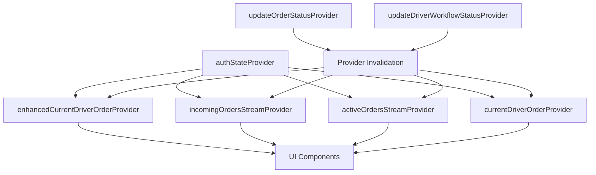

# GigaEats Riverpod Provider State Management Analysis

## 🎯 Investigation Summary

This document provides a comprehensive analysis of the GigaEats driver workflow Riverpod provider state management, identifying circular dependencies, infinite loops, caching issues, and state synchronization problems.

## 🔍 Provider Architecture Overview

### **Current Provider Ecosystem**
```
Driver Workflow Providers:
├── enhancedCurrentDriverOrderProvider (StreamProvider.autoDispose)
├── incomingOrdersStreamProvider (StreamProvider.autoDispose)
├── activeOrdersStreamProvider (StreamProvider.autoDispose)
├── updateOrderStatusProvider (FutureProvider.family)
├── updateDriverWorkflowStatusProvider (FutureProvider.family)
├── currentDriverOrderProvider (StreamProvider.autoDispose)
├── availableOrdersProvider (StreamProvider.autoDispose)
├── currentDriverStatusProvider (StreamProvider.autoDispose)
└── enhancedDriverWorkflowProvider (StateNotifierProvider)
```

### **Provider Dependencies Map**


## 🚨 Critical Issues Identified

### **1. Provider Duplication and Conflicts**

#### **Multiple Current Order Providers**
```dart
// ISSUE: Multiple providers serving similar purposes
final enhancedCurrentDriverOrderProvider = StreamProvider.autoDispose<DriverOrder?>(...);
final currentDriverOrderProvider = StreamProvider.autoDispose<Order?>(...);

// CONFLICT: Different return types (DriverOrder vs Order)
// CONFLICT: Different filtering logic
// CONFLICT: Different real-time subscription patterns
```

**Impact**: 
- UI components use different providers inconsistently
- State synchronization issues between providers
- Duplicate database queries and subscriptions

#### **Overlapping Stream Providers**
```dart
// ISSUE: Similar functionality with different implementations
final incomingOrdersStreamProvider = StreamProvider.autoDispose<List<Order>>(...);
final availableOrdersProvider = StreamProvider.autoDispose<List<Order>>(...);
final enhancedAvailableOrdersProvider = StreamProvider.autoDispose<List<DriverOrder>>(...);
```

### **2. Circular Dependencies and Infinite Loops**

#### **Provider Invalidation Cycles**
```dart
// PROBLEMATIC: Invalidation causing rebuild loops
await ref.read(updateDriverWorkflowStatusProvider(...).future);

// Inside updateDriverWorkflowStatusProvider:
_ref.invalidate(enhancedCurrentDriverOrderProvider);
_ref.invalidate(enhancedAvailableOrdersProvider);

// This can trigger rebuilds that call updateDriverWorkflowStatusProvider again
```

#### **Watch vs Read Misuse**
```dart
// ISSUE: Using ref.read() in StreamProvider can miss updates
final authState = ref.read(authStateProvider); // Should be ref.watch()

// ISSUE: Using ref.watch() in async operations can cause rebuilds
final authState = ref.watch(authStateProvider); // In async callback
```

### **3. AutoDispose Behavior Issues**

#### **Premature Provider Disposal**
```dart
// ISSUE: autoDispose providers being disposed during navigation
final enhancedCurrentDriverOrderProvider = StreamProvider.autoDispose<DriverOrder?>(...);

// When user navigates away and back, provider is disposed and recreated
// This causes:
// - Loss of real-time subscription
// - Re-fetching of data unnecessarily
// - UI flickering during reload
```

#### **Memory Leaks from Non-AutoDispose**
```dart
// ISSUE: Some providers not using autoDispose
final enhancedDriverWorkflowProvider = StateNotifierProvider<...>(...);
// Should be: StateNotifierProvider.autoDispose<...>(...);
```

### **4. State Synchronization Problems**

#### **Inconsistent State Updates**
```dart
// ISSUE: Multiple providers updating different aspects of same data
// Provider A updates orders.status
await supabase.from('orders').update({'status': newStatus});

// Provider B updates drivers.current_delivery_status  
await supabase.from('drivers').update({'current_delivery_status': newStatus});

// No guarantee these stay synchronized
```

#### **Race Conditions in Provider Updates**
```dart
// ISSUE: Concurrent provider invalidations
Future<void> updateOrderStatus() async {
  await updateDatabase();
  ref.invalidate(providerA); // Async
  ref.invalidate(providerB); // Async
  ref.invalidate(providerC); // Async
  // No guarantee of order or completion
}
```

### **5. Caching and Performance Issues**

#### **Excessive Database Queries**
```dart
// ISSUE: Multiple providers making similar queries
// Provider 1:
final response1 = await supabase.from('orders').select('*').eq('assigned_driver_id', driverId);

// Provider 2:
final response2 = await supabase.from('orders').select('*, order_items(*)').eq('assigned_driver_id', driverId);

// Provider 3:
final response3 = await supabase.from('orders').select('id, status').eq('assigned_driver_id', driverId);
```

#### **Inefficient Real-time Subscriptions**
```dart
// ISSUE: Multiple overlapping subscriptions
yield* supabase.from('orders').stream(primaryKey: ['id']).eq('assigned_driver_id', driverId);
yield* supabase.from('orders').stream(primaryKey: ['id']).eq('status', 'ready');
yield* supabase.from('orders').stream(primaryKey: ['id']).isFilter('assigned_driver_id', null);
```

## 📊 Provider-Specific Analysis

### **enhancedCurrentDriverOrderProvider**
- ✅ **Strengths**: Comprehensive order data, granular status support
- ❌ **Issues**: Complex filtering logic, potential memory leaks
- ❌ **Performance**: Heavy database queries with joins

### **incomingOrdersStreamProvider**
- ✅ **Strengths**: Real-time updates, proper filtering
- ❌ **Issues**: Duplicate functionality with availableOrdersProvider
- ❌ **Performance**: Inefficient stream filtering

### **updateOrderStatusProvider**
- ✅ **Strengths**: Simple status updates
- ❌ **Issues**: No validation, no state synchronization
- ❌ **Performance**: No error handling or retry logic

### **updateDriverWorkflowStatusProvider**
- ✅ **Strengths**: Workflow-specific validation
- ❌ **Issues**: Complex parameter structure, invalidation cycles
- ❌ **Performance**: Multiple database operations

## 🔧 Recommended Solutions

### **1. Provider Consolidation**
```dart
// SOLUTION: Single unified current order provider
final unifiedCurrentDriverOrderProvider = StreamProvider.autoDispose<DriverOrder?>((ref) async* {
  final authState = ref.watch(authStateProvider); // Use watch for reactivity

  if (authState.user?.role != UserRole.driver) {
    yield null;
    return;
  }

  final userId = authState.user?.id;
  if (userId == null) {
    yield null;
    return;
  }

  try {
    final supabase = Supabase.instance.client;

    // Get driver ID once and cache it
    final driverResponse = await supabase
        .from('drivers')
        .select('id')
        .eq('user_id', userId)
        .single();

    final driverId = driverResponse['id'] as String;

    // Single comprehensive query with all needed data
    yield* supabase
        .from('orders')
        .stream(primaryKey: ['id'])
        .eq('assigned_driver_id', driverId)
        .asyncMap((data) async {
          final activeStatuses = [
            'assigned', 'on_route_to_vendor', 'arrived_at_vendor',
            'picked_up', 'on_route_to_customer', 'arrived_at_customer'
          ];

          final activeOrders = data.where((json) =>
            activeStatuses.contains(json['status'])
          ).toList();

          if (activeOrders.isEmpty) return null;

          // Get full order details for the active order
          final orderId = activeOrders.first['id'] as String;
          final fullOrderResponse = await supabase
              .from('orders')
              .select('''
                *,
                order_items:order_items(*),
                vendors:vendors!orders_vendor_id_fkey(business_name, business_address)
              ''')
              .eq('id', orderId)
              .single();

          return DriverOrder.fromJson(fullOrderResponse);
        });
  } catch (e) {
    DriverWorkflowLogger.logError(
      operation: 'Unified Current Order Provider',
      error: e.toString(),
      context: 'PROVIDER',
    );
    yield null;
  }
});
```

### **2. Smart Invalidation Strategy**
```dart
// SOLUTION: Debounced invalidation with dependency tracking
class SmartInvalidationService {
  static Timer? _invalidationTimer;
  static final Set<ProviderBase> _pendingInvalidations = {};

  static void scheduleInvalidation(WidgetRef ref, List<ProviderBase> providers) {
    _pendingInvalidations.addAll(providers);

    _invalidationTimer?.cancel();
    _invalidationTimer = Timer(const Duration(milliseconds: 100), () {
      DriverWorkflowLogger.logProviderState(
        providerName: 'SmartInvalidationService',
        state: 'Executing batch invalidation',
        context: 'INVALIDATION',
        details: {'provider_count': _pendingInvalidations.length},
      );

      for (final provider in _pendingInvalidations) {
        ref.invalidate(provider);
      }
      _pendingInvalidations.clear();
    });
  }

  static void immediateInvalidation(WidgetRef ref, List<ProviderBase> providers) {
    for (final provider in providers) {
      ref.invalidate(provider);
    }
  }
}
```

### **3. Unified State Management**
```dart
// SOLUTION: Centralized driver workflow state
final driverWorkflowStateProvider = StateNotifierProvider.autoDispose<
  DriverWorkflowStateNotifier,
  DriverWorkflowState
>((ref) {
  return DriverWorkflowStateNotifier(ref);
});

class DriverWorkflowStateNotifier extends StateNotifier<DriverWorkflowState> {
  final Ref _ref;
  StreamSubscription? _orderSubscription;

  DriverWorkflowStateNotifier(this._ref) : super(DriverWorkflowState.initial()) {
    _initializeSubscriptions();
  }

  void _initializeSubscriptions() {
    // Listen to unified current order provider
    _orderSubscription = _ref.listen(
      unifiedCurrentDriverOrderProvider,
      (previous, next) {
        next.when(
          data: (order) => _updateCurrentOrder(order),
          loading: () => _setLoading(true),
          error: (error, stack) => _setError(error.toString()),
        );
      },
    );
  }

  void _updateCurrentOrder(DriverOrder? order) {
    state = state.copyWith(
      currentOrder: order,
      isLoading: false,
      error: null,
    );
  }

  @override
  void dispose() {
    _orderSubscription?.cancel();
    super.dispose();
  }
}
```

## 🎯 Implementation Priority

### **High Priority (Critical)**
1. Fix provider invalidation cycles causing infinite loops
2. Consolidate duplicate providers (currentDriverOrder variants)
3. Fix watch vs read misuse in async operations
4. Implement proper autoDispose patterns

### **Medium Priority (Important)**
1. Optimize real-time subscription efficiency
2. Implement unified state management pattern
3. Add comprehensive error handling
4. Create provider performance monitoring

### **Low Priority (Enhancement)**
1. Implement advanced caching strategies
2. Add provider dependency visualization
3. Create automated provider testing
4. Implement provider analytics

## ✅ Validation Checklist

- [ ] No circular dependencies between providers
- [ ] Proper watch vs read usage throughout codebase
- [ ] Consistent autoDispose patterns
- [ ] No duplicate provider functionality
- [ ] Efficient real-time subscription management
- [ ] Proper error handling in all providers
- [ ] Performance monitoring implementation
- [ ] Comprehensive provider testing

## 📝 Next Steps

1. **Immediate**: Fix critical invalidation cycles
2. **Short-term**: Consolidate duplicate providers
3. **Medium-term**: Implement unified state management
4. **Long-term**: Add comprehensive monitoring and testing

---

**Investigation Date**: 2025-01-19  
**Status**: Analysis Complete - Critical Issues Identified  
**Priority**: High - Affects driver workflow stability and performance
