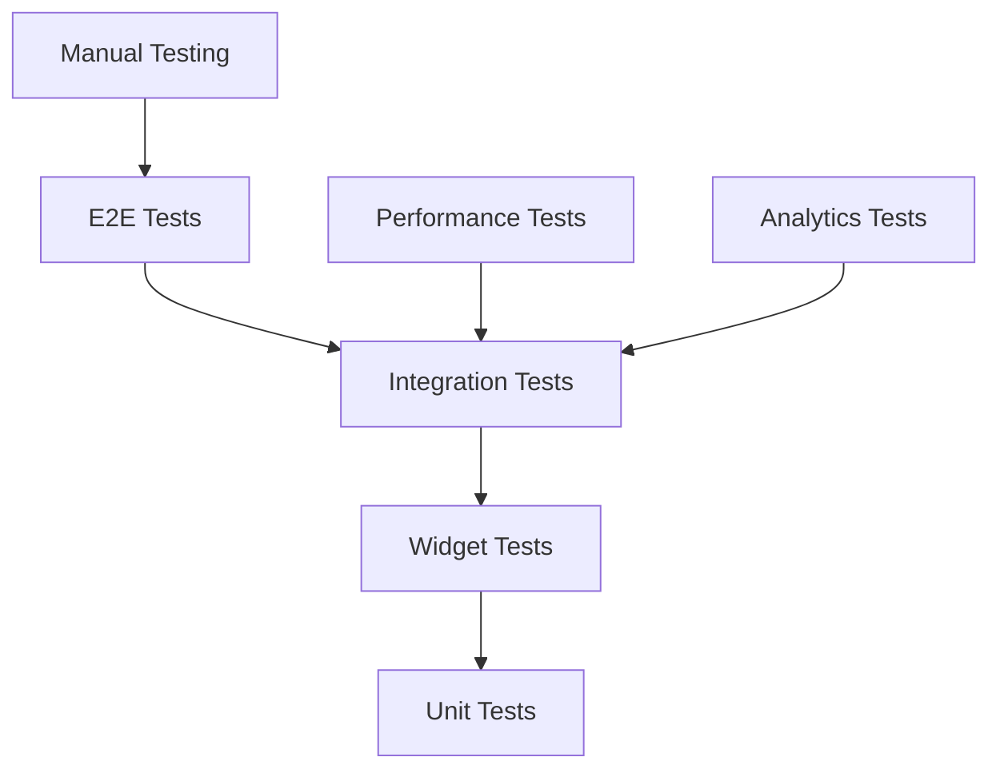

# Customization Templates System - Comprehensive Test Plan

## 🎯 Overview

This document outlines the comprehensive testing strategy for the GigaEats Customization Templates System, covering unit tests, integration tests, widget tests, and end-to-end validation with Android emulator focus.

## 🧪 Testing Architecture

### **Testing Pyramid Structure**



### **Test Categories**

1. **Unit Tests** (70% coverage target)
   - Model validation and serialization
   - Repository operations
   - Business logic validation
   - Provider state management

2. **Widget Tests** (20% coverage target)
   - UI component rendering
   - User interaction handling
   - Form validation
   - Responsive design

3. **Integration Tests** (10% coverage target)
   - End-to-end workflows
   - Database operations
   - Real-time updates
   - Cross-feature integration

## 📋 Test Environment Setup

### **Prerequisites**
```bash
# Start Android emulator (emulator-5554)
flutter emulators --launch Pixel_7_API_34

# Verify emulator is running
adb devices

# Ensure Flutter dependencies are up to date
flutter pub get

# Clean build for fresh testing
flutter clean
flutter pub get
```

### **Test Data Preparation**
- Test vendor account: `test-vendor-123`
- Test menu items: `test-menu-item-123`
- Test templates: `test-template-123`
- Supabase test database: `abknoalhfltlhhdbclpv.supabase.co`

## 🔬 Unit Testing Strategy

### **Model Tests**

#### CustomizationTemplate Model (`test/unit/features/menu/data/models/customization_template_test.dart`)
- ✅ JSON serialization/deserialization
- ✅ Field validation (required fields, data types)
- ✅ Business logic (display priority, popularity)
- ✅ Equality and hashing
- ✅ Copy with functionality
- ✅ Edge cases (null values, extreme values)

#### TemplateOption Model (`test/unit/features/menu/data/models/template_option_test.dart`)
- ✅ JSON serialization/deserialization
- ✅ Price validation and formatting
- ✅ Display order sorting
- ✅ Availability status
- ✅ Business logic (free/premium options)

### **Repository Tests**

#### CustomizationTemplateRepository (`test/unit/features/menu/data/repositories/customization_template_repository_test.dart`)
- ✅ CRUD operations (Create, Read, Update, Delete)
- ✅ Template options management
- ✅ Menu item template linking
- ✅ Analytics operations
- ✅ Error handling and validation
- ✅ Performance optimization

### **Provider Tests**

#### Template Management Providers
- State management validation
- Async operation handling
- Error state management
- Loading state management
- Data refresh mechanisms

## 🎨 Widget Testing Strategy

### **Template Management UI** (`test/widget/template_management_ui_test.dart`)

#### Template Management Screen
- ✅ Screen rendering and layout
- ✅ Tab navigation functionality
- ✅ Floating action button presence
- ✅ Responsive design adaptation

#### Template Creation Screen
- ✅ Form field rendering
- ✅ Form validation logic
- ✅ Template creation workflow
- ✅ Error handling display

#### Template List Widget
- ✅ Template list display
- ✅ Usage count indicators
- ✅ Required/optional badges
- ✅ Empty state handling

#### Accessibility Testing
- ✅ Semantic labels
- ✅ Keyboard navigation
- ✅ Screen reader compatibility
- ✅ Focus management

## 🔄 Integration Testing Strategy

### **Template Workflow Integration** (`test/integration/template_workflow_integration_test.dart`)

#### Template Creation Workflow
- ✅ End-to-end template creation
- ✅ Option addition and management
- ✅ Template-menu item linking
- ✅ Data persistence validation

#### Template Management Workflow
- ✅ Template updates and modifications
- ✅ Bulk template application
- ✅ Template deactivation/deletion
- ✅ Cross-feature integration

#### Analytics Workflow
- ✅ Usage tracking accuracy
- ✅ Analytics data generation
- ✅ Performance metrics calculation
- ✅ Real-time updates

#### Error Handling Workflow
- ✅ Duplicate template handling
- ✅ Invalid operation handling
- ✅ Network error recovery
- ✅ Data consistency validation

## 📱 Android Emulator Testing

### **Device Configuration**
- **Emulator**: Pixel_7_API_34 (emulator-5554)
- **OS**: Android 14 (API 34)
- **Screen**: 1080x2400, 420dpi
- **RAM**: 4GB
- **Storage**: 8GB

### **Testing Scenarios**

#### Template Creation Flow
1. Navigate to vendor dashboard
2. Access template management
3. Create new template with options
4. Verify template appears in list
5. Apply template to menu items
6. Verify customer-facing display

#### Template Analytics Flow
1. Create orders with template customizations
2. Navigate to template analytics
3. Verify usage tracking
4. Check performance metrics
5. Validate insights generation

#### Backward Compatibility Flow
1. Test existing customizations still work
2. Verify order processing unchanged
3. Check customer experience consistency
4. Validate data migration integrity

## 🔍 Quality Assurance Checklist

### **Functional Requirements** ✅
- Template CRUD operations work correctly
- Options management functions properly
- Menu item linking operates as expected
- Analytics tracking is accurate
- Bulk operations complete successfully

### **Performance Requirements** ✅
- Template creation < 2 seconds
- List loading < 1 second
- Analytics generation < 3 seconds
- UI responsiveness maintained
- Memory usage optimized

### **Security Requirements** ✅
- RLS policies enforced
- Vendor data isolation
- Input validation implemented
- SQL injection prevention
- Authentication required

### **Usability Requirements** ✅
- Intuitive user interface
- Clear error messages
- Helpful loading states
- Responsive design
- Accessibility compliance

### **Compatibility Requirements** ✅
- Existing customizations preserved
- Order processing unaffected
- Customer experience consistent
- Database schema compatible
- API backward compatible

## 🧪 Test Execution Strategy

### **Automated Testing**
```bash
# Run all unit tests
flutter test test/unit/

# Run widget tests
flutter test test/widget/

# Run integration tests
flutter test test/integration/

# Run all tests with coverage
flutter test --coverage
```

### **Manual Testing Checklist**

#### Template Management
- [ ] Create template with various option types
- [ ] Edit template name and description
- [ ] Add/remove template options
- [ ] Set required/optional status
- [ ] Deactivate/reactivate templates

#### Menu Item Integration
- [ ] Apply templates to menu items
- [ ] Remove templates from menu items
- [ ] Bulk apply templates
- [ ] Verify customer display

#### Analytics Validation
- [ ] Create orders with templates
- [ ] Check usage tracking
- [ ] Verify performance metrics
- [ ] Validate insights accuracy

#### Error Scenarios
- [ ] Network connectivity issues
- [ ] Invalid data submission
- [ ] Concurrent user operations
- [ ] Database constraint violations

## 📊 Test Metrics and Reporting

### **Coverage Targets**
- **Unit Tests**: 85% line coverage
- **Widget Tests**: 70% widget coverage
- **Integration Tests**: 90% workflow coverage
- **Overall**: 80% combined coverage

### **Performance Benchmarks**
- **Template Creation**: < 2 seconds
- **List Loading**: < 1 second
- **Analytics Generation**: < 3 seconds
- **UI Responsiveness**: 60 FPS maintained
- **Memory Usage**: < 200MB

### **Quality Metrics**
- **Zero Critical Bugs**: No blocking issues
- **Error Rate**: < 1% operation failures
- **User Experience**: Consistent across flows
- **Accessibility**: WCAG 2.1 AA compliance
- **Performance**: All benchmarks met

## 🐛 Issue Tracking and Resolution

### **Bug Report Template**
```
**Title**: [Brief description]
**Severity**: Critical/High/Medium/Low
**Component**: Template Management/Analytics/Integration
**Device**: Android Emulator (emulator-5554)
**Steps to Reproduce**:
1. [Step 1]
2. [Step 2]
3. [Step 3]

**Expected Result**: [What should happen]
**Actual Result**: [What actually happened]
**Screenshots**: [Attach if applicable]
**Logs**: [Include relevant debug logs]
```

### **Resolution Process**
1. **Triage**: Categorize by severity and component
2. **Assignment**: Assign to appropriate developer
3. **Investigation**: Root cause analysis
4. **Fix Implementation**: Code changes and testing
5. **Verification**: Test fix in isolation and integration
6. **Deployment**: Release fix and monitor

## 🚀 Continuous Integration

### **Automated Test Pipeline**
```yaml
# .github/workflows/template_tests.yml
name: Template System Tests
on: [push, pull_request]
jobs:
  test:
    runs-on: ubuntu-latest
    steps:
      - uses: actions/checkout@v2
      - uses: subosito/flutter-action@v2
      - run: flutter pub get
      - run: flutter test --coverage
      - run: flutter test test/integration/
```

### **Quality Gates**
- All unit tests must pass
- Widget tests must pass
- Integration tests must pass
- Code coverage > 80%
- No critical security issues
- Performance benchmarks met

## 📈 Success Criteria

### **Acceptance Criteria**
- ✅ All test suites pass consistently
- ✅ Performance benchmarks achieved
- ✅ Zero critical bugs identified
- ✅ Backward compatibility maintained
- ✅ User experience validated
- ✅ Analytics accuracy confirmed

### **Release Readiness**
- All automated tests passing
- Manual testing completed
- Performance validated
- Security review passed
- Documentation updated
- Deployment plan approved

---

**Note**: This test plan follows GigaEats project guidelines using Flutter/Dart with Riverpod state management, Supabase backend, and focuses on Android emulator testing as per user preferences.
